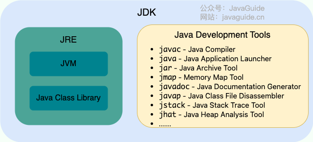
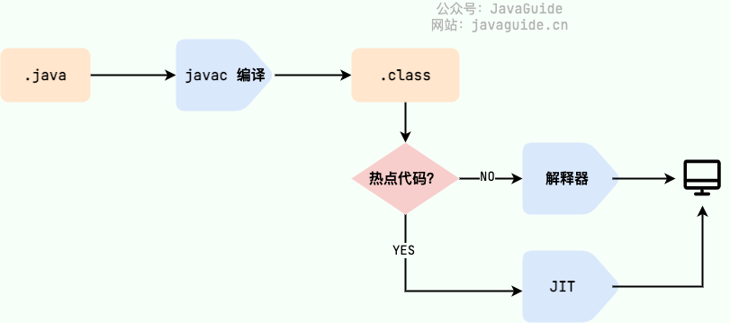
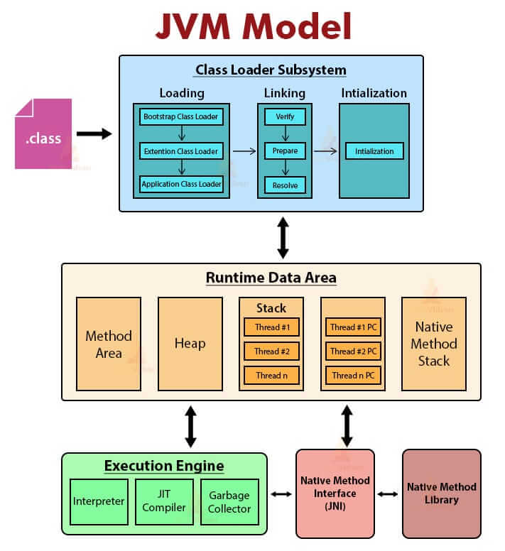
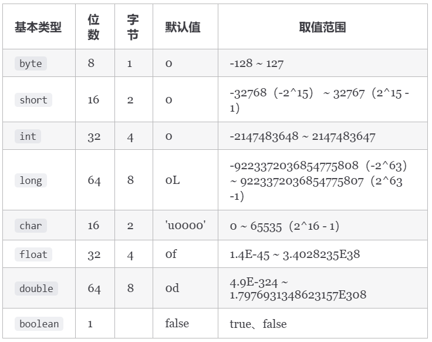
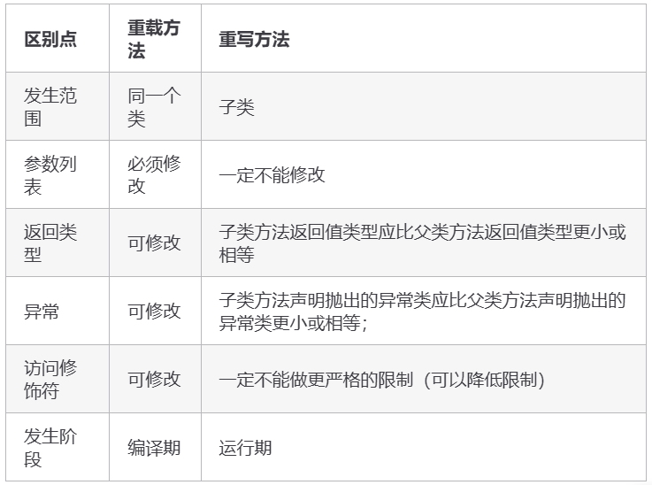
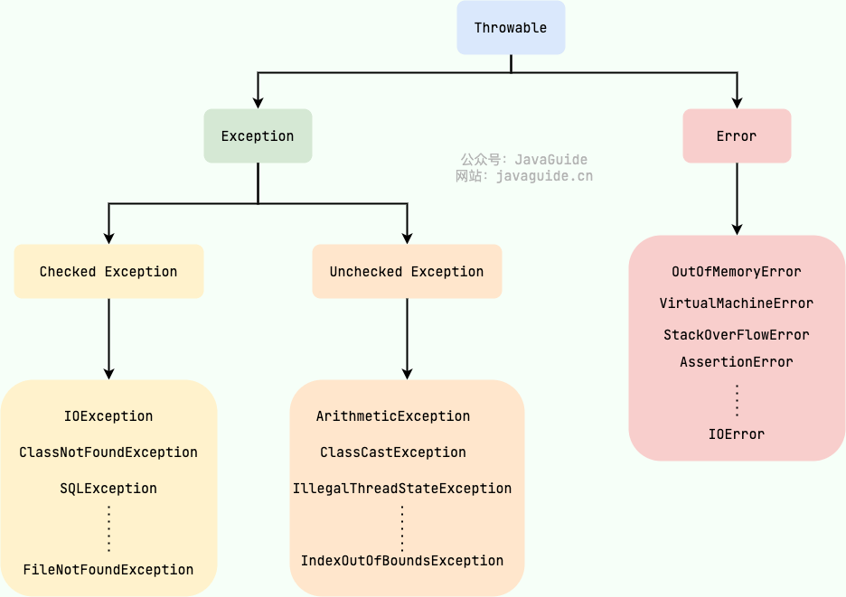

# Java语言基础

## JDK

* JVM：Java虚拟机，运行Java字节码的虚拟机
* JRE：Java运行环境，包含JVM以及Java基础类库
* JDK：Java开发工具包，包含JRE以及编译器javac和其他工具



* Java程序从源代码到运行的过程：.java文件被编译器javac编译成.class字节码文件，再由解释器逐行解释执行；对于热点代码，JIT编译器完成第一次编译后会将机器码保存下来，以提升执行效率
  
* JVM模型



## 数据类型

* 包装类型的缓存机制：`Byte`,`Short`,`Integer`,`Long` 这 4 种包装类默认创建了数值 **[-128，127]** 的相应类型的缓存数据，`Character` 创建了数值在 **[0,127]** 范围的缓存数据，`Boolean` 直接返回 `True` or `False`
* 为什么浮点数运算的时候会有精度丢失的风险？计算机是二进制的，在表示数字时宽度有限，无限循环的小数存储在计算机时，只能被阶段，因此导致精度发生损失的情况。BigDecimal可以实现浮点数的运算，而不造成精度损失



## 方法

* 方法重写和重载

  


## hashCode()与equals()

1. hashCode()是啥?

hashCode()的作用是获取哈希码, 也叫散列码, 具体是将对象的物理地址转换成一个整数，然后该整数通过hash函数的算法就得到hashcode, hashcode代表着该对象在hash表中的位置;

hashCode()方法的存在是为了提升查找的便捷性;

比如容器中有100个元素, 只能存不同的元素, 那第101个元素的加入需要跟1-100逐个对比; 如果利用hashCode(), 将100个元素分布在hash表1-5号位置上, 每个位置20个元素, 则第101个元素的加入, 则最多需对比hash表的相同位置, 再对比20个元素, 极大的提升了查找效率.

2. 为啥重写equals()时必须重写hashCode()方法

对于Map, Set等类型使用时, 重写了对象的equals()方法, 对象的相等取决于内容, 此时hashCode()返回的hashcode也应考虑对象内容相等, 而不是只关联对象的物理地址; 以保证相同的对象返回相同的hashcode


## 面向对象

* 三大特征：
  * 封装，将对象的状态信息隐藏在对象内部
  * 继承，支持使用已有的类作为基础建立新类，新类可以增加新的数据或新的功能
  * 多态，对象类型和引用类型之间具有继承/实现的关系，引用类型变量发出的方法调用必须在程序运行期间才能确定
* 接口和抽象类有什么相同点和区别？
  * 都不能被实例化，都可以包含抽象方法
  * 区别：
    * 接口主要用于对类的行为进行约束，抽象类主要用于代码复用
    * 单继承，多实现
    * 接口中的成员变量比如是public static final类型，抽象类则没有约束
    * Java 8 之前，接口中的方法默认是 `public abstract` ，也就是只能有方法声明。自 Java 8 起，可以在接口中定义 `default`（默认） 方法和 `static` （静态）方法。 自 Java 9 起，接口可以包含 `private` 方法。抽象类可定义抽象和非抽象方法

## 异常



* Try-catch-finally, **不要在 finally 语句块中使用 return!** 当 try 语句和 finally 语句中都有 return 语句时，try 语句块中的 return 语句会被忽略。这是因为 try 语句中的 return 返回值会先被暂存在一个本地变量中，当执行到 finally 语句中的 return 之后，这个本地变量的值就变为了 finally 语句中的 return 返回值。


## 反射

反射（Reflection）的主要作用是 **在运行时动态地获取和操作类的信息** 。反射机制允许程序在运行时检查类、接口、字段和方法，并动态调用方法或修改字段值，而无需在编译时知道这些类的具体信息.

```Java
publicclassTargetObject {
    privateString value;

    publicTargetObject() {
        value = "JavaGuide";
    }

    publicvoidpublicMethod(String s) {
        System.out.println("I love " + s);
    }

    privatevoidprivateMethod() {
        System.out.println("value is " + value);
    }
}
```

```Java
publicclassReflectMain {
    publicstaticvoidmain(String[] args) throwsClassNotFoundException, NoSuchMethodException, InstantiationException, IllegalAccessException, InvocationTargetException, NoSuchFieldException {
        // java中4种获取类实例的方式
Class<TargetObject> targetClass = TargetObject.class;
        Class<?> aClass1 = Class.forName("com.xinzhang.reflect.TargetObject");
        Class<? extendsTargetObject> aClass2 = newTargetObject().getClass();
        Class<?> aClass3 = ClassLoader.getSystemClassLoader().loadClass("com.xinzhang.reflect.TargetObject");

        /**
         * 获取 TargetObject 类中定义的所有方法
         */
Method[] methods = targetClass.getDeclaredMethods();
        for(Method method : methods) {
            System.out.println(method.getName());
        }

        TargetObject targetObject = targetClass.newInstance();
        /**
         * 获取指定方法并调用
         */
Method publicMethod = targetClass.getDeclaredMethod("publicMethod",
                String.class);
        publicMethod.invoke(targetObject, "JavaGuide");

        /**
         * 获取指定参数并对参数进行修改
         */
Field field = targetClass.getDeclaredField("value");
        //为了对类中的参数进行修改我们取消安全检查
field.setAccessible(true);
        field.set(targetObject, "JavaGuide");

        /**
         * 调用 private 方法
         */
Method privateMethod = targetClass.getDeclaredMethod("privateMethod");
        //为了调用private方法我们取消安全检查
privateMethod.setAccessible(true);
        privateMethod.invoke(targetObject);
    }

}
```


## 代理

- 静态代理

```Java
publicinterfaceSmsService{
    String send(String message);
}

publicclassSmsServiceImpl implementsSmsService{
    publicString send(String message) {
        System.out.println("send message:" + message);
        returnmessage;
    }
}
```

- JDK代理, 要求实现InvocationHandler接口

```Java
publicclassJdkProxy {
    publicstaticvoidmain(String[] args) {
        finalSmsServiceImpl target = newSmsServiceImpl();
        Object o = Proxy.newProxyInstance(target.getClass().getClassLoader(), target.getClass().getInterfaces(),
                new InvocationHandler() {
                    publicObject invoke(Object proxy, Method method, Object[] args) throwsThrowable {
                        System.out.println("enhance before: " + method.getName());
                        Object ret = method.invoke(target, args);
                        System.out.println("enhance after: " + method.getName());
                        returnret;
                    }
                });
        SmsServiceproxy = (SmsService) o;
        proxy.send("hello! jdkProxy");
    }

}
```

- Cglib代理

```Java
publicclassCglibProxy {
    publicstaticvoidmain(String[] args) {
        SmsServiceImpl target = newSmsServiceImpl();

        Enhancer enhancer = new Enhancer();
        enhancer.setClassLoader(target.getClass().getClassLoader());
        enhancer.setSuperclass(target.getClass());
        enhancer.setCallback(new MethodInterceptor() {
            @Override
            publicObject intercept(Object o, Method method, Object[] args, MethodProxy methodProxy) throwsThrowable {
                System.out.println("enhance before: " + method.getName());
                Object ret = method.invoke(target, args);
                System.out.println("enhance after: " + method.getName());
                returnret;
            }
        });
        SmsServiceproxy = (SmsService) enhancer.create();
        proxy.send("hello! cglibProxy");
    }
}
```


## 注解

Java 注解（Annotation）是一种元数据形式，用于为 Java 代码提供额外的信息

元注解用于定义自定义注解的行为：

* `@Target`：
  * 指定注解可以应用的目标元素（如类、方法、字段等）。
  * 例如：`@Target(ElementType.METHOD)` 表示注解只能用于方法。
* `@Retention`：
  * 指定注解的生命周期（源码级别、编译级别、运行时级别）。
  * 例如：`@Retention(RetentionPolicy.RUNTIME)` 表示注解在运行时可用。
* `@Documented`：
  * 表示注解应该包含在 Javadoc 中。
* `@Inherited`：
  * 表示注解可以被子类继承。
* `@Repeatable`：
  * 表示注解可以重复使用（Java 8 引入）。

## 四种引用类型

* 强引用，不会被垃圾回收
* 软引用，OOM之前才回收
* 弱引用，下一次垃圾回收时回收
* 虚引用，一个对象设置虚引用关联的唯一目的就是能在这个对象被收集器回收时收到一个系统通知。虚引用主要用来跟踪对象被垃圾回收的活动。
