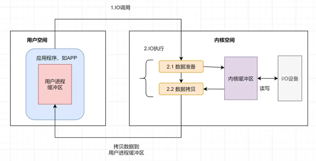
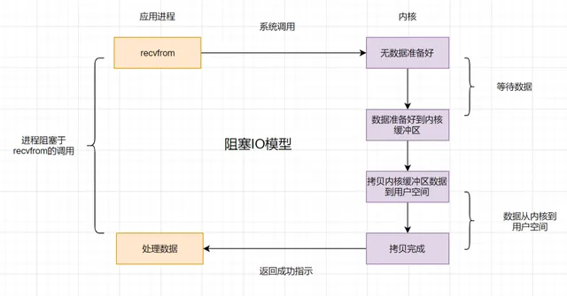
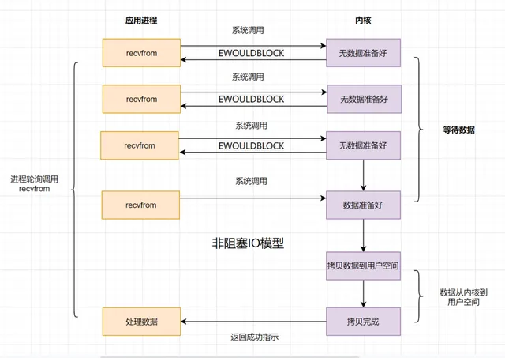
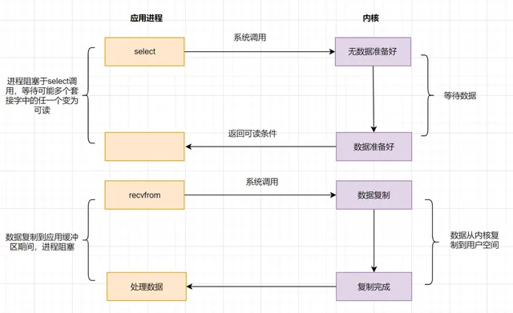
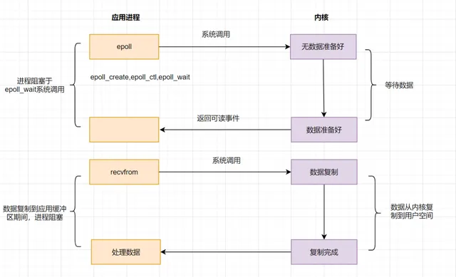
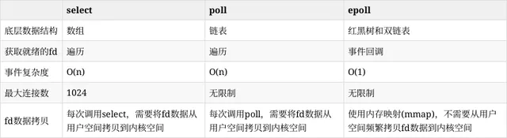
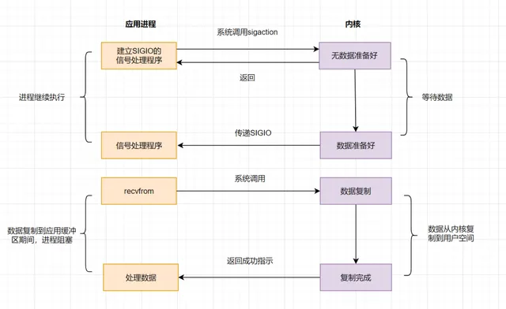
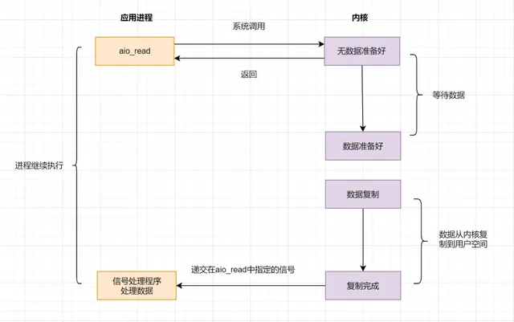
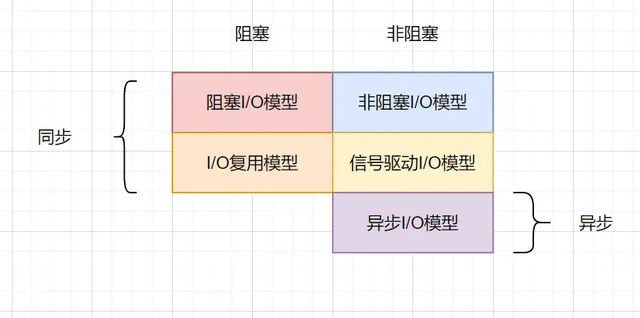
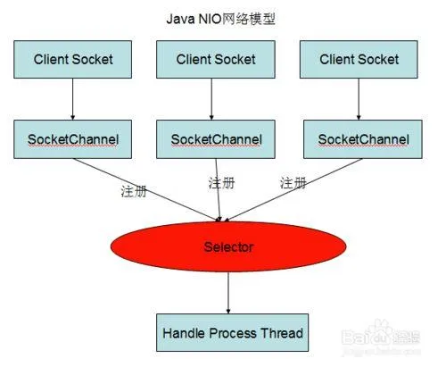

# IO模型

一次IO过程如下

* 应用程序进程向操作系统发起IO调用请求
* 操作系统准备数据，把IO外部设备的数据，加载到内核缓冲区
* 操作系统拷贝数据，即将内核缓冲区的数据，拷贝到用户进程缓冲区

## 阻塞IO(BIO)

* 如果内核数据内有准备好, 那么用户进程将一直阻塞, 浪费CPU资源
* 应用: 阻塞socket、Java BIO
* 

## 非阻塞IO(NIO)

* 应用进程轮询调用系统内核
* 频繁轮询依然消耗CPU资源
* 

## 多路复用IO

### select

* 应用进程通过select函数询问内核数据是否准备就绪, 数据就绪后再发起系统调用
* 缺点
  * 监听的IO最大连接数在Liunx上最大为1024
  * select函数返回后, 需要遍历所有流才能找到就绪的描述符fd, 如果同时连接大量的客户端, 同一时刻可能只有极少数流处于就绪状态, 随着监视的描述符数量增长, 效率也会线性下降
* poll模型解决了连接数的限制, 但解决不了遍历所有流的问题
* 

### epoll

* 采用监听事件回调机制, 先通过epoll_ctl()注册一个文件描述符fd, 一旦某个fd就绪时, 内核会采用回调机制, 迅速激活fd, 当进程调用epoll_wait()时便得到通知
* 进程调用epoll_wait()时依然有可能被阻塞
* 

### select, poll, epoll 对比

## 信号驱动模型

* 不再主动询问内核数据是否就绪, 而是向内核发送一个信号, 然后应用进程去做别的事, 不用阻塞, 当内核数据准备好后, 再通过信号通知应用进程, 应用进程收到信号立刻读取数据
* 

## 异步IO(AIO)

* 上面的BIO, NIO, 信号驱动等模型, 在数据从内核复制到应用缓冲的时候都是阻塞的, 异步IO实现了IO全流程的非阻塞, 在应用进程发出系统调用后, 立即返回成功, 等内核数据拷贝完成后再通知用户进程操作执行完毕
* 

## 总结

## JAVA NIO

* **传统 ****NIO** 是操作系统级别的非阻塞 I/O 机制, **Java NIO** 是 Java 对传统 NIO 的封装和扩展，提供了更高效的 I/O 操作方式
* NIO 主要有三大核心部分： Channel(通道)， Buffer(缓冲区), Selector.

传统 IO 基于字节流和字符流进行操作， 而 NIO 基于 Channel 和 Buffer(缓冲区)进行操作，数据总是从通道读取到缓冲区中，或者从缓冲区写入到通道中。 Selector(选择区)用于监听多个通道的事件（比如：连接打开，数据到达）。因此，单个线程可以监听多个数据通道。

NIO 和传统 IO 之间第一个最大的区别是， IO 是面向流的， NIO 是面向缓冲区的。

