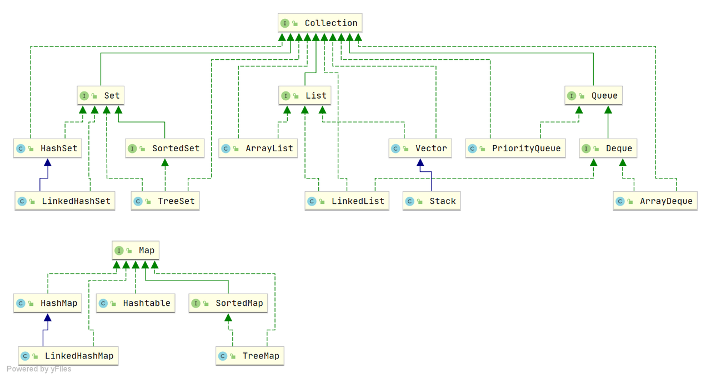
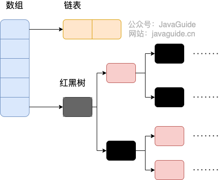
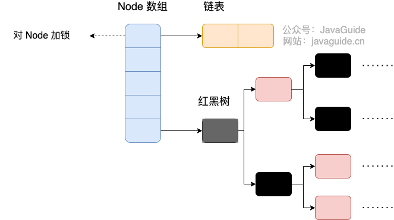
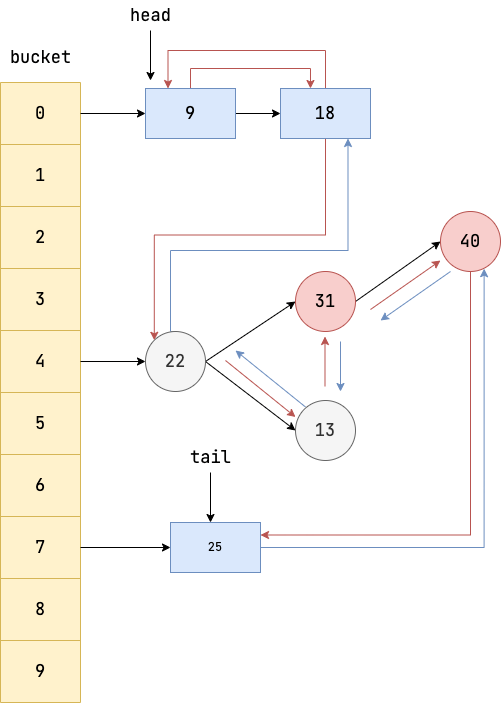
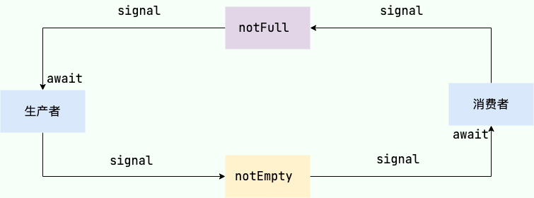

# 集合




## ArrayList

* 底层为Object[], 初始容量为10, 每次扩容近似为原始容量的1.5倍

```Java
/**
     * ArrayList扩容的核心方法。
     */
    private void grow(int minCapacity) {
        // oldCapacity为旧容量，newCapacity为新容量
        int oldCapacity = elementData.length;
        //将oldCapacity 右移一位，其效果相当于oldCapacity /2，
        //我们知道位运算的速度远远快于整除运算，整句运算式的结果就是将新容量更新为旧容量的1.5倍，
        int newCapacity = oldCapacity + (oldCapacity >> 1);
        //然后检查新容量是否大于最小需要容量，若还是小于最小需要容量，那么就把最小需要容量当作数组的新容量，
        if (newCapacity - minCapacity < 0)
            newCapacity = minCapacity;
        //再检查新容量是否超出了ArrayList所定义的最大容量，
        //若超出了，则调用hugeCapacity()来比较minCapacity和 MAX_ARRAY_SIZE，
        //如果minCapacity大于MAX_ARRAY_SIZE，则新容量则为Integer.MAX_VALUE，否则，新容量大小则为 MAX_ARRAY_SIZE。
        if (newCapacity - MAX_ARRAY_SIZE > 0)
            newCapacity = hugeCapacity(minCapacity);
        // minCapacity is usually close to size, so this is a win:
        elementData = Arrays.copyOf(elementData, newCapacity);
    }
```


### CopyOnWriteArrayList

* 读写锁是读读不互斥, 其余读写, 写写均互斥
* `CopyOnWriteArrayList` 读写也不互斥, 写时复制的策略是当需要修改数组内容时, 不会修改原数组, 而是会先创建底层数组的副本, 对副本数组进行修改, 修改完成之后再将修改后的数组赋值回去

```Java
// 插入元素到 CopyOnWriteArrayList 的尾部
public boolean add(E e) {
    final ReentrantLock lock = this.lock;
    // 加锁
    lock.lock();
    try {
        // 获取原来的数组
        Object[] elements = getArray();
        // 原来数组的长度
        int len = elements.length;
        // 创建一个长度+1的新数组，并将原来数组的元素复制给新数组
        Object[] newElements = Arrays.copyOf(elements, len + 1);
        // 元素放在新数组末尾
        newElements[len] = e;
        // array指向新数组
        setArray(newElements);
        return true;
    } finally {
        // 解锁
        lock.unlock();
    }
}
```


## LinkedList

* 底层是双向链表

```Java
private static class Node<E> {
    E item;// 节点值
    Node<E> next; // 指向的下一个节点（后继节点）
    Node<E> prev; // 指向的前一个节点（前驱结点）

    // 初始化参数顺序分别是：前驱结点、本身节点值、后继节点
    Node(Node<E> prev, E element, Node<E> next) {
        this.item = element;
        this.next = next;
        this.prev = prev;
    }
}
```


## HashMap

### 底层实现

* 初始容量为16, 当数组元素超过(**

  $$
  threshold = capacity * loadFactor
  $$

  **)16*0.75=12时, 需扩容
* 负载因子loadFactor=0.75f, 该数值越大(趋近于1), 数组中存放的元素越多, 数组越密, 导致链表的长度增加, 查找耗时增加; 反之数值越少, 数组越稀疏, 空间利用率越低
* 当链表长度大于阈值8时, 若数组长度小于64, 则会进行数组扩容, 若大于64, 则将链表转为红黑树



* Node

```Java
// 继承自 Map.Entry<K,V>
static class Node<K,V> implements Map.Entry<K,V> {
       final int hash;// 哈希值，存放元素到hashmap中时用来与其他元素hash值比较
       final K key;//键
       V value;//值
       // 指向下一个节点
       Node<K,V> next;
      ...
}
```

* TreeNode

```Java
static final class TreeNode<K,V> extends LinkedHashMap.Entry<K,V> {
        TreeNode<K,V> parent;  // 父
        TreeNode<K,V> left;    // 左
        TreeNode<K,V> right;   // 右
        TreeNode<K,V> prev;    // needed to unlink next upon deletion
        boolean red;           // 判断颜色
        TreeNode(int hash, K key, V val, Node<K,V> next) {
            super(hash, key, val, next);
        }
```


### 长度为什么是2的幂次方

* 哈希函数采用对数组取模得到的余数作为元素在数组中的下标
* 取余操作中如果除数是2的幂次方则等价于与其除数减一的与操作, 即hash%length==hash&(length-1)的前提是 length 是 2 的 n 次方, 因此将hashmap长度设计为2的幂次方可以使用二进制位&操作, 提高运算效率

### ConcurrentHashMap




### LinkedHashMap

* 在HashMap的基础上, 在各个节点之家你维护一条双向链表




#### 使用LinkedHashMap实现LRU(最近最少使用缓存)

```Java
public class LRUCache<K, V> extends LinkedHashMap<K, V> {
    private final int capacity;

    //构造方法中指定 accessOrder 为 true ，这样在访问元素时就会把该元素移动到链表尾部，链表首元素就是最近最少被访问的元素；
    public LRUCache(int capacity) {
        super(capacity, 0.75f, true);
        this.capacity = capacity;
    }

    /**
     * 判断size超过容量时返回true，告知LinkedHashMap移除最老的缓存项(即链表的第一个元素)
     */
    @Override
    protected boolean removeEldestEntry(Map.Entry<K, V> eldest) {
        return size() > capacity;
    }
}
```


```Java
// 测试代码如下, 指定初始容量为3, 当添加4时, 1会被删除, 添加5时, 2会被删除
LRUCache<Integer, String> cache = new LRUCache<>(3);
cache.put(1, "one");
cache.put(2, "two");
cache.put(3, "three");
cache.put(4, "four");
cache.put(5, "five");
for (int i = 1; i <= 5; i++) {
    System.out.println(cache.get(i));
}
------------result
null
null
three
four
five
```


## ArrayBlockingQueue

* 初始化

```Java
// capacity 表示队列初始容量，fair 表示 锁的公平性
public ArrayBlockingQueue(int capacity, boolean fair) {
  //如果设置的队列大小小于0，则直接抛出IllegalArgumentException
  if (capacity <= 0)
      throw new IllegalArgumentException();
  //初始化一个数组用于存放队列的元素
  this.items = new Object[capacity];
  //创建阻塞队列流程控制的锁
  lock = new ReentrantLock(fair);
  //用lock锁创建两个条件控制队列生产和消费
  notEmpty = lock.newCondition();
  notFull =  lock.newCondition();
}
```

* 阻塞式获取和新增元素




* Put

```Java
public void put(E e) throws InterruptedException {
    //确保插入的元素不为null
    checkNotNull(e);
    //加锁
    final ReentrantLock lock = this.lock;
    //这里使用lockInterruptibly()方法而不是lock()方法是为了能够响应中断操作，如果在等待获取锁的过程中被打断则该方法会抛出InterruptedException异常。
    lock.lockInterruptibly();
    try {
            //如果count等数组长度则说明队列已满，当前线程将被挂起放到AQS队列中，等待队列非满时插入（非满条件）。
       //在等待期间，锁会被释放，其他线程可以继续对队列进行操作。
        while (count == items.length)
            notFull.await();
           //如果队列可以存放元素，则调用enqueue将元素入队
        enqueue(e);
    } finally {
        //释放锁
        lock.unlock();
    }
}


private void enqueue(E x) {
   //获取队列底层的数组
    final Object[] items = this.items;
    //将putindex位置的值设置为我们传入的x
    items[putIndex] = x;
    //更新putindex，如果putindex等于数组长度，则更新为0
    if (++putIndex == items.length)
        putIndex = 0;
    //队列长度+1
    count++;
    //通知队列非空，那些因为获取元素而阻塞的线程可以继续工作了
    notEmpty.signal();
}
```

* Take

```Java
public E take() throws InterruptedException {
       //获取锁
     final ReentrantLock lock = this.lock;
     lock.lockInterruptibly();
     try {
             //如果队列中元素个数为0，则将当前线程打断并存入AQS队列中，等待队列非空时获取并移除元素（非空条件）
         while (count == 0)
             notEmpty.await();
            //如果队列不为空则调用dequeue获取元素
         return dequeue();
     } finally {
          //释放锁
         lock.unlock();
     }
}

private E dequeue() {
  //获取阻塞队列底层的数组
  final Object[] items = this.items;
  @SuppressWarnings("unchecked")
  //从队列中获取takeIndex位置的元素
  E x = (E) items[takeIndex];
  //将takeIndex置空
  items[takeIndex] = null;
  //takeIndex向后挪动，如果等于数组长度则更新为0
  if (++takeIndex == items.length)
      takeIndex = 0;
  //队列长度减1
  count--;
  if (itrs != null)
      itrs.elementDequeued();
  //通知那些被打断的线程当前队列状态非满，可以继续存放元素
  notFull.signal();
  return x;
}
```


* 非阻塞式获取和新增元素
  * `offer(E e)`：将元素插入队列尾部。如果队列已满，则该方法会直接返回 false，不会等待并阻塞线程。
  * `poll()`：获取并移除队列头部的元素，如果队列为空，则该方法会直接返回 null，不会等待并阻塞线程。
  * `add(E e)`：将元素插入队列尾部。如果队列已满则会抛出 `IllegalStateException` 异常，底层基于 `offer(E e)` 方法。
  * `remove()`：移除队列头部的元素，如果队列为空则会抛出 `NoSuchElementException` 异常，底层基于 `poll()`。
  * `peek()`：获取但不移除队列头部的元素，如果队列为空，则该方法会直接返回 null，不会等待并阻塞线程。
  * `offer(E e, long timeout, TimeUnit unit)` 和 `poll(long timeout, TimeUnit unit)`
