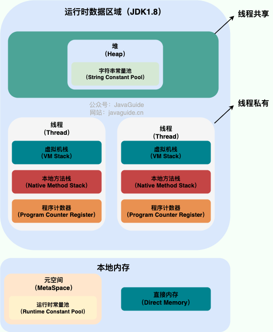
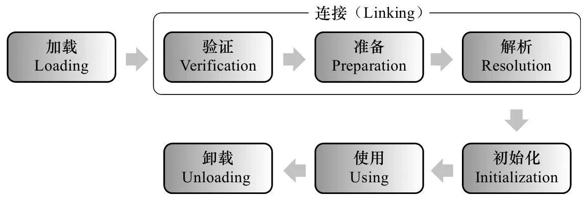
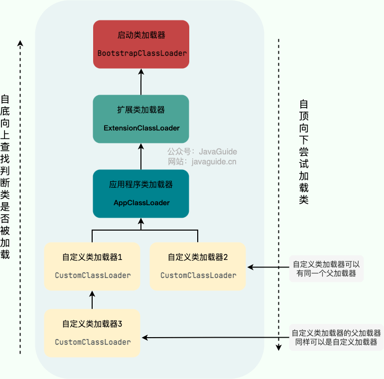
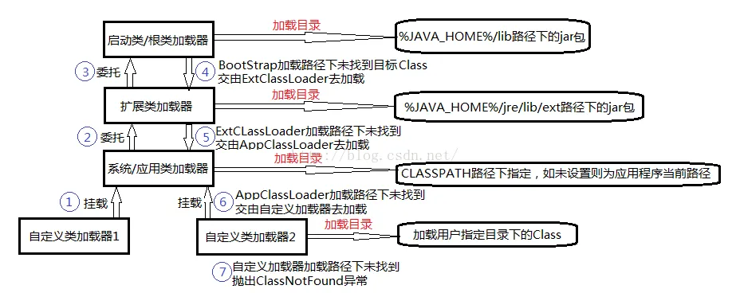
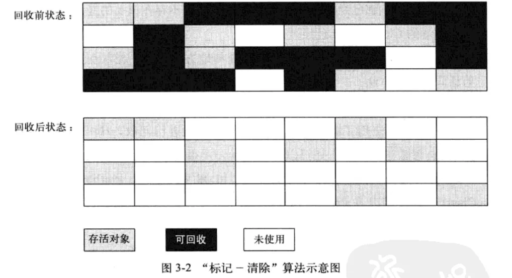
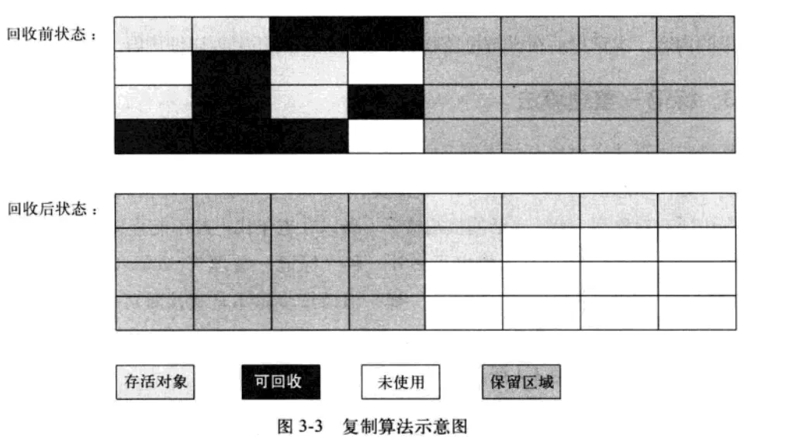
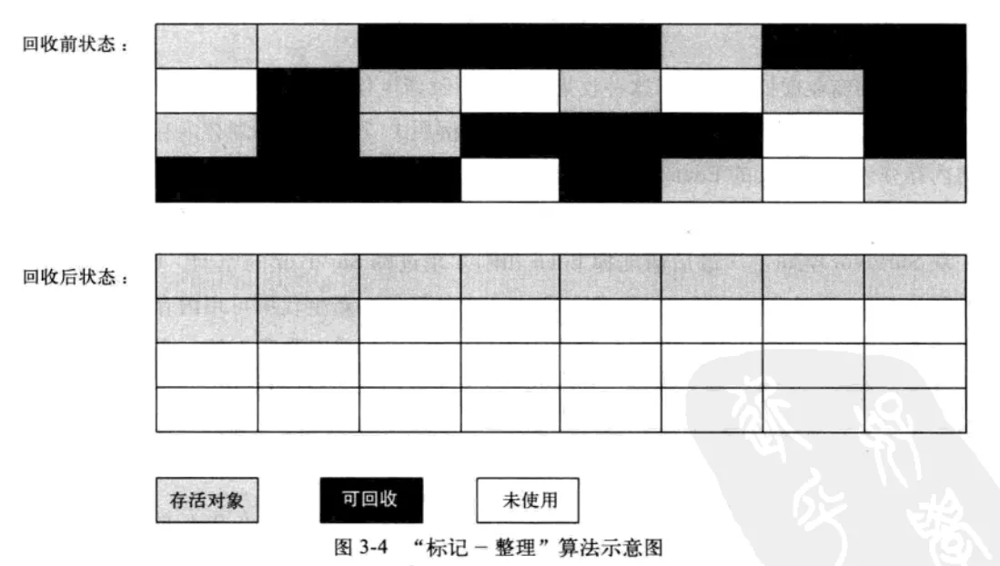
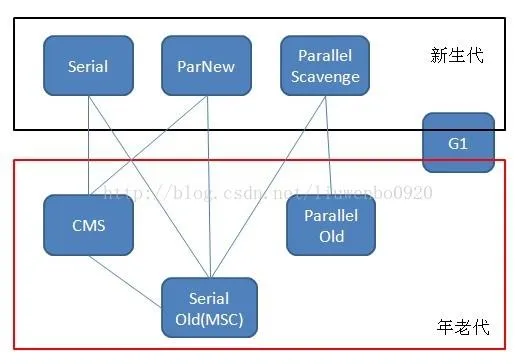

# JVM基础

## JDK1.8的运行时数据区域

* JDK1.8 hotspot移除了永久代用元空间(Metaspace)取而代之, 这时候字符串常量池还在堆, 运行时常量池还在方法区, 只不过方法区的实现从永久代变成了元空间(Metaspace)

## JVM类加载

### 类加载过程

1. 加载（Loading）：通过类的全限定名获取定义此类的二进制字节流，并将这个字节流所代表的静态存储结构转化为方法区的运行时数据结构，然后在内存中生成一个代表这个类的java.lang.Class对象，作为方法区这个类的各种数据的访问入口。
2. 验证（Verification）：确保Class文件的字节流中包含的信息符合当前虚拟机的要求，并且不会危害虚拟机自身的安全，包括文件格式验证、元数据验证、字节码验证和符号引用验证。
3. 准备（Preparation）：为类变量（即静态变量）分配内存并设置类变量初始值（通常为零值），这些变量所使用的内存都将在方法区中进行分配。
4. 解析（Resolution）：将常量池内的符号引用替换为直接引用的过程，解析动作主要针对类或接口、字段、类方法、接口方法、方法类型、方法句柄和调用点限定符7类符号引用进行。
5. 初始化（Initialization）：执行类构造器 `<clinit>`()方法的过程，`<clinit>`()方法是由编译器自动收集类中的所有类变量的赋值动作和静态语句块（static{}块）中的语句合并产生的，虚拟机会保证一个类的 `<clinit>`()方法在多线程环境中被正确地加锁、同步。
6. 使用（Using）：类加载完成后，JVM就可以使用该类来创建对象、调用方法等。
7. 卸载（Unloading）：当类不再被任何实例引用，且没有任何地方引用该类时，JVM会卸载该类，释放其占用的内存空间。

### 类加载器

JVM 中内置了三个重要的 `ClassLoader`：

1. **`BootstrapClassLoader`** **(启动** **类加载器**  **)** ：最顶层的加载类，由 C++实现，通常表示为 null，并且没有父级，主要用来加载 JDK 内部的核心类库（ `%JAVA_HOME%/lib`目录下的 `rt.jar`、`resources.jar`、`charsets.jar`等 jar 包和类）以及被 `-Xbootclasspath`参数指定的路径下的所有类。
2. **`ExtensionClassLoader`** **(扩展** **类加载器**  **)** ：主要负责加载 `%JRE_HOME%/lib/ext` 目录下的 jar 包和类以及被 `java.ext.dirs` 系统变量所指定的路径下的所有类。
3. **`AppClassLoader`** **(应用程序** **类加载器**  **)** ：面向我们用户的加载器，负责加载当前应用 classpath 下的所有 jar 包和类。

   

### **双亲委派加载机制**

在Java中，当一个类加载器收到类加载的请求时，它首先不会自己去尝试加载这个类，而是把这个请求委派给父类加载器去完成，每一层次的类加载器都是如此，因此所有的加载请求最终都应该传送到顶层的启动类加载器中，只有当父类加载器反馈自己无法完成这个加载请求（它的搜索范围中没有找到所需的类）时，子加载器才会尝试自己去加载。

 **双亲委派加载机制的好处** ：

1. **避免重复加载** ：确保一个类在JVM中只被加载一次，避免了类的重复加载，节省了内存空间。
2. **安全性** ：防止核心API库被随意篡改，确保Java核心库的类型安全，因为核心类库由启动类加载器加载，不会被自定义的类加载器加载的类所替代。
3. **稳定性** ：保证了Java程序的稳定运行，因为类的加载顺序是从上至下的，确保了基础类的行为不会被派生类所影响。

## 4种引用类型

* 强引用

在 Java 中最常见的就是强引用， 把一个对象赋给一个引用变量，这个引用变量就是一个强引用。当一个对象被强引用变量引用时，它处于可达状态，它是不可能被垃圾回收机制回收的，即使该对象以后永远都不会被用到 JVM 也不会回收。因此强引用是造成 Java 内存泄漏的主要原因之一。

* 软引用

软引用需要用 SoftReference 类来实现，对于只有软引用的对象来说，当系统内存足够时它不会被回收，当系统内存空间不足时它会被回收。软引用通常用在对内存敏感的程序中.

* 弱引用

弱引用需要用 WeakReference 类来实现，它比软引用的生存期更短，对于只有弱引用的对象来说，只要垃圾回收机制一运行，不管 JVM 的内存空间是否足够，总会回收该对象占用的内存。

* 虚引用

虚引用需要 PhantomReference 类来实现，它不能单独使用，必须和引用队列联合使用。 虚引用的主要作用是跟踪对象被垃圾回收的状态。

## 内存分配策略

> 新生代分为Eden 区（伊甸园区）, Survivor 区（幸存者区）,大多数新创建的对象会首先分配在 Eden 区, Survivor 区分为两个部分：From 区和To 区

1. **对象优先在 Eden 区分配** ：
2. 大多数新创建的对象会分配在新生代的 Eden 区。
3. 如果 Eden 区空间不足，会触发 Minor GC。
4. **大对象直接进入老年代** ：
5. 大对象（如长字符串或大数组）会直接分配到老年代，避免在 Eden 区和 Survivor 区之间复制。
6. **长期存活的对象进入老年代** ：
7. 对象在 Survivor 区每经历一次 Minor GC，年龄加 1。
8. 当年龄达到阈值（默认 15），对象会被晋升到老年代。
9. **动态对象年龄判定** ：
10. 如果 Survivor 区中相同年龄的所有对象大小总和超过 Survivor 区的一半，年龄大于或等于该年龄的对象可以直接进入老年代。
11. **空间分配担保** ：
12. 在 Minor GC 之前，JVM 会检查老年代的最大可用连续空间是否大于新生代所有对象的总空间。
13. 如果条件不满足，会检查是否允许担保失败（HandlePromotionFailure）。
14. 如果允许，则继续 Minor GC；否则，触发 Full GC。

## 垃圾回收与算法

### 如何确定垃圾

* **引用计数法（Reference Counting）, **JVM** 不采用引用计数法，因为它无法处理循环引用**
* 每个对象维护一个引用计数器，记录有多少引用指向它。
* 当引用计数器为 0 时，表示该对象不再被引用，可以被回收
* **可达性分析法（Reachability Analysis）,  **JVM** 中主流的垃圾判定方法**
* 从一组 **GCRoots** 出发，遍历对象图，标记所有可达的对象。
* 未被标记的对象被认为是不可达的，可以被回收。
* Gc Roots是一组特殊的对象引用,  **GCRoots 包括** ：
* 虚拟机栈中的局部变量。
* 方法区中的静态变量和常量。
* 本地方法栈中的 JNI 引用。
* 活跃线程和同步锁对象等。

### 垃圾收集算法

* **标记清除算法（Mark-Sweep）** :最基础的垃圾回收算法，分为两个阶段，标注和清除 , 该算法最大的问题是内存碎片化严重，后续可能发生大对象不能找到可利用空间的问题
* 
* **复制算法（copying）** ,按内存容量将内存划分为等大小的两块。每次只使用其中一块，当这一块内存满后将尚存活的对象复制到另一块上去，把已使用的内存清掉,这种算法虽然实现简单，内存效率高，不易产生碎片，但是最大的问题是可用内存被缩到了原本的一半。且存活对象增多的话， Copying 算法的效率会大大降低
* 
* **标记整理算法(Mark-Compact)** , 结合了以上两个算法，为了避免缺陷而提出。标记阶段和 Mark-Sweep 算法相同， 标记后不是清理对象，而是将存活对象移向内存的一端。然后清除端边界外的对象。
* 
* **分代收集算法**

分代收集法是目前大部分 JVM 所采用的方法，其核心思想是根据对象存活的不同生命周期将内存划分为不同的域，一般情况下将 GC 堆划分为老生代(Tenured/Old Generation)和新生代(YoungGeneration)。老生代的特点是每次垃圾回收时只有少量对象需要被回收，新生代的特点是每次垃圾回收时都有大量垃圾需要被回收，因此可以根据不同区域选择不同的算法。

* **在新生代-复制算法**

  每次垃圾收集都能发现大批对象已死, 只有少量存活. 因此选用复制算法, 只需要付出少量存活对象的复制成本就可以完成收集
* **在老年代-标记整理算法**
  因为对象存活率高、没有额外空间对它进行分配担保, 就必须采用“标记—清理”或“标记—整理” 算法来进行回收, 不必进行内存复制, 且直接腾出空闲内存
* **分区收集算法**

分区算法则将整个堆空间划分为连续的不同小区间, 每个小区间独立使用, 独立回收. 这样做的好处是可以控制一次回收多少个小区间 , 根据目标停顿时间, 每次合理地回收若干个小区间(而不是整个堆), 从而减少一次 GC 所产生的停顿。

### 垃圾收集器

* Serial**垃圾收集器** （单线程、 复制算法）

Serial垃圾收集器依然是 java 虚拟机运行在 Client 模式下默认的新生代垃圾收集器

* ParNew  **垃圾收集器**  **（Serial+**  **多线程** ）

ParNew 垃圾收集器其实是 Serial 收集器的多线程版本,ParNew垃圾收集器是很多 java虚拟机运行在 Server 模式下新生代的默认垃圾收集器

* **Parallel Scavenge** *收集器（**多线程***复制算法、高效）

它重点关注的是程序达到一个可控制的吞吐量（Thoughput， CPU 用于运行用户代码的时间/CPU 总消耗时间,即吞吐量=运行用户代码时间/(运行用户代码时间+垃圾收集时间)），高吞吐量可以最高效率地利用 CPU 时间，尽快地完成程序的运算任务，主要适用于在后台运算而不需要太多交互的任务。 自适应调节策略也是ParallelScavenge 收集器与 ParNew 收集器的一个重要区别

* Serial Old 收集器（单线程标记整理算法 ）

Serial Old 是 Serial 垃圾收集器年老代版本，它同样是个单线程的收集器，使用标记-整理算法，这个收集器也主要是运行在 Client 默认的 java 虚拟机默认的年老代垃圾收集器。

* Parallel Old 收集器（多线程标记整理算法）

Parallel Old 收集器是Parallel Scavenge的年老代版本，使用多线程的标记-整理算法 , Parallel Old 正是为了在年老代同样提供吞吐量优先的垃圾收集器

* CMS收集器（多线程标记清除算法）

Concurrent mark sweep(CMS)收集器是一种年老代垃圾收集器,最短的垃圾收集停顿时间可以为交互比较高的程序提高用户体验, 总体上来看CMS 收集器的内存回收和用户线程是一起并发地执行

* G1 收集器

Garbage first 垃圾收集器是目前垃圾收集器理论发展的最前沿成果，相比与 CMS 收集器， G1 收
集器两个最突出的改进是：
基于标记-整理算法，不产生内存碎片。
可以非常精确控制停顿时间，在不牺牲吞吐量前提下，实现低停顿垃圾回收。G1 收集器避免全区域垃圾收集，它把堆内存划分为大小固定的几个独立区域，并且跟踪这些区域的垃圾收集进度，同时在后台维护一个优先级列表，每次根据所允许的收集时间， 优先回收垃圾最多的区域。区域划分和优先级区域回收机制，确保 G1 收集器可以在有限时间获得最高的垃圾收集效率。
