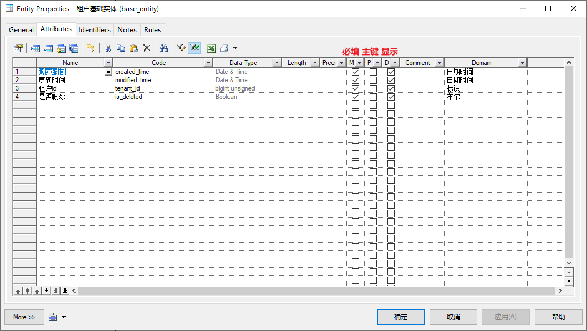
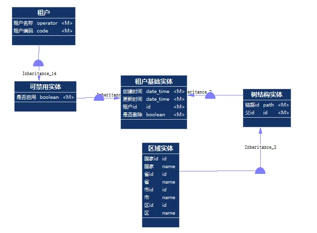
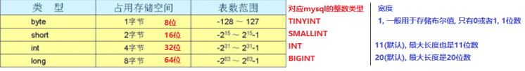
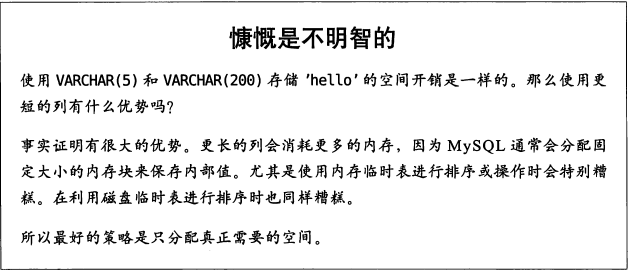
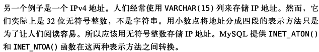
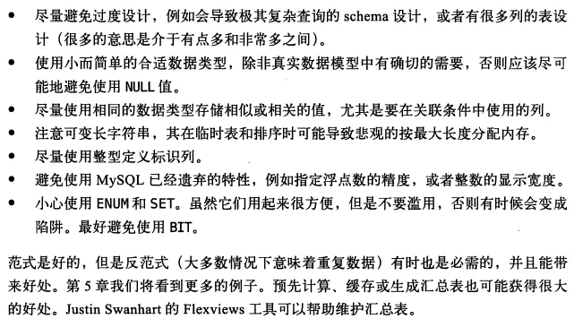

# PowerDesign简易教程

## 维护库表

版本 ：16.5.0.3982 (`Help`->`About PowerDesigner`, 项目组成员的PowerDesigner版本必须一致).

注意：添加字段前需要和组内成员沟通，确认此前修改的文件必须提交才能继续操作.


### cdm概念模型操作流程

1. 新建cdm, `Workspace`->`New`->`Conceptual Data Model`->输入名称
2. 划分cdm模块, 比如公共模块(存放租户, 基础, 启用等实体), 基础模块(存放用户, 角色等通用实体), 各业务模块等.
3. 添加实体维护字段, 右侧 `Toolbox`->`Entity`选中并添加, 双击选中 `Entity`, 维护 `General`面板中的 `Name`, `Code`, 维护 `Attributes`面板中的字段, 示例如下



4. 建立实体之间的继承关系, 右侧 `Toolbox`->Inheritance选中, 然后在面板中由子实体连向父实体, 如下示例



5. 维护字段的域, 域可以定义检查约束、取值范围、最大值、最小值、默认值等. 顶栏 `Model`->`Domains`列出所有域, 新添字段时, 优先使用已存在的域, 若没有对应类型则需要先维护域, 再维护字段, 常见的域如下示例


| Name     | Code          | Data Type                  | Length | Precision | M |
| -------- | ------------- | -------------------------- | ------ | --------- | - |
| json     | json          | Variable characters (2048) | 2,048  |           |   |
| md5      | md5           | Variable characters (32)   | 32     |           |   |
| url      | url           | Variable characters (500)  | 500    |           |   |
| 人名     | operator      | Variable characters (20)   | 20     |           |   |
| 令牌     | token         | Variable characters (100)  | 100    |           |   |
| 优先级   | priority      | Short integer              |        |           |   |
| 加密字段 | encrypt_field | Variable characters (500)  | 500    |           |   |
| 名称     | name          | Variable characters (50)   | 50     |           |   |
| 地址     | address       | Variable characters (1500) | 1,500  |           |   |
| 密码     | password      | Variable characters (100)  | 100    |           | X |
| 布尔     | boolean       | Boolean                    |        |           | X |
| 数量     | quantity      | Integer                    |        |           |   |
| 日期     | date          | Date                       |        |           |   |
| 日期时间 | date_time     | Date & Time                |        |           |   |
| 时间     | time          | Time                       |        |           |   |
| 枚举     | enum          | tinyint unsigned           |        |           |   |
| 标识     | id            | bigint unsigned            |        |           | X |
| 版本     | version       | Integer                    |        |           |   |
| 电话     | telephone     | Variable characters (50)   | 50     |           |   |
| 百分比   | percentage    | tinyint unsigned           |        |           |   |
| 短备注   | remark        | Variable characters (100)  | 100    |           |   |
| 编码     | code          | Variable characters (50)   | 50     |           |   |
| 路径     | path          | Variable characters (100)  | 100    |           |   |
| 邮箱     | email         | Variable characters (100)  | 100    |           |   |
| 金额     | price         | Decimal (15,4)             | 15     | 4         |   |
| 长备注   | long_remark   | Variable characters (500)  | 500    |           |   |

6. 生成pdm, 顶栏 `Tools`->`Generate Physical Data Model`选择对应的数据库以及版本


### pdm物理模型操作流程

1. 确认物理模型的表以及字段添加成功
2. 生成备注,  顶栏 `Tools`-->`Execute Commands`-->`Edit/Run Scripts`, 执行name2comment脚本

```Java
Option   Explicit   
ValidationMode   =   True   
InteractiveMode   =   im_Batch  
  
Dim   mdl   '   the   current   model  
  
'   get   the   current   active   model   
Set   mdl   =   ActiveModel   
If   (mdl   Is   Nothing)   Then   
      MsgBox   "There   is   no   current   Model "   
ElseIf   Not   mdl.IsKindOf(PdPDM.cls_Model)   Then   
      MsgBox   "The   current   model   is   not   an   Physical   Data   model. "   
Else   
      ProcessFolder   mdl   
End   If  
  
'   This   routine   copy   name   into   comment   for   each   table,   each   column   and   each   view   
'   of   the   current   folder   
Private   sub   ProcessFolder(folder)   
      Dim   Tab   'running     table   
      for   each   Tab   in   folder.tables   
            if   not   tab.isShortcut   then   
                  tab.comment   =   tab.name   
                  Dim   col   '   running   column   
                  for   each   col   in   tab.columns   
                        col.comment=   col.name   
                  next   
            end   if   
      next  
  
      Dim   view   'running   view   
      for   each   view   in   folder.Views   
            if   not   view.isShortcut   then   
                  view.comment   =   view.name   
            end   if   
      next  
  
      '   go   into   the   sub-packages   
      Dim   f   '   running   folder   
      For   Each   f   In   folder.Packages   
            if   not   f.IsShortcut   then   
                  ProcessFolder   f   
            end   if   
      Next   
end   sub
```

3. 生成sql脚本, 顶栏 `Database`->`Generate Database`, 在General面板确认生成的文件名以及路径, 在Format面板勾选：`Generate name in empty comment`，编码类型为：`UTF-8`, 在 `Selection`面板确认选择的表, 在 `Preview`一栏确认是否有生成注释, 点击确认即可


## 基本规范

### 维护流程

1. 先维护cdm, 再生成pdm, cdm以及pdm文件需一同做版本管理
2. 表必须指定主键索引, 编码必须指定唯一索引, 布尔值需考虑非空约束, 新建表同时需考虑建立普通索引

### 字段设计规范

* 所有标识符均采用小写，各单词之间用下划线隔开，长度不超过30
* 同一字段在各表的名称、类型必须一致
* 树形结构表添加cid字段记录层次数据，添加parent_id记录上级数据
* 默认使用innodb引擎
* 默认使用UTF-8编码
* 数字类型均不允许为NULL
* 单据表采用乐观锁解决并发问题，统一增加version字段

### 类型命名规范

* 主键：表名_id，无符号bigint
* 枚举： tinyint(3)
* 金额：decimal(15,4)
* 布尔值：tinyint(1)，is_开头，默认值为0
* 日期：date，_date结尾
* 带时间日期：datetime，_time结尾
* 普通字符串：varchar
* 汉字字符串：nvarchar

### 常用字段命名规范

* 金额：_amount结尾
* 价格：_price结尾
* 数量：_quantity结尾
* 备注：remark
* 是否作废：is_invalid
* 计划数量：plan_quantity
* 锁定数量：lock_quantity
* 出库数量：out_quantity
* 入库数量：in_quantity

## 理论补充

### Schema与数据类型优化

注: 内容来源为《高性能MYSQL》对应章节

#### 选择优化的数据类型

1. 更小的通常更好， 因为它们占用更少的磁盘，内存和CPU缓存，并且处理时需要的CPU周期也更少
2. 简单就好， 例如，整形比字符操作代价更低，因为字符集和校对规则使字符比较比整形比较更麻烦
3. 尽量避免使用null， 因为查询中包含可为null的列， 对mysql更难优化，可为null的列使得索引，索引统计和值比较都更复杂，可为null的列会使用更多的存储空间，在mysql里也需要特殊处理，当可为null的列被索引时，每个索引的记录需要一个额外的字节。

##### 整数类型

* TINYINT, SMALLINT, MEDIUMINT, INT, BIGINT, 分别使用8，16， 24， 32, 64位存储空间
* 整数类型可选的有UNSIGNED（无符号）属性，表示不允许负值，这大致可以使正数的上限提高一倍，比如TINYINT的存储范围是-128-127，TINYINT UNSIGNED的存储范围是0-255；有符号和无符号类型使用相同的存储空间，并具有相同的性能，因此可以根据实际情况选择合适的类型
* mysql可以为整数类型指定宽度，比如INT(11), 对大多数应用这是没有意义的，它不会限制值的合法范围，只是规定了mysql的一些交互工具（比如命令行客户端）用来显示字符的个数，对于存储和计算来说，INT(1)和INT(20)是相同的

与java中数据类型对应



因此通用设计为**TINYINT(1)存储布尔, TINYINT(3)存储枚举, ** **INT**  **(11)存储Integer类型, BIGINT(20)存储Long类型** .

##### 实数类型

* 实数是带有小数部分的数字, 也可以用DECIMAL存储比BIGINT还大的整数.
* FLOAT和DOUBLE类型支持使用标准的浮点类型进行近似运算, DECIMAL类型用于存储精确的小数, 在mysql5.0和更高版本, DECIMAL类型支持精确计算.
* 浮点和DECIMAL类型都可以指定精度, 对于DECIMAL列, 可以指定小数点前后允许的最大位数. 例如DECIMAL(18,9)小数点两边各存9个数字, 占9个字节, 小数点本身占一个字节
* 因为需要额外的空间和计算开销, 所以应该尽量只在对小数进行精确计算时才使用DECIMAL, 例如存储财务数据, 但在数据量比较大的时候, 可以考虑使用BIGINT代替DECIMAL, 例如要存储财务数据精确到万分之一分, 则可以把所有金额乘以一百万, 然后将结果存在BIGINT里, 这样可以同时避免浮点数存储计算不精确和DICEMAL精确计算代价高的问题

##### 字符串类型

* VARCHAR类型用于存储可变长字符串, 比定长更节省空间, 因为它仅使用必要的空间.

适合使用VARCHAR的情况: 字符串列的最大长度比平均长度大很多, 列的更新很少, 所以碎片不是问题; 使用了像UTF-8这样复杂的字符集,  每个字符都使用不同的字节数进行存储

* CHAR类型是定长的, MYSQL总根据定义的长度分配足够的空间

适合存储很短的字符串, 或者所有值都接近同一个长度, 例如, CHAR非常适合存储密码的MD5值, 对于经常变更的数据, CHAR也比VARCHAR更好, 因为定长的CHAR类型不容易产生碎片, 对于非常短的列, CHAR也比VARCHAR在存储空间上更有效率



* BLOB和TEXT类型, 都是为存储很大的数据而设计的字符串数据类型, 分别采用二进制和字符方式存储.

##### 日期和时间类型

保存日期和时间时, 使用DATETIME还是TIMESTAMP

* DATETIME

能保存大范围的值, 从1001年到9999年, 精度为秒. 它将日期和时间封装到格式为YYYYMMDDHHMMSS的整数中, 与时区无关. 使用8个字节的存储空间. 默认情况下, MYSQL以一种可排序的无歧义的格式显示DATETIME的值, 比如"2008-01-05 22:12:12";

* TIMESTAMP

保存了从1970年1月1日午夜以来的秒数, 它和UNIX时间戳相同. 只使用4个字节的存储空间, 因此存储范围比DATETIME小得多, 只能表示从1970年到2038年.TIMESTAMP显示的值依赖于时区, MYSQL服务器, 操作系统以及客户端连接都有时区设置. 此外, TIMESTAMP列默认为NOT NULL, 插入记录时, MYSQL默认会更新第一个TIMESTAMP列的值.

除了特殊行为之外, 通常应该尽量使用TIMESTAMP, 因为它比DATETIME空间效率更高.

##### 位数据类型

* BIT, MYSQL将BIT当做字符串处理, 但是在数字上下文的场景中检索时, 却是将位字符串转换成数字. 对于大部分应用, 最好避免使用这种类型
* SET, 如果要保存很多的true/false值, 可以考虑合并这些列到一个SET数据类型, 它在MYSQL内部是以一系列打包的位的集合来表示的; 另一种替代SET的方式是使用一个整数来包装一系列的位, 例如可以将8个位包装到一个TINYINT中, 并且按位操作来使用

##### 特殊数据类型

某些类型的数据并不直接与内置类型一致



#### 范式和反范式

三大范式:

1.第一范式（1NF）列不可再分

2.第二范式（2NF）属性完全依赖于主键

3.第三范式（3NF）属性不依赖于其它非主属性, 属性直接依赖于主键

范式的优点:

* 范式化的更新操作通常比反范式要快
* 当数据被较好的范式化时, 就只有很少或者没有重复数据, 所以只需要修改更少的数据
* 范式化的表通常更小, 所以放到内存中操作更快
* 很少有多余的数据意味着很少的DISTINCT或GROUP BY语句

范式的缺点:

* 稍微复杂一点的查询语句通常都要关联, 不但代价昂贵, 也可能使一些索引策略失效

**总结**



### MYSQL索引失效的场景

参考: [https://blog.csdn.net/wuseyukui/article/details/72312574](https://blog.csdn.net/wuseyukui/article/details/72312574)
