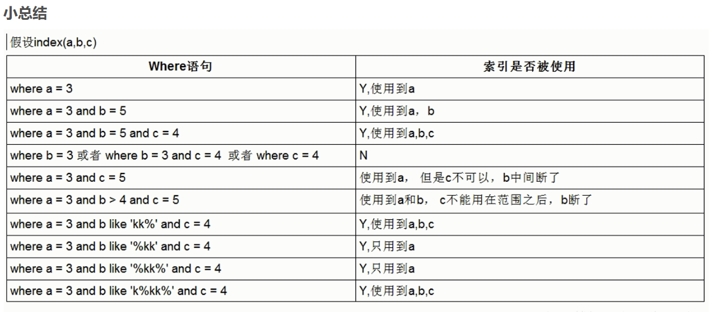

# 索引

## 概念

参考: [https://juejin.im/post/5b17ef6a6fb9a01e8564210e](https://juejin.im/post/5b17ef6a6fb9a01e8564210e)

索引(Index)是帮助MySQL高效获取数据的数据结构. Mysql索引主要有两种结构：B+Tree索引和Hash索引。我们平常所说的索引，如果没有特别指明，一般都是指B树结构组织的索引(B+Tree索引).

解释查询结果

* id: id相同,执行顺序由上而下; id不同,值越大越先被执行
* select_type
  * SIMPLE： 表示此查询不包含 UNION 查询或子查询
  * PRIMARY： 表示此查询是最外层的查询
  * SUBQUERY： 子查询中的第一个 SELECT
  * UNION： 表示此查询是 UNION 的第二或随后的查询
  * DEPENDENT UNION： UNION 中的第二个或后面的查询语句, 取决于外面的查询
  * UNION RESULT, UNION 的结果
  * DEPENDENT SUBQUERY: 子查询中的第一个 SELECT, 取决于外面的查询. 即子查询依赖于外层查询的结果.
  * DERIVED：衍生，表示导出表的SELECT（FROM子句的子查询）
* table: table表示查询涉及的表或衍生的表
* **type**
  * system: 表中只有一条数据， 这个类型是特殊的 const 类型。
  * const: 针对主键或唯一索引的等值查询扫描，最多只返回一行数据。 const 查询速度非常快， 因为它仅仅读取一次即可。例如下面的这个查询，它使用了主键索引，因此 type 就是 const 类型的：explain select * from user_info where id = 2；
  * eq_ref: 此类型通常出现在多表的 join 查询，表示对于前表的每一个结果，都只能匹配到后表的一行结果。并且查询的比较操作通常是 =，查询效率较高。例如：explain select * from user_info, order_info where user_info.id = order_info.user_id;
  * ref: 此类型通常出现在多表的 join 查询，针对于非唯一或非主键索引，或者是使用了 最左前缀 规则索引的查询。例如下面这个例子中， 就使用到了 ref 类型的查询：explain select * from user_info, order_info where user_info.id = order_info.user_id AND order_info.user_id = 5
  * range: 表示使用索引范围查询，通过索引字段范围获取表中部分数据记录。这个类型通常出现在 =, <>, >, >=, <, <=, IS NULL, <=>, BETWEEN, IN() 操作中。例如下面的例子就是一个范围查询：explain select * from user_info  where id between 2 and 8；
  * index: 表示全索引扫描(full index scan)，和 ALL 类型类似，只不过 ALL 类型是全表扫描，而 index 类型则仅仅扫描所有的索引， 而不扫描数据。index 类型通常出现在：所要查询的数据直接在索引树中就可以获取到, 而不需要扫描数据。当是这种情况时，Extra 字段 会显示 Using index。
  * ALL: 表示全表扫描，这个类型的查询是性能最差的查询之一。通常来说， 我们的查询不应该出现 ALL 类型的查询，因为这样的查询在数据量大的情况下，对数据库的性能是巨大的灾难。 如一个查询是 ALL 类型查询， 那么一般来说可以对相应的字段添加索引来避免。

通常来说, 不同的 type 类型的性能关系如下:

ALL < index < range ~ index_merge < ref < eq_ref < const < system

ALL 类型因为是全表扫描， 因此在相同的查询条件下，它是速度最慢的。而 index 类型的查询虽然不是全表扫描，但是它扫描了所有的索引，因此比 ALL 类型的稍快.后面的几种类型都是利用了索引来查询数据，因此可以过滤部分或大部分数据，因此查询效率就比较高了。

* possible_keys: 它表示 mysql 在查询时，可能使用到的索引。
* **key** : 此字段是 mysql 在当前查询时所真正使用到的索引.
* key_len: 表示查询优化器使用了索引的字节数，这个字段可以评估组合索引是否完全被使用。
* ref: 这个表示显示索引的哪一列被使用了，如果可能的话,是一个常量。
* **rows** : rows 也是一个重要的字段，mysql 查询优化器根据统计信息，估算 sql 要查找到结果集需要扫描读取的数据行数，这个值非常直观的显示 sql 效率好坏， 原则上 rows 越少越好。可以对比key中的例子，一个没建立索引钱，rows是9，建立索引后，rows是4。
* extra
  * using filesort ：表示 mysql 需额外的排序操作，不能通过索引顺序达到排序效果。一般有 using filesort都建议优化去掉，因为这样的查询 cpu 资源消耗大。
  * using index：覆盖索引扫描，表示查询在索引树中就可查找所需数据，不用扫描表数据文件，往往说明性能不错。
  * using temporary：查询有使用临时表, 一般出现于排序， 分组和多表 join 的情况， 查询效率不高，建议优化。
  * using where ：表名使用了where过滤。

---

## 相关SQL

参考: [https://www.cnblogs.com/xu-xiaofeng/p/7673776.html](https://www.cnblogs.com/xu-xiaofeng/p/7673776.html)

* 创建索引
  * 普通索引

create index **#idx_name** on **#table_name** ( **#column_list** )

* 唯一索引

create unique index **#udx_name** on **#table_name** ( **#column_list** )

* 删除索引

drop index **#idx_name** on **#table_name**

---

## 联合索引最左匹配原则

对于复合索引（多列b+tree，使用多列值组合而成的b+tree索引）。遵循最左侧原则，从左到右的使用索引中的字段，一个查询可以只使用索引中的一部份，但只能是最左侧部分。例如索引是key index (a,b,c). 可以支持a  a,b a,b,c 3种组合进行查找，但不支持 b,c进行查找。当使用最左侧字段时，索引就十分有效。

联合索引的使用在写where条件的顺序无关，mysql查询分析会进行优化而使用索引。但是减轻查询分析器的压力，最好和索引的从左到右的顺序一致。

---

## 索引失效的场景?

> 参考: https://blog.csdn.net/wuseyukui/article/details/72312574

* 没有命中最左匹配原则: 带头索引不能死, 中间索引不能断

- 索引列存在计算, 函数, 自动/手动类型转换

- 联合索引, 当中间列是范围查询时, 其右侧的列是走不了索引的; 因为右侧的列的索引有序性已经被中间的范围查询打破, 只能逐行匹配

- 索引字段使用!=或<>

- 索引字段使用is null或is not null

- 索引字段使用like '%字符串'; 使用覆盖索引可以解决失效

- 索引字段是字符串, 但查询时不加单引号

- 使用or; 可以改为union

