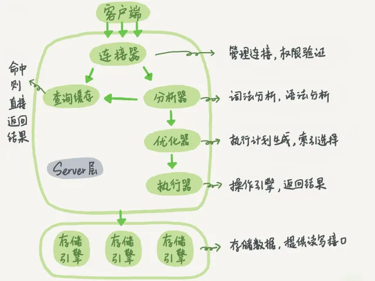
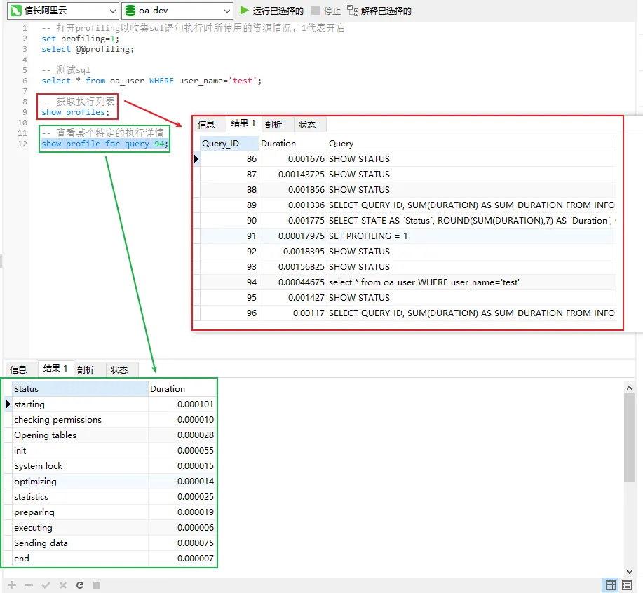
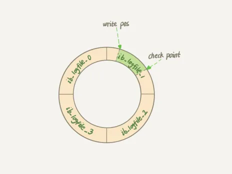
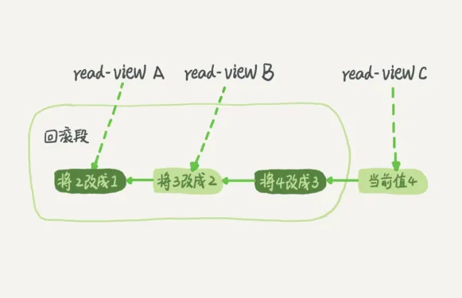
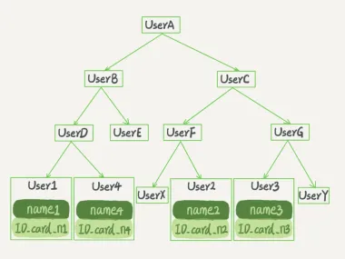
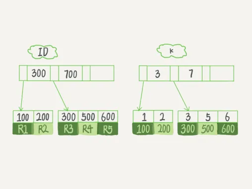
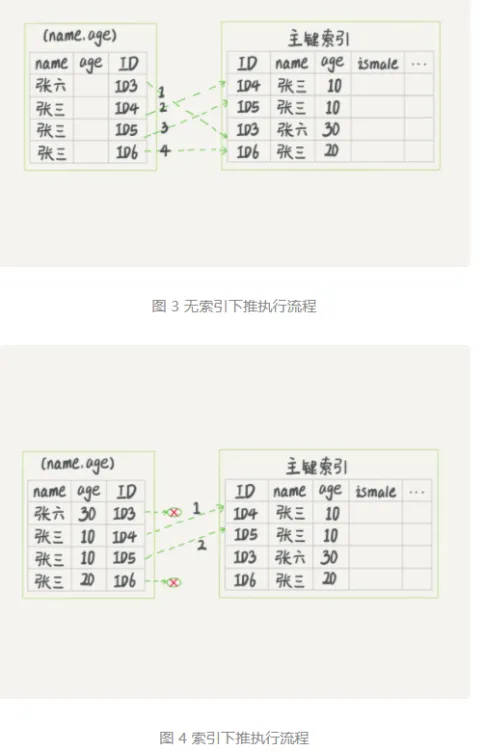

## SQL查询语句的执行过程

MySQL 可以分为 Server 层和存储引擎层两部分。

* Server 层包括连接器、查询缓存、分析器、优化器、执行器等，涵盖 MySQL 的大多数核心服务功能，以及所有的内置函数（如日期、时间、数学和加密函数等），所有跨存储引擎的功能都在这一层实现，比如存储过程、触发器、视图等。
* 存储引擎层负责数据的存储和提取。其架构模式是插件式的，支持 InnoDB、MyISAM、Memory 等多个存储引擎。现在最常用的存储引擎是 InnoDB，它从 MySQL 5.5.5 版本开始成为了默认存储引擎。

  
* 分析SQL执行

```
-- 打开profiling以收集sql语句执行时所使用的资源情况, 1代表开启
set profiling=1;
select @@profiling;

-- 测试sql
select * from oa_user WHERE user_name='test';

-- 获取执行列表
show profiles;

-- 查看某个特定的执行详情, 在Navicat中执行完后可以直接点剖析查看
show profile for query 94;
```



### 连接器建立连接

```
mysql -h$ip -P$port -u$user -p
```

连接器负责跟客户端建立连接、获取权限、维持和管理连接。

认证不对, 报错"Access denied for user"; 认证通过, 连接器会到权限表里面查出你拥有的权限。之后，这个连接里面的权限判断逻辑，都将依赖于此时读到的权限。

* 长连接是指连接成功后，如果客户端持续有请求，则一直使用同一个连接。
* 短连接则是指每次执行完很少的几次查询就断开连接，下次查询再重新建立一个。
* MySQL 在执行过程中临时使用的内存是管理在连接对象里面的。这些资源会在连接断开的时候才释放。所以如果长连接累积下来，可能导致内存占用太大，被系统强行杀掉（OOM），从现象看就是 MySQL 异常重启了。

### 查询缓存

MySQL 8.0 版本直接将查询缓存的整块功能删掉了，也就是说 8.0 开始彻底没有这个功能了

### 分析器, 进行词法分析和语法分析

不对则会报错"You have an error in your SQL syntax"

### 优化器, 决定索引和表连接顺序

优化器是在表里面有多个索引的时候，决定使用哪个索引；或者在一个语句有多表关联（join）的时候，决定各个表的连接顺序。

### 执行器, 调用引擎接口获取结果

开始执行的时候，要先判断一下你对这个表 T 有没有执行查询的权限，如果没有，就会返回没有权限的错误，如下所示 (在工程实现上，如果命中查询缓存，会在查询缓存返回结果的时候，做权限验证。查询也会在优化器之前调用 precheck 验证权限)。

## SQL更新语句的执行过程

同样走上面一遍流程, 此外还有日志处理

redo log(重做日志)--InnoDB 引擎特有的日志

InnoDB 的 redo log 是固定大小的，比如可以配置为一组 4 个文件，每个文件的大小是 1GB，那么这块“粉板”总共就可以记录 4GB 的操作。从头开始写，写到末尾就又回到开头循环写，如下面这个图所示。

write pos 是当前记录的位置，一边写一边后移，写到第 3 号文件末尾后就回到 0 号文件开头。checkpoint 是当前要擦除的位置，也是往后推移并且循环的，擦除记录前要把记录更新到数据文件。

有了 redo log，InnoDB 就可以保证即使数据库发生异常重启，之前提交的记录都不会丢失，这个能力称为 crash-safe。



**binlog(归档日志)--Server层日志**

这两种日志有以下三点不同。

1. redo log 是 InnoDB 引擎特有的；binlog 是 MySQL 的 Server 层实现的，所有引擎都可以使用。
2. ** Redo log不是记录数据页“更新之后的状态”，而是记录这个页 “做了什么改动”。Binlog有两种模式，statement 格式的话是记sql语句， row格式会记录行的内容，记两条，更新前和更新后都有。**
3. redo log 是循环写的，空间固定会用完；binlog 是可以追加写入的。“追加写”是指 binlog 文件写到一定大小后会切换到下一个，并不会覆盖以前的日志。

执行器和 InnoDB 引擎在执行这个简单的 update 语句时的内部流程。

1. 执行器先找引擎取 ID=2 这一行。
2. 执行器拿到引擎给的行数据，把这个值加上 1，再调用引擎接口写入这行新数据。
3. 引擎将这行新数据更新到内存中，同时将这个更新操作记录到 redo log 里面，此时 redo log 处于 prepare 状态。然后告知执行器执行完成了，随时可以提交事务。
4. 执行器生成这个操作的 binlog，并把 binlog 写入磁盘。
5. 执行器调用引擎的提交事务接口，引擎把刚刚写入的 redo log 改成提交（commit）状态，更新完成。

以上两阶段提交协议是为了保证数据的一致性

1 prepare阶段 2 写binlog 3 commit

当在2之前崩溃时

重启恢复：后发现没有commit，回滚。备份恢复：没有binlog 。

一致

当在3之前崩溃

重启恢复：虽没有commit，但满足prepare和binlog完整，所以重启后会自动commit。备份：有binlog. 一致

## 范式和反范式

三大范式:

1.第一范式（1NF）列不可再分

2.第二范式（2NF）属性完全依赖于主键

3.第三范式（3NF）属性不依赖于其它非主属性, 属性直接依赖于主键

范式的优点:

* 范式化的更新操作通常比反范式要快
* 当数据被较好的范式化时, 就只有很少或者没有重复数据, 所以只需要修改更少的数据
* 范式化的表通常更小, 所以放到内存中操作更快
* 很少有多余的数据意味着很少的DISTINCT或GROUP BY语句

范式的缺点:

* 稍微复杂一点的查询语句通常都要关联, 不但代价昂贵, 也可能使一些索引策略失效

## 事务

事务就是一组原子性的sql查询， 或者说一个独立的工作单元。

### 四大特性

事务的ACID特性，**ACID（Atomicity、Consistency、Isolation、Durability，即原子性、一致性、隔离性、持久性）**

* 原子性，一个事务必须被视为一个不可分割的最小工作单元；
* 一致性，数据库总是从一个一致性的状态转换到另一个一致性的状态；
* 隔离性，一个事务所做的修改在提交以前，对其他事务是不可见的；
* 持久性，一旦事务提交，其所做的修改就会永久的保存到数据库中。

### 隔离级别

读未提交是指，一个事务还没提交时，它做的变更就能被别的事务看到。

读提交是指，一个事务提交之后，它做的变更才会被其他事务看到。

可重复读是指， 一个事务执行过程中看到的数据，总是跟这个事务在启动时看到的数据是一致的。 当然在可重复读隔离级别下，未提交变更对其他事务也是不可见的。

串行化，顾名思义是对于同一行记录，“写”会加“写锁”，“读”会加“读锁”。当出现读写锁冲突的时候，后访问的事务必须等前一个事务执行完成，才能继续执行。

### 隔离级别实现原理

在实现上，数据库里面会创建一个视图，访问的时候以视图的逻辑结果为准。 在“可重复读”隔离级别下，这个视图是在事务启动时创建的，整个事务存在期间都用这个视图。在“读提交”隔离级别下，这个视图是在每个 SQL 语句开始执行的时候创建的。 这里需要注意的是，“读未提交”隔离级别下直接返回记录上的最新值，没有视图概念；而“串行化”隔离级别下直接用加锁的方式来避免并行访问。

### 事务实现原理

在 MySQL 中，实际上 每条记录在更新的时候都会同时记录一条回滚操作 。记录上的最新值，通过回滚操作，都可以得到前一个状态的值。

当前值是 4，但是在查询这条记录的时候，不同时刻启动的事务会有不同的 read-view。如图中看到的，在视图 A、B、C 里面，这一个记录的值分别是 1、2、4，同一条记录在系统中可以存在多个版本，就是数据库的多版本并发控制（MVCC）。对于 read-view A，要得到 1，就必须将当前值依次执行图中所有的回滚操作得到。



### 补充:多版本并发控制（MVCC）

不同数据库对MVCC的实现不同，MVCC是行级锁的变种，在很多情况下避免加锁操作，因此开销更低。

MVCC的实现是通过保存数据在某个时间点的快照来实现的， 典型的有乐观并发控制和悲观并发控制。

InnoDB的MVCC是通过在每行记录后面保存两个隐藏的列来实现的。

一个保存行的创建时间，一个保存行的删除时间

存储的不是时间值，存储的是系统版本号，每开始一个新的事务，系统版本号都会递增， 事务开始时刻的系统版本号会作为事务的版本号，用来和查询到每行记录的版本号进行比较

SELECT

* 只查版本号早于当前事务版本的数据行，确保事务读取的行，要么是事务开始前已经存在的， 要么是事务自身插入或修改过的
* 行的删除版本要么未定义，要么大于当前事务版本号，确保事务读取的行，在事务开始之前未被删除

INSERT

* 为新插入的一行保存当前系统版本号作为行版本号

DELETE

* 为删除的每一行保存当前系统版本号作为行删除标识

UPDATE

* 为插入的一行新记录保存当前系统版本号作为行版本号， 同时保存当前系统版本号到原来的行作为行删除标识

MVVC只在可重复读和读已提交两个隔离级别下工作， 因为读未提交总是读取最新的数据， 串行化则会对所有读取的行加锁。


## 索引

### 常见索引类型

搜索树

二叉搜索树的特点是：父节点左子树所有结点的值小于父节点的值，右子树所有结点的值大于父节点的值。树可以有二叉，也可以有多叉。多叉树就是每个节点有多个儿子，儿子之间的大小保证从左到右递增。

 二叉树是搜索效率最高的， 但是实际上大多数的数据库存储却并不使用二叉树。其原因是，索引不止存在内存中，还要写到磁盘上。 为了让一个查询尽量少地读磁盘，就必须让查询过程访问尽量少的数据块。那么，我们就不应该使用二叉树，而是要使用“N 叉”树。 这里，“N 叉”树中的“N”取决于数据块的大小。

N 叉树由于在读写上的性能优点，以及适配磁盘的访问模式，已经被广泛应用在数据库引擎中了。




### InnoDB的索引模型

在 InnoDB 中，表都是根据主键顺序以索引的形式存放的，这种存储方式的表称为索引组织表。又因为前面我们提到的，InnoDB 使用了 B+ 树索引模型，所以数据都是存储在 B+ 树中的。每一个索引在 InnoDB 里面对应一棵 B+ 树。

假设，我们有一个主键列为 ID 的表，表中有字段 k，并且在 k 上有索引。这个表的建表语句是：

```

mysql> create table T(
id int primary key, 
k int not null, 
name varchar(16),
index (k))engine=InnoDB;
```

表中 R1~R5 的 (ID,k) 值分别为 (100,1)、(200,2)、(300,3)、(500,5) 和 (600,6)，两棵树的示例示意图如下。



从图中不难看出，根据叶子节点的内容，索引类型分为主键索引和非主键索引。

* 主键索引的叶子节点存的是整行数据。在 InnoDB 里，主键索引也被称为聚簇索引（clustered index）。
* 非主键索引的叶子节点内容是主键的值。在 InnoDB 里，非主键索引也被称为二级索引（secondary index）。

根据上面的索引结构说明，我们来讨论一个问题：基于主键索引和普通索引的查询有什么区别？

* 如果语句是 select * from T where ID=500，即主键查询方式，则只需要搜索 ID 这棵 B+ 树；
* 如果语句是 select * from T where k=5，即普通索引查询方式，则需要先搜索 k 索引树，得到 ID 的值为 500，再到 ID 索引树搜索一次。这个过程称为 回表 。

也就是说， 基于非主键索引的查询需要多扫描一棵索引树 。因此，我们在应用中应该尽量使用主键查询。


### 索引维护

B+ 树为了维护索引有序性，在插入新值的时候需要做必要的维护。

以上面这个图为例，如果插入新的行 ID 值为 700，则只需要在 R5 的记录后面插入一个新记录。如果新插入的 ID 值为 400，就相对麻烦了，需要逻辑上挪动后面的数据，空出位置。而更糟的情况是，如果 R5 所在的数据页已经满了，根据 B+ 树的算法，这时候需要申请一个新的数据页，然后挪动部分数据过去。这个过程称为 页分裂 。

在这种情况下，性能自然会受影响。 除了性能外，页分裂操作还影响数据页的利用率。 原本放在一个页的数据，现在分到两个页中，整体空间利用率降低大约 50%。

**当然有分裂就有合并。**当相邻两个页由于删除了数据，利用率很低之后，会将数据页做合并。合并的过程，可以认为是分裂过程的逆过程。

案例: 主键

1. 要自增, 每次插入一条新记录，都是追加操作，都不涉及到挪动其他记录，也不会触发叶子节点的分裂。
2. 主键长度越小，普通索引的叶子节点就越小，普通索引占用的空间也就越小。

用业务字段直接做主键的场景:

* 只有一个索引；
* 该索引必须是唯一索引。(由于没有其他索引，所以也就不用考虑其他索引的叶子节点大小的问题。)

### 覆盖索引

如果查询条件使用的是普通索引（或是联合索引的最左原则字段），查询结果是联合索引的字段或是主键，不用回表操作，直接返回结果，减少IO磁盘读写读取正行数据

由于覆盖索引可以减少树的搜索次数，显著提升查询性能(避免回表)，所以使用覆盖索引是一个常用的性能优化手段

示例: 在一个市民信息表上，是否有必要将身份证号和名字建立联合索引？

```sql
CREATE TABLE `tuser` (
  `id` int(11) NOT NULL,
  `id_card` varchar(32) DEFAULT NULL,
  `name` varchar(32) DEFAULT NULL,
  `age` int(11) DEFAULT NULL,
  `ismale` tinyint(1) DEFAULT NULL,
  PRIMARY KEY (`id`),
  KEY `id_card` (`id_card`),
  KEY `name_age` (`name`,`age`)
) ENGINE=InnoDB
```

如果有根据身份证号查询市民信息的需求，我们只要在身份证号字段上建立索引就够了。

如果现在有一个高频请求，要根据市民的身份证号查询他的姓名，这个联合索引就有意义了。它可以在这个高频请求上用到覆盖索引，不再需要回表查整行记录，减少语句的执行时间。


### 最左前缀原则

B+ 树这种索引结构，可以利用索引的“最左前缀”，来定位记录。

最左前缀可以是联合索引的最左 N 个字段，也可以是字符串索引的最左 M 个字符。

**在建立联合索引的时候，**如何安排索引内的字段顺序。

**这里我们的评估标准是，索引的复用能力。因为可以支持最左前缀，所以当已经有了 (a,b) 这个联合索引后，一般就不需要单独在 a 上建立索引了。因此，**第一原则是，如果通过调整顺序，可以少维护一个索引，那么这个顺序往往就是需要优先考虑采用的。

### 索引下推

MySQL 5.6 引入的索引下推优化（index condition pushdown)， 可以在索引遍历过程中，对索引中包含的字段先做判断，直接过滤掉不满足条件的记录，减少回表次数。



图 4 跟图 3 的区别是，InnoDB 在 (name,age) 索引内部就判断了 age 是否等于 10，对于不等于 10 的记录，直接判断并跳过。在我们的这个例子中，只需要对 ID4、ID5 这两条记录回表取数据判断，就只需要回表 2 次。


## 全局锁和表锁
