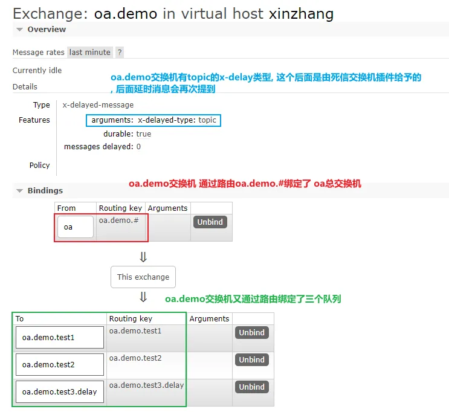
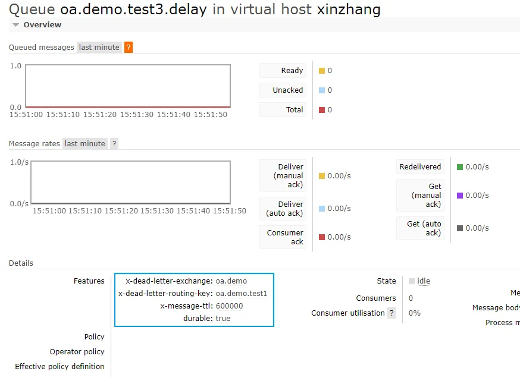
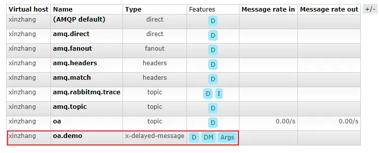

# RabbitMQ实践


示例项目地址:
[https://git.code.tencent.com/xinzhang0618/oa2.git](https://git.code.tencent.com/xinzhang0618/oa2.git)
feature/xinzhang_rabbitmq分支
参考文档:
mq概念(这俩篇必读):
[https://www.yuque.com/fvy7xd/xinzhang/toi6on](https://www.yuque.com/fvy7xd/xinzhang/toi6on)
[https://www.yuque.com/fvy7xd/xinzhang/if5xfk](https://www.yuque.com/fvy7xd/xinzhang/if5xfk)
**延时队列: **[https://zhuanlan.zhihu.com/p/130417736](https://zhuanlan.zhihu.com/p/130417736)
**基本使用: **[https://zhuanlan.zhihu.com/p/265732383](https://zhuanlan.zhihu.com/p/265732383)


## 思路

rabbitmq的玩法比较丰富, 包括但不限于: 异步, 微服务通信, 多线程处理提高性能, 延时等.
**难点在于一是本身的概念配置丰富, 二是不同的业务场景玩法比较花, 本篇着重于梳理mq的最佳简易配置, 并指出各功能点针对的应用场景. **
在看本篇之前, 建议熟悉rabbitmq中概念, 并熟悉基本使用.

## 解析

部署略, 注意:
1. 需要添加管理界面用户
2. 启动管理插件
3. 安装并启用死信交换机插件
4. 当exchange/queue为durable时,** 若有配置变更, 需要删掉原来的使程序重新生成**

**常用命令**

```
- rabbitmqctl 
rabbitmqctl --help 查看帮助
rabbitmqctl status 查看状态
rabbitmqctl shutdown/stop/stop_app 停止
rabbitmqctl start_app 启动

- rabbitmq-plugins  
rabbitmq-plugins --help 查看帮助
rabbitmq-plugins list 查看插件列表
rabbitmq-plugins enable <pluginName> 启用插件
rabbitmq-plugins disable <pluginName> 禁用插件

部署补充:
1.需启用管理插件, rabbitmq_plugins enable rabbitmq_management
2.需安装并启用死信交换机插件 
- 上 https://www.rabbitmq.com/community-plugins.html 找 rabbitmq_delayed_message_exchange
- 下载rabbitmq_delayed_message_exchange-3.8.0.ez扔到/usr/lib/rabbitmq/plugins/下
- 启用rabbitmq-plusgins enable rabbitmq_delayed_message_exchange

```


### 配置
注: 示例项目为单体多模块, 交换机都使用topic类型, 项目结构如下图

#### 依赖
oa-core, oa-consumer, oa-biz三个模块都需配置
```
 <dependency>
            <groupId>org.springframework.boot</groupId>
            <artifactId>spring-boot-starter-web</artifactId>
        </dependency>
        <dependency>
            <groupId>org.springframework.boot</groupId>
            <artifactId>spring-boot-starter-amqp</artifactId>
        </dependency>
        <dependency>
            <groupId>org.springframework.boot</groupId>
            <artifactId>spring-boot-starter-test</artifactId>
        </dependency>
        <dependency>
            <groupId>com.alibaba</groupId>
            <artifactId>fastjson</artifactId>
        </dependency>
```
#### 基础配置
以下配置都在oa-core模块下, 这部分主要是对mq的通用配置以及template的封装

Message抽象类, 包含优先级, 延迟分钟, 租户等属性, 具体实现类需要指定交换机以及路由key
```
package top.xinzhang0618.oa.amqp;


import top.xinzhang0618.oa.BizContext;

/**
 * MQ消息抽象类 实现类需要提供消息发送的exchange，避免发送到默认exchange 实现类需要提供消息的routingKey，用于消息路由
 */
public abstract class Message {

    /**
     * 优先级
     */
    private Integer priority;
    /**
     * 延迟分钟
     */
    private Integer delayMinutes;
    /**
     * 租户ID
     */
    private Long tenantId;

    public Message() {
        this.tenantId = BizContext.getTenantId();
    }

    public Long getTenantId() {
        return tenantId;
    }

    public void setTenantId(Long tenantId) {
        this.tenantId = tenantId;
    }

    public Integer getPriority() {
        return priority;
    }

    public void setPriority(Integer priority) {
        this.priority = priority;
    }

    public Integer getDelayMinutes() {
        return delayMinutes;
    }

    public void setDelayMinutes(Integer delayMinutes) {
        this.delayMinutes = delayMinutes;
    }

    /**
     * 返回消息对应的路由器
     *
     * @return ExchangeName
     */
    public String exchange() {
        return "oa";
    }

    /**
     * 返回消息路由键
     *
     * @return RoutingKey
     */
    public abstract String routingKey();

    @Override
    public String toString() {
        return "Message{" +
                "priority=" + priority +
                ", delayMinutes=" + delayMinutes +
                ", tenantId=" + tenantId +
                '}';
    }
}
```
MqProducer消息发布接口
```
package top.xinzhang0618.oa.amqp;

import java.util.Collection;

/**
 * 消息生产者.
 */
public interface MqProducer {

  /**
   * 发送消息.
   */
  void send(Message message);

  /**
   * 批量发送消息.
   */
  void send(Collection<? extends Message> messages);
}

```
RabbitMqProducer, rabbitmq消息发布的实现
注意: 这里包装了一层SpringEvent来处理mq事务(是否性能更佳存疑...)
rabbbitmq的事务: https://blog.csdn.net/u013256816/article/details/55515234
applicationEvent事务: https://blog.csdn.net/crowhyc/article/details/96433001
rabbitmq原生事务性能差, 因此不用; ApplicationEvent的消费端注解@TransactionalEventListener默认绑定的监听阶段是 TransactionPhase.AFTER_COMMIT即事务提交后, 如果事务回滚了, 消费端是接收不到消息的.

同时, 也aplicationEvent也解决了"生产端事务未提交, 消费端从数据库中查不到数据"这一问题
```
package top.xinzhang0618.oa.amqp;

import org.springframework.amqp.rabbit.core.RabbitTemplate;
import org.springframework.beans.factory.annotation.Autowired;
import org.springframework.boot.autoconfigure.condition.ConditionalOnBean;
import org.springframework.context.ApplicationEventPublisher;
import org.springframework.stereotype.Component;
import org.springframework.transaction.event.TransactionalEventListener;
import top.xinzhang0618.oa.Assert;

import javax.annotation.Resource;
import java.util.Collection;
import java.util.List;

/**
 * 消息模板包装类.
 * 这里利用applicationEvent的事务来取代rabbitmq的事务
 */
@Component
@ConditionalOnBean(RabbitTemplate.class)
public class RabbitMqProducer implements MqProducer {

    @Autowired
    private ApplicationEventPublisher applicationEventPublisher;

    /**
     * 发送消息.
     *
     * @param message 消息
     */
    @Override
    public void send(Message message) {
        applicationEventPublisher.publishEvent(new MessageSendingEvent(message.routingKey(), message));
    }

    @Override
    public void send(Collection<? extends Message> messages) {
        messages.forEach(this::send);
    }


    @Component
    public static class RabbitMqMessageSender {

        @Resource
        private RabbitTemplate rabbitTemplate;

        @TransactionalEventListener(fallbackExecution = true, classes = MessageSendingEvent.class)
        public void sendMessage(MessageSendingEvent messageSendingEvent) {
            List<Message> messages = messageSendingEvent.getMessages();
            if (Assert.isEmpty(messages)) {
                return;
            }
            send(messages);
        }

        private void send(Message message) {
            if (message.getPriority() == null && message.getDelayMinutes() == null) {
                rabbitTemplate.convertAndSend(message.exchange(), message.routingKey(), message);
                return;
            }
            rabbitTemplate.convertAndSend(message.exchange(), message.routingKey(), message, msg -> {
                if (message.getPriority() != null) {
                    msg.getMessageProperties().setPriority(message.getPriority());
                }
                if (message.getDelayMinutes() != null) {
                    msg.getMessageProperties().setDelay(1000 * 60 * message.getDelayMinutes());
                }
                return msg;
            });
        }

        private void send(List<Message> messages) {
            messages.forEach(this::send);
        }
    }
}

```
MessageSendingEvent, ApplicationEvent的实现
```
package top.xinzhang0618.oa.amqp;

import org.springframework.context.ApplicationEvent;

import java.util.Arrays;
import java.util.List;

/**
 * 消息事件.
 */
public class MessageSendingEvent extends ApplicationEvent {

  private final List<Message> messages;

  public MessageSendingEvent(Object source, Message... messages) {
    super(source);
    this.messages = Arrays.asList(messages);
  }

  public List<Message> getMessages() {
    return messages;
  }

  @Override
  public String toString() {
    return "MessageSendingEvent{" +
            "messages=" + messages +
            '}';
  }
}
```
另外
BaseMqConfig, 整个项目的总交换机配置
```
package top.xinzhang0618.oa.amqp;

import org.springframework.amqp.core.TopicExchange;
import org.springframework.amqp.rabbit.connection.ConnectionFactory;
import org.springframework.amqp.rabbit.core.RabbitTemplate;
import org.springframework.context.annotation.Bean;
import org.springframework.context.annotation.Configuration;

/**
 * @author xinzhang
 * @date 2021/2/8 14:05
 */
@Configuration
public class BaseMqConfig {
    /**
     * 总交换机.
     */
    private static final String EXCHANGE_OA = "oa";

    /**
     * OA总交换机.
     */
    @Bean
    public TopicExchange oaExchange() {
        return new TopicExchange(EXCHANGE_OA);
    }

    @Bean
    public RabbitTemplate rabbitTemplate(final ConnectionFactory connectionFactory) {
        final RabbitTemplate rabbitTemplate = new RabbitTemplate(connectionFactory);
        rabbitTemplate.setMessageConverter(new FastJson2JsonMessageConverter());
        return rabbitTemplate;
    }
}
```
FastJson2JsonMessageConverter, 序列化转换器, 在BaseMqConfig的生产端rabbitTemplate的Bean中有配置, 消费端的factory也需要配置, 后文会提到
```
package top.xinzhang0618.oa.amqp;

import com.alibaba.fastjson.JSON;
import org.springframework.amqp.core.Message;
import org.springframework.amqp.core.MessageProperties;
import org.springframework.amqp.support.converter.AbstractMessageConverter;
import org.springframework.amqp.support.converter.ClassMapper;
import org.springframework.amqp.support.converter.DefaultClassMapper;
import org.springframework.amqp.support.converter.MessageConversionException;

/**
 * @author xinzhang
 * @date 2021/2/8 11:13
 */
public class FastJson2JsonMessageConverter extends AbstractMessageConverter {
    public static final String DEFAULT_CHARSET = "UTF-8";
    public static final String DEFAULT_CONTENT_TYPE = "application/json";
    private static final ClassMapper CLASS_MAPPER = new FastJson2JsonMessageConverter.FastJsonClassMapper();

    public FastJson2JsonMessageConverter() {
    }

    public ClassMapper getClassMapper() {
        return CLASS_MAPPER;
    }

    @Override
    protected Message createMessage(Object object, MessageProperties messageProperties) {
        byte[] bytes = JSON.toJSONBytes(object);
        messageProperties.setContentType(DEFAULT_CONTENT_TYPE);
        messageProperties.setContentEncoding(DEFAULT_CHARSET);
        messageProperties.setContentLength(bytes.length);
        this.getClassMapper().fromClass(object.getClass(), messageProperties);
        return new Message(bytes, messageProperties);
    }

    @Override
    public Object fromMessage(Message message) throws MessageConversionException {
        Object content = null;
        MessageProperties properties = message.getMessageProperties();
        if (properties != null) {
            String contentType = properties.getContentType();
            if (DEFAULT_CONTENT_TYPE.equals(contentType)) {
                Class<?> targetClass = this.getClassMapper().toClass(message.getMessageProperties());
                content = JSON.parseObject(message.getBody(), targetClass);
            }
        }

        if (content == null) {
            content = message.getBody();
        }

        return content;
    }

    public static class FastJsonClassMapper extends DefaultClassMapper {
        public FastJsonClassMapper() {
            this.setTrustedPackages("*");
        }
    }
}
```
#### 消费端配置
以下配置在oa-consumer模块, 这部分主要是对rabbitmq监听容器的配置

配置文件
```
spring:
	rabbitmq:
    host: 47.94.148.180
    port: 5672
    username: bite
    password: bite
    virtual-host: xinzhang
oa:
  consumer:
    demo:
      exchange:
        concurrent: 5
        maxConcurrent: 10
```
启动类添加注解
```
@EnableAsync
@EnableRabbit
@SpringBootApplication(scanBasePackages = "top.xinzhang0618.oa")
public class ConsumerApplication {

    public static void main(String[] args) {
        SpringApplication.run(ConsumerApplication.class, args);
    }

}
```
ConsumerConfig, 消费端factory配置
注意:
核心参数是prefetchCount, concurrent, maxConcurrent, 后两个从配置文件中读取
factory配置了fastJson序列化
(confirm默认关闭, ack默认开启)这里开启了手动ack, 正常场景直接自动ack就行, ack的应用场景下文会特别提到
```
package top.xinzhang0618.oa.config;

import org.springframework.amqp.core.AcknowledgeMode;
import org.springframework.amqp.rabbit.config.SimpleRabbitListenerContainerFactory;
import org.springframework.amqp.rabbit.connection.ConnectionFactory;
import org.springframework.amqp.rabbit.listener.RabbitListenerContainerFactory;
import org.springframework.beans.factory.annotation.Value;
import org.springframework.context.annotation.Bean;
import org.springframework.context.annotation.Configuration;
import top.xinzhang0618.oa.amqp.FastJson2JsonMessageConverter;

/**
 * @author xinzhang
 * @date 2021/2/8 15:27
 */
@Configuration
public class ConsumerConfig {
    @Value("${oa.consumer.demo.exchange.concurrent:1}")
    private Integer concurrent;
    @Value("${oa.consumer.demo.exchange.maxConcurrent:1}")
    private Integer maxConcurrent;

    @Bean
    public RabbitListenerContainerFactory<?> rabbitListenerContainerFactory(ConnectionFactory connectionFactory) {
        SimpleRabbitListenerContainerFactory factory = new SimpleRabbitListenerContainerFactory();
        factory.setConnectionFactory(connectionFactory);
        factory.setMessageConverter(new FastJson2JsonMessageConverter());
        factory.setAcknowledgeMode(AcknowledgeMode.MANUAL);
        // 参考: https://www.cnblogs.com/throwable/p/13834465.html
        // prefetchCount表示手动ack情况下队列未ack的预取或说阻塞的消息的最大数, 该参数用来使消费端负载均衡, 默认250, 官方推荐30
        factory.setPrefetchCount(30);
        // 并发消费者数, 即开多线程消费, 比如2个consumer则默认单线程即2个channel, 将concurrent设置为5后, 变为10个channel
        factory.setConcurrentConsumers(concurrent);
        factory.setMaxConcurrentConsumers(maxConcurrent);
        return factory;
    }
}

```
AbstractConsumer, consumer基类
作用: 1. 做统一异常以及日志处理;  2. 做手动ack等
```
package top.xinzhang0618.oa.consumer;

import com.alibaba.fastjson.JSON;
import com.rabbitmq.client.Channel;
import org.slf4j.Logger;
import org.slf4j.LoggerFactory;
import top.xinzhang0618.oa.amqp.Message;

import java.io.IOException;

/**
 * @author xinzhang
 * @date 2021/2/19 13:59
 */
public abstract class AbstractConsumer {
    private static final Logger LOGGER = LoggerFactory.getLogger(AbstractConsumer.class);

    protected <T extends Message> void run(T message, final Channel channel, long tag,
                                           Runnable runnable) throws IOException {
        try {
            if (LOGGER.isDebugEnabled()) {
                LOGGER.debug("{}处理消息：{}", this.getClass().getName(), message);
            }
            runnable.run();
            channel.basicAck(tag, false);
        } catch (Exception e) {
            LOGGER.error("消息处理异常！{},{}", this.getClass().getName(), JSON.toJSONString(message));
            LOGGER.error("消息处理异常！", e);
            channel.basicReject(tag, false);
        }
    }
}
```
消费者示例
Test1Consumer
```
package top.xinzhang0618.oa.consumer;

import com.alibaba.fastjson.JSON;
import com.rabbitmq.client.Channel;
import org.springframework.amqp.rabbit.annotation.RabbitHandler;
import org.springframework.amqp.rabbit.annotation.RabbitListener;
import org.springframework.amqp.support.AmqpHeaders;
import org.springframework.messaging.handler.annotation.Header;
import org.springframework.stereotype.Component;
import top.xinzhang0618.oa.amqp.demo.MqConstants;
import top.xinzhang0618.oa.amqp.demo.TestMessage1;
import top.xinzhang0618.oa.amqp.demo.TestMessage3;

import java.io.IOException;
import java.time.LocalDateTime;

/**
 * @author xinzhang
 * @date 2021/2/8 15:10
 */
@Component
@RabbitListener(queues = MqConstants.QUEUE_TEST1)
public class Test1Consumer extends AbstractConsumer {

    @RabbitHandler(isDefault = true)
    public void test(TestMessage1 testMessage1, Channel channel,
                     @Header(AmqpHeaders.DELIVERY_TAG) long tag) throws IOException {
        run(testMessage1, channel, tag, () -> {
            System.out.println("test1队列收到消息了, 消息内容为: " + JSON.toJSON(testMessage1) + ", 消息接收时间为: " + LocalDateTime.now());
        });
    }

    @RabbitHandler
    public void test3(TestMessage3 testMessage3, Channel channel,
                      @Header(AmqpHeaders.DELIVERY_TAG) long tag) throws IOException {
        run(testMessage3, channel, tag, () -> {
            System.out.println("test1队列收到消息了, 消息内容为: " + JSON.toJSON(testMessage3) + ", 消息接收时间为: " + LocalDateTime.now());
        });
    }
}
```
Test2Consumer
```
package top.xinzhang0618.oa.consumer;

import com.alibaba.fastjson.JSON;
import com.rabbitmq.client.Channel;
import org.springframework.amqp.rabbit.annotation.RabbitHandler;
import org.springframework.amqp.rabbit.annotation.RabbitListener;
import org.springframework.amqp.support.AmqpHeaders;
import org.springframework.messaging.handler.annotation.Header;
import org.springframework.stereotype.Component;
import top.xinzhang0618.oa.amqp.demo.MqConstants;
import top.xinzhang0618.oa.amqp.demo.TestMessage2;

import java.io.IOException;
import java.time.LocalDateTime;

/**
 * @author xinzhang
 * @date 2021/2/8 15:10
 */
@Component
@RabbitListener(queues = MqConstants.QUEUE_TEST2)
public class Test2Consumer extends AbstractConsumer {

    @RabbitHandler
    public void test(TestMessage2 testMessage2, Channel channel,
                     @Header(AmqpHeaders.DELIVERY_TAG) long tag) throws IOException {
        run(testMessage2, channel, tag, () -> {
            System.out.println("test2队列收到消息了, 消息内容为: " + JSON.toJSON(testMessage2) + ", 消息接收时间为: " + LocalDateTime.now());
        });
    }
}
```
#### 业务端配置
以下配置在oa-biz模块, 这部分跟业务紧密相关, 主要是业务交换机以及队列的配置

示例配置
DemoMqConfig
```
package top.xinzhang0618.oa.amqp.demo;

import org.springframework.amqp.core.*;
import org.springframework.beans.factory.annotation.Qualifier;
import org.springframework.boot.autoconfigure.condition.ConditionalOnBean;
import org.springframework.context.annotation.Bean;
import org.springframework.context.annotation.Configuration;
import top.xinzhang0618.oa.amqp.BaseMqConfig;

/**
 * 交换机配置
 *
 * @author xinzhang
 * @date 2021/2/8 14:35
 */
@ConditionalOnBean(BaseMqConfig.class)
@Configuration
public class DemoMqConfig {
    /**
     * 示例交换机
     */
    @Bean
    public Exchange demoExchange() {
        return ExchangeBuilder.topicExchange(MqConstants.EXCHANGE_DEMO).delayed().build();
    }

    /**
     * 示例交换机绑定总交换机, routingKey: oa.demo.#
     */
    @Bean
    public Binding demoExchangeBindingOaExchange(@Qualifier("oaExchange") TopicExchange oaExchange,
                                                 @Qualifier("demoExchange") Exchange demoExchange) {
        return BindingBuilder.bind(demoExchange).to(oaExchange).with(MqConstants.EXCHANGE_DEMO_BINDING_KEY);
    }

    /**
     * 测试1队列
     */
    @Bean
    public Queue test1Queue() {
        return QueueBuilder.durable(MqConstants.QUEUE_TEST1).build();
    }

    /**
     * 测试1队列 绑定 demo交换机, routingKey: oms.demo.test1
     */
    @Bean
    public Binding test1QueueBindingDemoExchange(@Qualifier("demoExchange") Exchange demoExchange,
                                                 @Qualifier("test1Queue") Queue test1Queue) {
        return BindingBuilder
                .bind(test1Queue)
                .to(demoExchange)
                .with(MqConstants.QUEUE_TEST1_BINDING_KEY)
                .noargs();
    }

    /**
     * 测试2队列
     */
    @Bean
    public Queue test2Queue() {
        return QueueBuilder.durable(MqConstants.QUEUE_TEST2).build();
    }

    /**
     * 测试2队列 绑定 demo交换机, routingKey: oms.demo.test2
     */
    @Bean
    public Binding test2QueueBindingDemoExchange(@Qualifier("demoExchange") Exchange demoExchange,
                                                 @Qualifier("test2Queue") Queue test1Queue) {
        return BindingBuilder
                .bind(test1Queue)
                .to(demoExchange)
                .with(MqConstants.QUEUE_TEST2_BINDING_KEY)
                .noargs();
    }

    /**
     * 测试3延时队列, 延迟10min
     * 这个队列没有消费者, 消息过期后由死信交换机demo转发至oa.demo.test1
     */
    @Bean
    public Queue test3DelayQueue() {
        return QueueBuilder
                .durable(MqConstants.QUEUE_TEST3_DELAY)
                .withArgument("x-dead-letter-exchange", MqConstants.EXCHANGE_DEMO)
                .withArgument("x-dead-letter-routing-key", MqConstants.QUEUE_TEST1_BINDING_KEY)
                .withArgument("x-message-ttl", 1000 * 60 * 10)
                .build();
    }

    /**
     * 测试3延时队列 绑定 demo交换机, routingKey: oms.demo.test3.delay
     */
    @Bean
    public Binding test3DelayQueueBindingDemoExchange(@Qualifier("demoExchange") Exchange demoExchange,
                                                      @Qualifier("test3DelayQueue") Queue test3DelayQueue) {
        return BindingBuilder
                .bind(test3DelayQueue)
                .to(demoExchange)
                .with(MqConstants.QUEUE_TEST3_DELAY_BINDING_KEY)
                .noargs();
    }
}

```
MqConstants
```
package top.xinzhang0618.oa.amqp.demo;

/**
 * @author xinzhang
 * @date 2021/2/8 14:14
 */
public class MqConstants {

    /**
     * 示例交换机.
     */
    public static final String EXCHANGE_DEMO = "oa.demo";
    public static final String EXCHANGE_DEMO_BINDING_KEY = "oa.demo.#";

    /**
     * 测试队列1
     */
    public static final String QUEUE_TEST1 = "oa.demo.test1";
    public static final String QUEUE_TEST1_BINDING_KEY = "oa.demo.test1";

    /**
     * 测试队列2
     */
    public static final String QUEUE_TEST2 = "oa.demo.test2";
    public static final String QUEUE_TEST2_BINDING_KEY = "oa.demo.test2";

    /**
     * 测试队列3, 延时队列
     */
    public static final String QUEUE_TEST3_DELAY = "oa.demo.test3.delay";
    public static final String QUEUE_TEST3_DELAY_BINDING_KEY = "oa.demo.test3.delay";
}
```
TestMessage1
```
package top.xinzhang0618.oa.amqp.demo;

import top.xinzhang0618.oa.amqp.Message;

/**
 * @author xinzhang
 * @date 2021/2/4 18:15
 */
public class TestMessage1 extends Message {
    private String msg;

    @Override
    public String exchange() {
        return super.exchange();
    }

    @Override
    public String routingKey() {
        return "oa.demo.test1";
    }

    public String getMsg() {
        return msg;
    }

    public void setMsg(String msg) {
        this.msg = msg;
    }

    @Override
    public String toString() {
        return "TestMessage1{" +
                "msg='" + msg + '\'' +
                '}';
    }
}

```
TestMessage2
```
package top.xinzhang0618.oa.amqp.demo;

import top.xinzhang0618.oa.amqp.Message;

/**
 * @author xinzhang
 * @date 2021/2/4 18:15
 */
public class TestMessage2 extends Message {
    private String msg;

    @Override
    public String exchange() {
        return super.exchange();
    }

    @Override
    public String routingKey() {
        return "oa.demo.test2";
    }

    public String getMsg() {
        return msg;
    }

    public void setMsg(String msg) {
        this.msg = msg;
    }

    @Override
    public String toString() {
        return "TestMessage2{" +
                "msg='" + msg + '\'' +
                '}';
    }
}
```
TestMessage3
```
package top.xinzhang0618.oa.amqp.demo;

import top.xinzhang0618.oa.amqp.Message;

/**
 * @author xinzhang
 * @date 2021/2/4 18:15
 */
public class TestMessage3 extends Message {
    private String msg;

    @Override
    public String exchange() {
        return super.exchange();
    }

    @Override
    public String routingKey() {
        return "oa.demo.test3.delay";
    }

    public String getMsg() {
        return msg;
    }

    public void setMsg(String msg) {
        this.msg = msg;
    }

    @Override
    public String toString() {
        return "TestMessage2{" +
                "msg='" + msg + '\'' +
                '}';
    }
}
```
#### 测试
至此， 基础的配置都已完成，后续我们再来针对一个个功能点做分析， 先做简单的消息测试，配置完成后结构如下

启动消费者服务, 发送TestMessage1和TestMessage2, 两个消费者能够正常接收到消息并消费
```
@Test
    public void test() {
        TestMessage1 testMessage1 = new TestMessage1();
        testMessage1.setMsg("这里是test1测试消息, 消息发送时间为: " + LocalDateTime.now());
        TestMessage2 testMessage2 = new TestMessage2();
        testMessage2.setMsg("这里是test2测试消息, 消息发送时间为: " + LocalDateTime.now());
        producer.send(testMessage1);
        producer.send(testMessage2);
    }
-----------------------------
14:35:37.214 DEBUG [SimpleAsyncTaskExecutor-4] t.x.oa.consumer.AbstractConsumer - top.xinzhang0618.oa.consumer.Test1Consumer处理消息：TestMessage1{msg='这里是test1测试消息, 消息发送时间为: 2021-02-19T14:35:37.089'}
test1队列收到消息了, 消息内容为: {"msg":"这里是test1测试消息, 消息发送时间为: 2021-02-19T14:35:37.089"}, 消息接收时间为: 2021-02-19T14:35:37.214
14:35:37.214 DEBUG [SimpleAsyncTaskExecutor-5] t.x.oa.consumer.AbstractConsumer - top.xinzhang0618.oa.consumer.Test2Consumer处理消息：TestMessage2{msg='这里是test2测试消息, 消息发送时间为: 2021-02-19T14:35:37.089'}
test2队列收到消息了, 消息内容为: {"msg":"这里是test2测试消息, 消息发送时间为: 2021-02-19T14:35:37.089"}, 消息接收时间为: 2021-02-19T14:35:37.214
```

### 消息的准确投递问题
oms参考方案如下:
消息全流程: 生产端-->broker-->消费端
● 使用了applicationEvent取代mq事务来保证消息从生产端-->broker的准确投递(若事务回滚则mq不会发送消息)
● 消费端若消费失败
  ○ 利用手动ack对特定异常, 进行消息回队, 等待再次消费
  ○ 利用定时器进行业务补偿, 比如因为缺货或并发导致配货失败, 会有"缺货重配", "定时扫表再次配货"等定时任务

### 发布者确认以及消费者应答
参考文档: https://www.rabbitmq.com/confirms.html
https://www.zhihu.com/question/41976893

发布者确认一般用于事务控制, 默认关闭, 这里没用到
消费者应答默认开启, 这里采用手动ack的方式
ack机制能灵活的控制消息的消费, 拒绝后可以选择性的删除或者重新入队, 比如oms中使用consumer ack来实现
"如果消费端爆出版本异常(乐观锁), 则消息重新入队(后续再被消费), 其余情况则直接丢弃" 这一功能

使用ack示例代码如下:
1. 先打开手动ack
```
factory.setAcknowledgeMode(AcknowledgeMode.MANUAL);
```
2. 在AbstractConsumer中针对特殊异常做处理
```
package com.greatonce.oms.consumer;

import com.greatonce.core.util.JsonUtil;
import com.greatonce.oms.domain.OmsException;
import com.greatonce.oms.domain.SysExceptions;
import com.greatonce.oms.message.Message;
import com.greatonce.oms.util.consumer.MessageListenerContainerManager;
import com.rabbitmq.client.Channel;
import java.io.IOException;
import javax.annotation.PostConstruct;
import org.slf4j.Logger;
import org.slf4j.LoggerFactory;
import org.springframework.beans.factory.annotation.Autowired;

/**
 * 消息处理抽象类.
 *
 * @author ginta
 * @author Shenzhen Greatonce Co Ltd
 * @version 2018/3/23
 */
public abstract class AbstractConsumer {

  private static final Logger LOGGER = LoggerFactory.getLogger(AbstractConsumer.class);

  @Autowired
  private MessageListenerContainerManager messageListenerContainerManager;

  @PostConstruct
  protected void init() {
    messageListenerContainerManager.registerContainer(containerId(), containerName());
  }

  protected abstract String containerId();

  protected abstract String containerName();

  protected <T extends Message> void run(T message, final Channel channel, long tag,
      Runnable runnable) throws IOException {
    try {
      if (LOGGER.isDebugEnabled()) {
        LOGGER.debug("{}处理消息：{}", this.getClass().getName(), message);
      }
      runnable.run();
      channel.basicAck(tag, false);
    } catch (OmsException e) {
      LOGGER.error("消息处理异常！{},{},{}", this.getClass().getName(), JsonUtil.toJson(message), e.getMessage());
      LOGGER.error("消息处理异常！", e);
      if (SysExceptions.VERSION_CHANGED.equals(e.getMessage())
          || SysExceptions.MALL_SECURITY_API_ERROR.equals(e.getMessage())) {
        channel.basicReject(tag, true);
      } else {
        channel.basicReject(tag, false);
      }
    } catch (Exception e) {
      LOGGER.error("消息处理异常！{},{}", this.getClass().getName(), JsonUtil.toJson(message));
      LOGGER.error("消息处理异常！", e);
      channel.basicReject(tag, false);
    }
  }
}
```
basicReject与basicNack方法区别: 
basicReject：是接收端告诉服务器这个消息我拒绝接收,不处理,可以设置是否放回到队列中还是丢掉，而且只能一次拒绝一个消息,官网中有明确说明不能批量拒绝消息，为解决批量拒绝消息才有了basicNack。
basicNack：可以一次拒绝N条消息，客户端可以设置basicNack方法的multiple参数为true，服务器会拒绝指定了delivery_tag的所有未确认的消息.

DeliveryTag作用:
对于每个Channel来说，每个消息都会有一个DeliveryTag，一般用接收消息的顺序来表示：1,2,3,4 等等

### 消息的优先级
只有在消费端消息堆积的时候才有效果, 不然也没卵用, 比如oms中转化队列配置了"下载的销售单"比"从第三方系统同步的销售单"更优先进行转化

使用示例:
1. 先设置队列的优先级, 表示能容纳的消息的最大优先级, 数字越大越优先
```
 @Bean
  public Queue salesTranslateQueue() {
    return QueueBuilder
        .durable(QUEUE_TRADE_SALES_ORDER_TRANSLATE)
        .withArgument("x-max-priority", 2)
        .build();
  }
```
2. 然后设置消息的优先级
```
/**
 * 销售单从第三方系统同步消息.
 *
 * @author ginta
 * @author Shenzhen Greatonce Co Ltd
 * @version 2018/3/7
 */
public class MallSalesOrderSynchronizedMessage extends MallSalesOrderMessage {

  public MallSalesOrderSynchronizedMessage(Long mallSalesOrderId, Long storeId, String tradeId) {
    super(mallSalesOrderId, storeId, tradeId,"synchronized");
    this.setPriority(1);
  }
}
```
```
/**
 * 销售单已下载消息.
 *
 * @author ginta
 * @author Shenzhen Greatonce Co Ltd
 * @version 2018/3/7
 */
public class MallSalesOrderDownloadMessage extends MallSalesOrderMessage {

  public MallSalesOrderDownloadMessage(Long mallSalesOrderId, Long storeId, String tradeId) {
    super(mallSalesOrderId, storeId, tradeId,"download");
    this.setPriority(2);
  }
}
```
3. 在配置上, 上面的RabbitMqProducer示例代码中已经将priority属性设置进MessageProperties了
```
 rabbitTemplate.convertAndSend(message.exchange(), message.routingKey(), message, msg -> {
                if (message.getPriority() != null) {
                    msg.getMessageProperties().setPriority(message.getPriority());
                }
                if (message.getDelayMinutes() != null) {
                    msg.getMessageProperties().setDelay(1000 * 60 * message.getDelayMinutes());
                }
                return msg;
            });
```
### 延迟消息
利用队列的ttl以及死信队列实现
前言
这里也可以利用消息的ttl实现, 需要设置消息的expiration属性
补充: 当队列和消息同时有过期时间时, 更短的一个会生效

但有个严重问题是, 消息会在队列进行排队顺序消费, 若前一消息的ttl大于后一消息, 则后一消息到期后依然要等到前面消息消费完
比如按顺序发送"2min过期的消息", "1min过期的消息", 消费端会在2min后一起消费这两条消息, 
因此在示例项目的配置中(message的封装上, rabbitmqProducer的封装上), 我完全摈弃了消息的ttl这一特性
```
 if (this.delayMinutes != null) {
        int delayTimemillis = 1000 * 60 * this.delayMinutes;
        if (delayType == DelayType.EXCHANGE) {
          message.getMessageProperties().setDelay(delayTimemillis);
        } else {
          message.getMessageProperties().setExpiration(String.valueOf(delayTimemillis));
        }
      }
```
使用流程
这一方案, 可以参考上面test3DelayQueue的配置, 这个队列10分钟过期, 没有消费者
消息过期后, 会由"x-dead-letter-exchange"通过"x-dead-letter-routing-key"将消息转发出去, 队列配置如下
因此使用示例:
发送消息到test3DelayQueue队列, 过10分钟后消息过期转发到路由oa.demo.test1, 然后Test1Consumer消费, 实现了消息延迟10分钟消费
```
/**
     * 测试3延时队列, 延迟10min
     * 这个队列没有消费者, 消息过期后由死信交换机demo转发至oa.demo.test1
     */
    @Bean
    public Queue test3DelayQueue() {
        return QueueBuilder
                .durable(MqConstants.QUEUE_TEST3_DELAY)
                .withArgument("x-dead-letter-exchange", MqConstants.EXCHANGE_DEMO)
                .withArgument("x-dead-letter-routing-key", MqConstants.QUEUE_TEST1_BINDING_KEY)
                .withArgument("x-message-ttl", 1000 * 60 * 10)
                .build();
    }

    /**
     * 测试3延时队列 绑定 demo交换机, routingKey: oms.demo.test3.delay
     */
    @Bean
    public Binding test3DelayQueueBindingDemoExchange(@Qualifier("demoExchange") Exchange demoExchange,
                                                      @Qualifier("test3DelayQueue") Queue test3DelayQueue) {
        return BindingBuilder
                .bind(test3DelayQueue)
                .to(demoExchange)
                .with(MqConstants.QUEUE_TEST3_DELAY_BINDING_KEY)
                .noargs();
    }
```
从管理界面上也能看到各个标签, 鼠标挪到标签上会有信息显示


#### 利用死信交换机插件实现
这一实现更加简单, 安装并启用插件后, 声明交换机的delay属性
一个消息变成死信的条件有：
1.消费被拒绝（basic.reject 或者 basic.nack），并且参数 requeue = false 时
2.消息TTL（存活时间）过期
3.队列达到最大长度
rabbitMQ对于死信消息的处理是：如果配置了死信队列，成为死信的消息会被丢进死信队列，如果没有则被丢弃。

```
/**
     * 示例交换机
     */
    @Bean
    public Exchange demoExchange() {
        return ExchangeBuilder.topicExchange(MqConstants.EXCHANGE_DEMO).delayed().build();
    }
```
管理界面也能看到交换机类型变为"x-delayed-message"

给消息设置一定的延迟时间, 这里也要注意是消息的"x-delay"属性
交换机会等待delay的时间, 然后再将消息转发到对应的队列中
```
rabbitTemplate.convertAndSend(message.exchange(), message.routingKey(), message, msg -> {
                if (message.getPriority() != null) {
                    msg.getMessageProperties().setPriority(message.getPriority());
                }
                if (message.getDelayMinutes() != null) {
                    msg.getMessageProperties().setDelay(1000 * 60 * message.getDelayMinutes());
                }
                return msg;
            });
```
测试如下
```
@Test
    public void testSimpleConsume() {
        TestMessage1 testMessage1 = new TestMessage1();
        testMessage1.setDelayMinutes(1);
        testMessage1.setMsg("这里是test1测试消息, 消息发送时间为: " + LocalDateTime.now());
        producer.send(testMessage1);
    }
-------------------
16:02:33.276 DEBUG [SimpleAsyncTaskExecutor-5] t.x.oa.consumer.AbstractConsumer - top.xinzhang0618.oa.consumer.Test1Consumer处理消息：TestMessage1{msg='这里是test1测试消息, 消息发送时间为: 2021-02-19T16:01:33.152'}
test1队列收到消息了, 消息内容为: {"msg":"这里是test1测试消息, 消息发送时间为: 2021-02-19T16:01:33.152","delayMinutes":1}, 消息接收时间为: 2021-02-19T16:02:33.276
```

### 灵活控制消费者开启关闭
自定义注解
通过自定义注解能开启或关闭单个消费者, 由配置文件控制, 更改需要重启应用
```
import java.lang.annotation.Documented;
import java.lang.annotation.ElementType;
import java.lang.annotation.Retention;
import java.lang.annotation.RetentionPolicy;
import java.lang.annotation.Target;
import org.springframework.boot.autoconfigure.condition.ConditionalOnProperty;

@Target({ElementType.TYPE, ElementType.METHOD})
@Retention(RetentionPolicy.RUNTIME)
@Documented
@ConditionalOnProperty(name = "oms.consumer.dispatch.enabled", havingValue = "true")
public @interface DispatchOrderCondition {

}
```

#### 监听容器开关
根据业务区分不同的监听容器, 个业务组下的交换机注册到各监听容器中, 通过http请求方式直接关闭开启监听容器