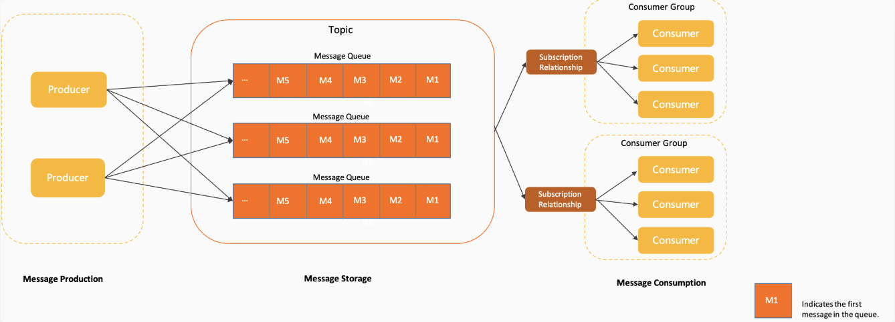
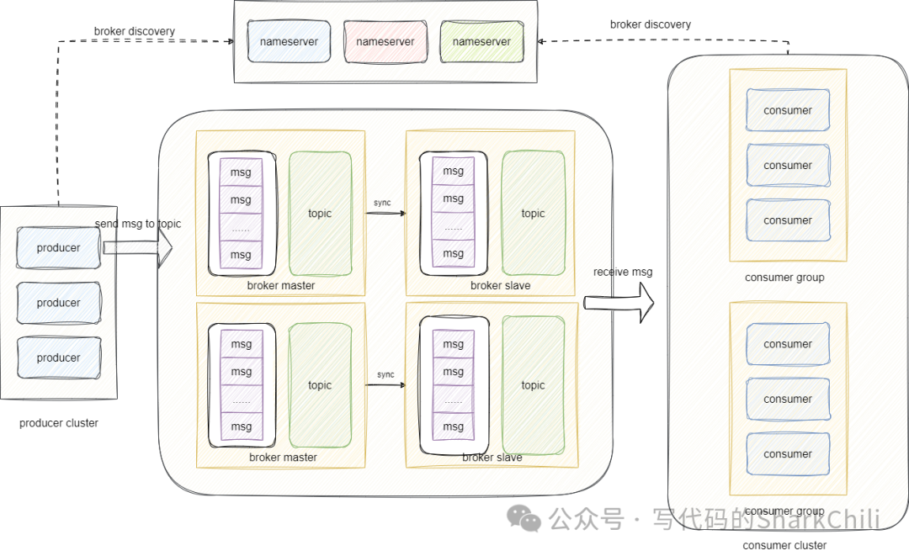
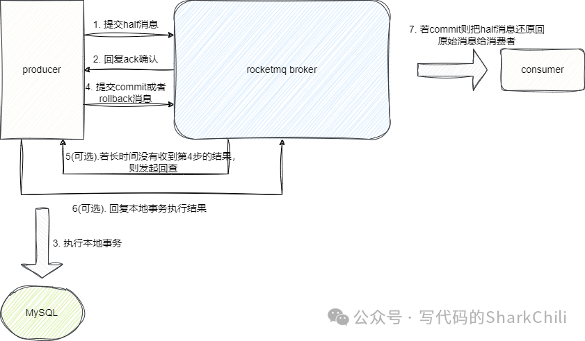

# RocketMQ基础

> https://rocketmq.apache.org/zh/docs

## 架构

如何保证消息的可靠性?

- 生产端重试, 同步发送失败会根据retryTimesWhenSendFailed(默认3)重试; 异步发送失败由业务方实现重试逻辑
- 消息采用多副本存储, 默认每个Topic的MessageQueue分布在多个Broker节点上，支持主备冗余, 通过**DFS（分布式文件系统）**实现副本同步，确保副本间数据一致性; 所有消息在发送到Broker后，立即写入磁盘（默认异步刷盘），即使Broker宕机也不会丢失
- 消费端确认机制(ACK), 消费端消费完成后可主动提交Offset, 消费失败时消息会被重新投递到同一队列（默认重试次数 `maxReconsumeTimes=16`）,超过最大重试次数后，消息进入死信队列**（DLQ）**, 可通过消费死信队列的消息来进行一些业务补偿

> https://mp.weixin.qq.com/s/N8mqYhk63Djcvk1ogSzsBg

- nameserver: 提供服务路由功能, 负责维护broker的数据信息; 对应的producer以及consumer在服务启动时通过nameserver获得broker地址信息

## 事务消息

