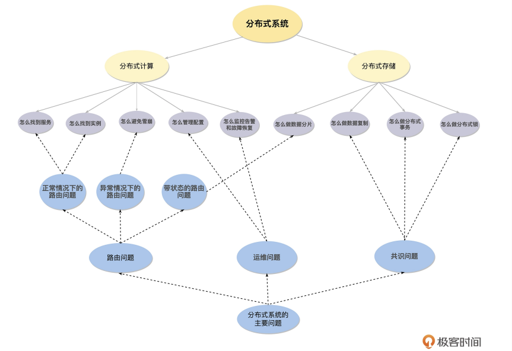

# 分布式理论

分布式系统主要解决单机性能瓶颈导致的成本问题

## 理论

### CAP

CAP理论主张任何基于网络的数据共享系统, 都最多只能拥有以下三条中的两条:

* 一致性(Consistency), 所有节点访问同一份最新的数据副本
* 可用性(Availability), 非故障的节点在合理的时间内返回合理的响应（不是错误或者超时的响应）
* 分区容错性(Partition Tolerance), 分布式系统出现网络分区的时候，仍然能够对外提供服务
  * 网络分区: 分布式系统节点之间因为故障而不连通, 整个网络分成了几块区域

直白一点的解释, 分布式系统中, 在满足分区容错的前提下, 没有算法能同时满足数据一致性和服务可用性

* CP架构: ZooKeeper、HBase
* AP架构: Cassandra、Eureka
* 特殊: Nacos都支持

### BASE

BASE 是 Basically Available（基本可用）、Soft-state（软状态） 和 Eventually Consistent（最终一致性） 三个短语的缩写

* BASE理论是对AP方案的一个补充

### 分布式共识算法

#### Paxos算法

#### Raft算法

## 分布式系统设计

### 分布式文件系统

* HDFS
* GFS

### 分布式消息队列

* Kafka
* Pulsar

### 分布式缓存

* Redis Cluster
* Codis

### 分布式数据库

### 微服务框架

## 分布式系统问题

### 分布式计算

* 怎么找到服务, 服务注册与发现, AP/CP
* 怎么找到实例, 负载均衡策略（轮询、权重、Hash、一致性 Hash，FAIR 等各种策略的适用场景）
* 怎么管理配置, 多实例使用统一的配置中心
* 怎么进行协同, 分布式锁
* 怎么确保请求只执行一次, 重试+幂等
* 怎么避免雪崩, 快速失败和降级（熔断、降级、限流 等）;弹性扩容
* 怎么监控告警和故障恢复, 分布式系统监控, 分布式追踪Trace, 模拟故障的混沌工程以及相关的告警等 机制

### 分布式存储

* 怎么做数据分片, Hash 和 Region 分片
* 怎么做数据复制, 中心化方案（主从复制、一致性协议，比如 Raft 和 Paxos 等）和 去中心化的方案（ Quorum 和 Vector Clock）
* 怎么做分布式事务, 先有事务ID, 再通过 2PC 或者 3PC 协议来实现分布式事务的原子性

总结:

