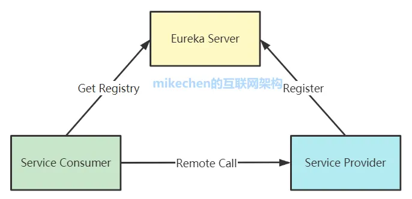
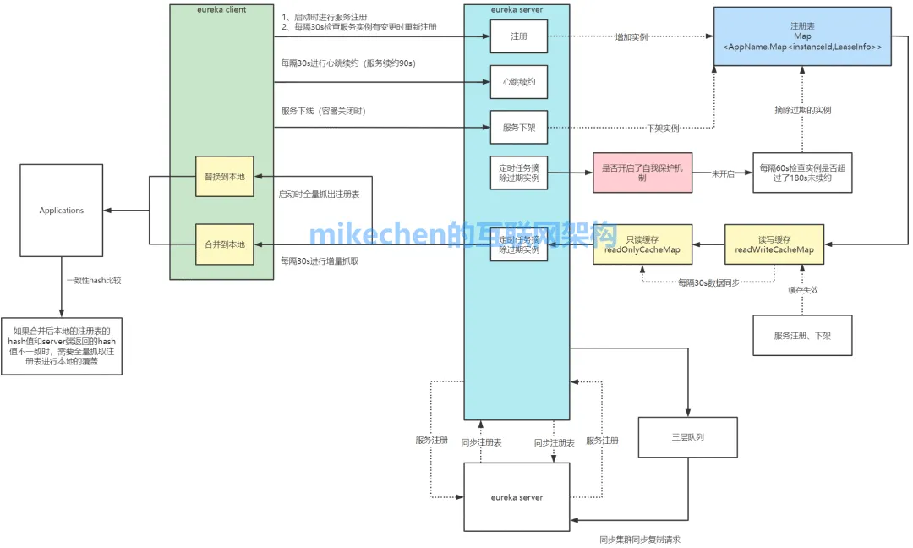
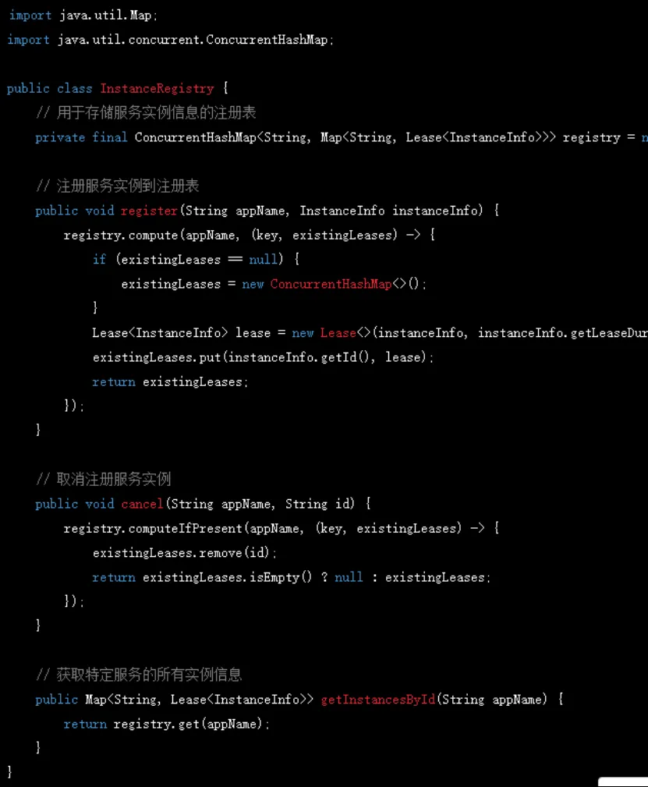
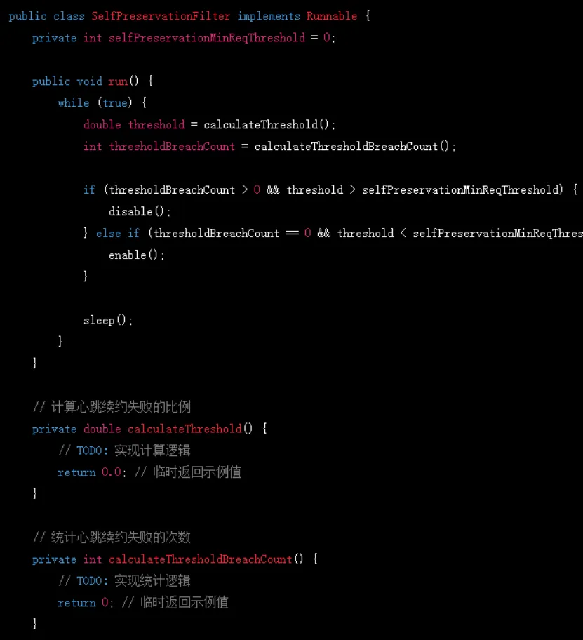
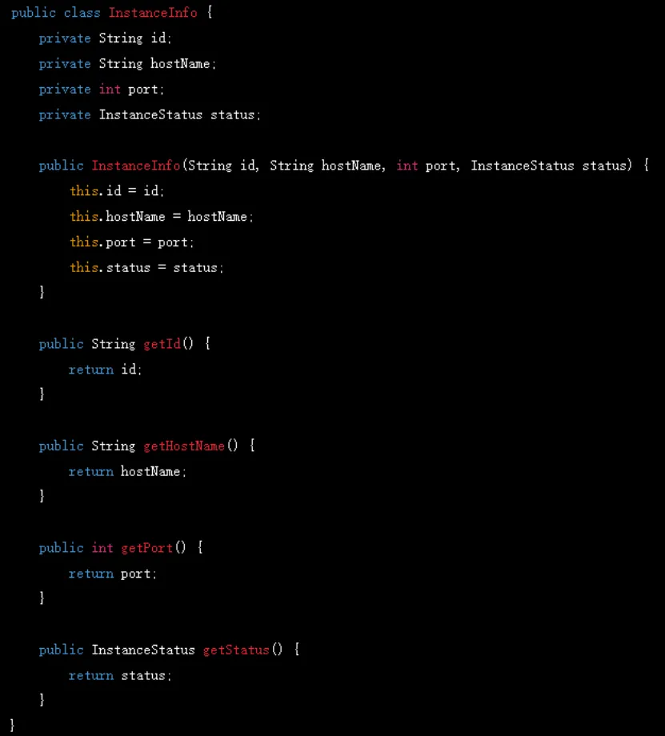
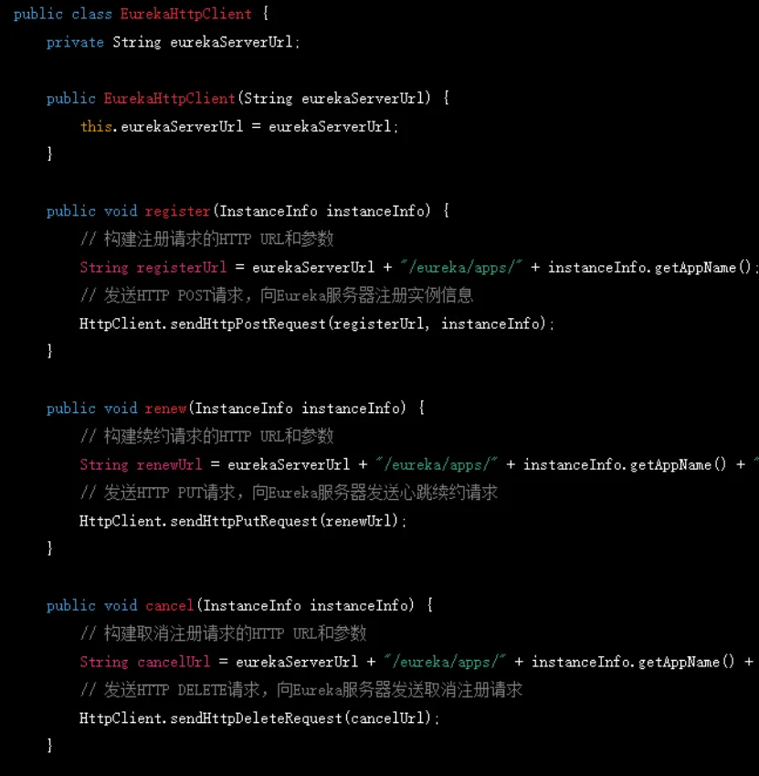

# 服务注册与发现

## Spring Cloud Eureka

> 参考:
>
> - https://mp.weixin.qq.com/s/9pE4uLUovI0FIFr5pPsbWw
>
> - https://mp.weixin.qq.com/s/n_s5m9SEynP2oMaNk3vBPg

### 架构

### 工作流程

### 核心组件

#### 服务端

- **InstanceRegistry（实例注册表）**

  负责存储所有已注册的服务实例信息，包括它们的元数据，如实例ID、主机名、端口等, 具体功能包括:

  - 注册服务实例：register 方法负责将服务实例注册到注册表。
  - 取消注册服务实例：cancel 方法用于从注册表中移除不再可用的实例。
  - 获取服务实例信息：getInstancesById 方法用于获取特定服务的所有实例信息。

- **LeaseManager（租约管理器）**

管理实例的租约, 确保实例的健康状态

- 注册实例并创建租约：register 方法负责为新注册的实例创建租约。
- 续约租约：renew 方法用于更新租约的到期时间，延长租约的有效期。
- 移除租约：cancel 方法负责在实例取消注册时移除租约。

- **SelfPreservationFilter(自我保护过滤器)**

特殊情况，由于网络不稳定15秒内85%服务器出现心跳异常，一次收不到就算心跳一次。旨在确保在网络抖动等异常情况下，Eureka服务器不会过早地剔除正常运行的服务实例，从而保持服务的可用性和稳定性。在代码层面，SelfPreservationFilter定期计算心跳续约失败的比例，根据配置启动或关闭自我保护模式

#### 客户端

- **InstanceInfo（实例信息）**,在应用启动时，Eureka客户端创建InstanceInfo对象，包含实例的元数据。它在服务实例启动时创建并初始化，存储了该实例的基本信息，如实例ID、主机名、端口和状态。它通过HTTP请求将元数据注册到Eureka服务器。

- **EurekaHttpClient（Eureka HTTP客户端）**, 它用于客户端与Eureka服务器的通信，发送注册、续约、取消注册等HTTP请求，获取注册表信息。

