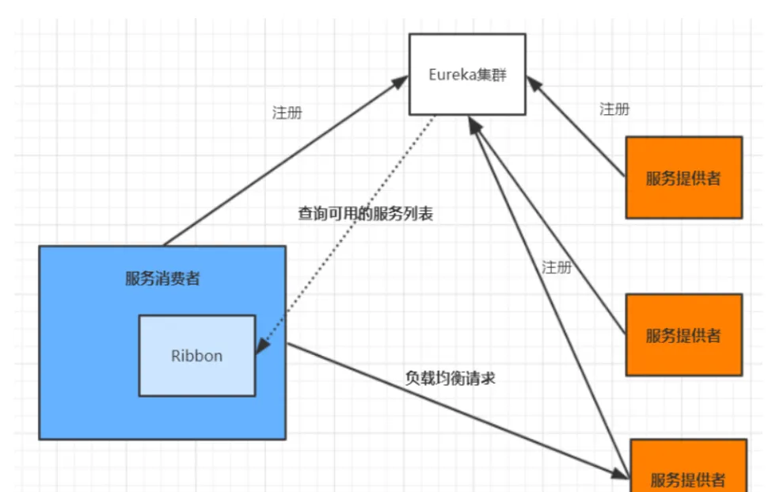
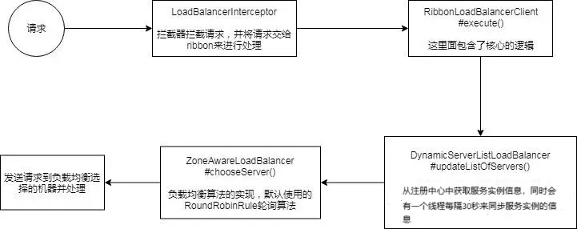
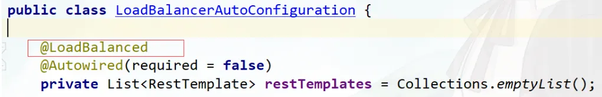
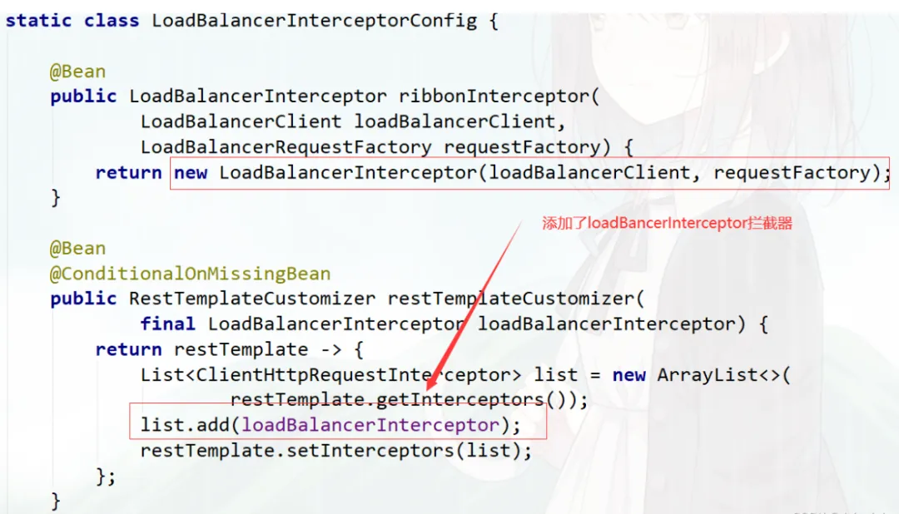
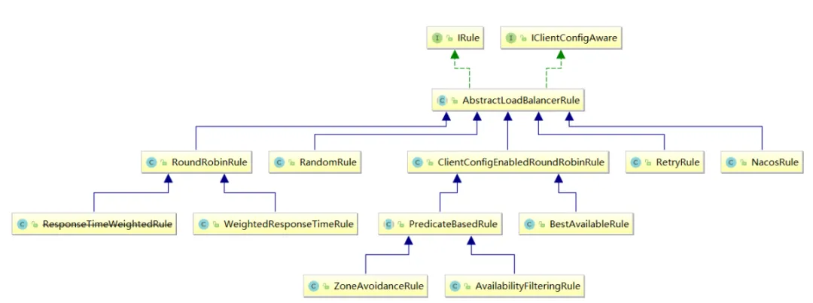

# 客户端负载均衡

## Spring Cloud Ribbon

> 参考: https://mp.weixin.qq.com/s/KKOOPkudR7GdWwl8n9iWWA

### 架构



### 交互流程



### 核心组件

#### @LoadBalanced 注解原理

参考源码：LoadBalancerAutoConfiguration

@LoadBalanced利用@Qualifier作为restTemplates注入的筛选条件，筛选出具有负载均衡标识的RestTemplate。



被@LoadBalanced注解的restTemplate会被定制，添加LoadBalancerInterceptor拦截器。



#### Ribbon负载均衡策略




- RandomRule：随机选择一个Server。
- RetryRule：对选定的负载均衡策略机上重试机制，在一个配置时间段内当选择Server不成功，则一直尝试使用subRule的方式选择一个可用的server。
- RoundRobinRule：轮询选择， 轮询index，选择index对应位置的Server。4、AvailabilityFilteringRule：过滤掉一直连接失败的被标记为circuit tripped的后端Server，并过滤掉那些高并发的后端Server或者使用一个AvailabilityPredicate来包含过滤server的逻辑，其实就是检查status里记录的各个Server的运行状态。5、BestAvailableRule：选择一个最小的并发请求的Server，逐个考察Server，如果Server被tripped了，则跳过。
- WeightedResponseTimeRule：根据响应时间加权，响应时间越长，权重越小，被选中的可能性越低。
- ZoneAvoidanceRule：默认的负载均衡策略，即复合判断Server所在区域的性能和Server的可用性选择Server，在没有区域的环境下，类似于轮询(RandomRule)
- NacosRule: 同集群优先调用


#### **修改默认负载均衡策略**

全局配置

```
@Configuration
public class RibbonConfig {

  /**
    * 全局配置
    * 指定负载均衡策略
    * @return
    */
  @Bean
  public IRule() {
      // 指定使用Nacos提供的负载均衡策略（优先调用同一集群的实例，基于随机权重）
      return new NacosRule();
  }
```

局部配置

```
# 被调用的微服务名
mall-order:
ribbon:
  # 指定使用Nacos提供的负载均衡策略（优先调用同一集群的实例，基于随机&权重）
  NFLoadBalancerRuleClassName: com.alibaba.cloud.nacos.ribbon.NacosRule
```

#### **自定义负载均衡策略**

实现IRule接口

```
@Slf4j
public class NacosRandomWithWeightRule extends AbstractLoadBalancerRule {

  @Autowired
  private NacosDiscoveryProperties nacosDiscoveryProperties;

  @Override
  public Server choose(Object key) {
      DynamicServerListLoadBalancer loadBalancer = (DynamicServerListLoadBalancer) getLoadBalancer();
      String serviceName = loadBalancer.getName();
      NamingService namingService = nacosDiscoveryProperties.namingServiceInstance();
      try {
          //nacos基于权重的算法
          Instance instance = namingService.selectOneHealthyInstance(serviceName);
          return new NacosServer(instance);
      } catch (NacosException e) {
          log.error("获取服务实例异常：{}", e.getMessage());
          e.printStackTrace();
      }
      return null;
  }
  @Override
  public void initWithNiwsConfig(IClientConfig clientConfig) {

  }
```

#### 开启饥饿加载，解决第一次调用慢的问题

ribbon默认懒加载

```
ribbon:
  eager-load:
      # 开启ribbon饥饿加载
     enabled: true
     # 配置mall-order使用ribbon饥饿加载，多个使用逗号分隔
     clients: mall-order
```
