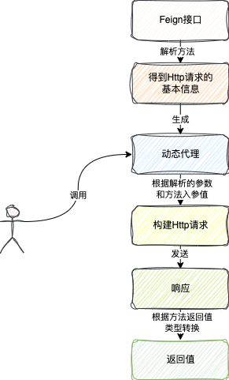
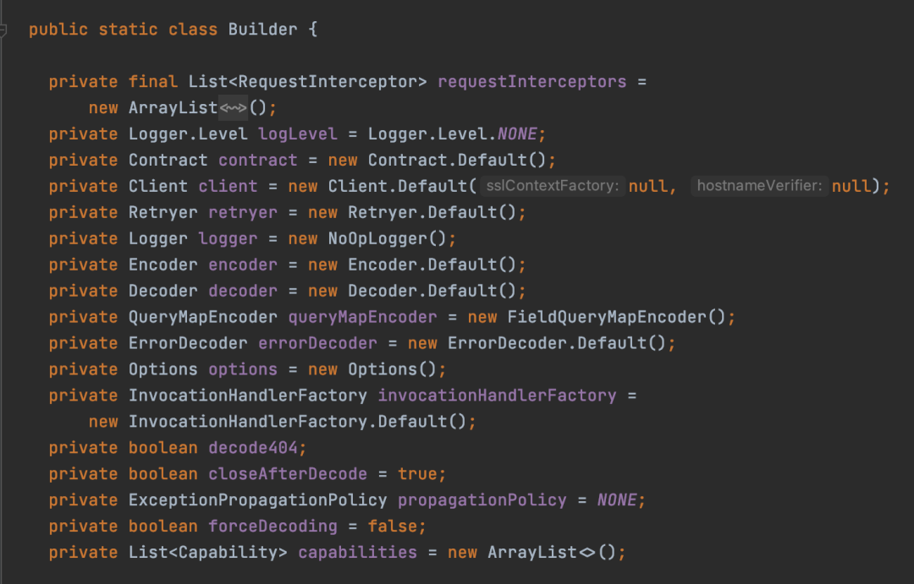
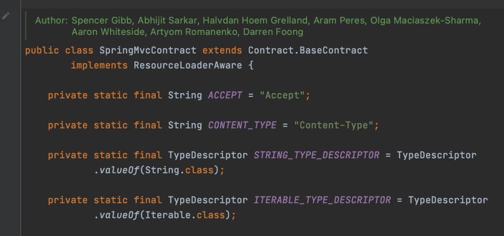
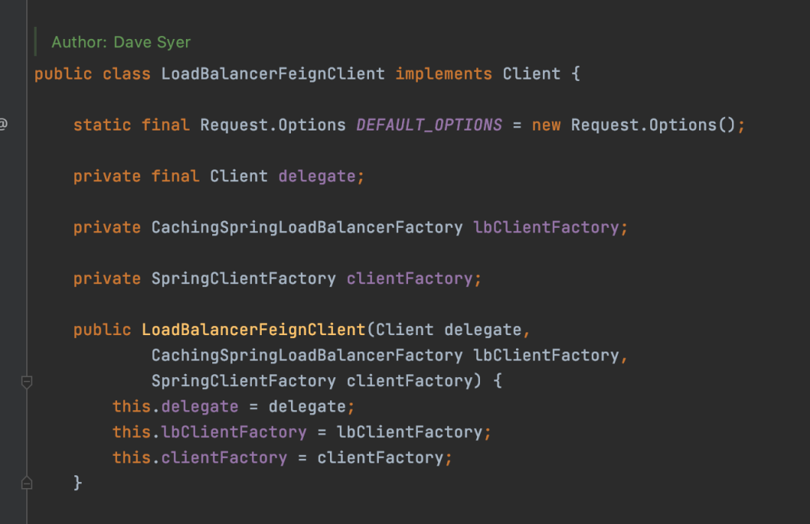
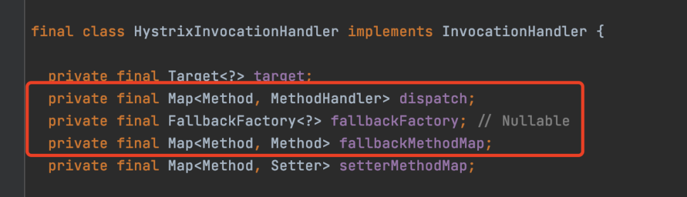
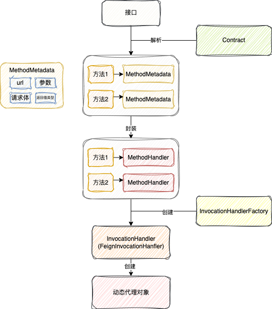
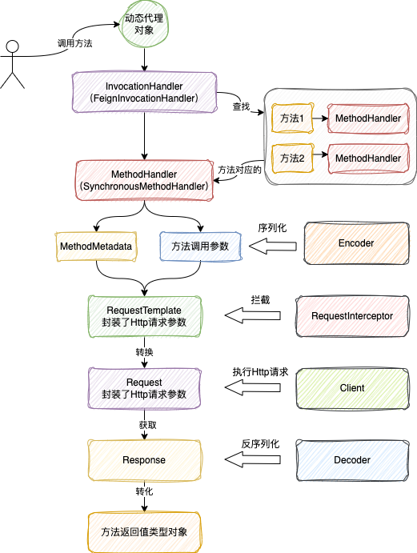
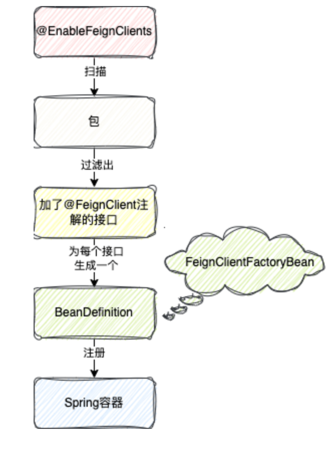

# 声明式服务调用

## SpringCloud OpenFeign

> 参考:https://mp.weixin.qq.com/s/rQqDg9KlfWfVBIPsDO_A9w

### 工作流程

### 核心组件

- Contract, Feign在构建动态代理时, 解析方法上的注解和参数, 获取http请求需要用到的参数等; SpringCloud做了自己的实现
- 
- Encoder, 将请求体方法参数序列化成字节数组
- Decoder, 将响应体中的字节流反序列化成方法返回值类型的对象
- Client, 动态代理对象, 最终用来执行http请求的组件

  - 默认为HttpUrlConnection, 也有基于HttpClient, 以及OkHttp的实现
  - 当然也有Ribbon的
  - 
- InvocationHandlerFactory, 创建InvocationHandler的工厂, 对于JDK动态代理来说，必须得实现InvocationHandler才能创建动态代理

  - 限流熔断框架Hystrix和Sentinel都实现了自己的InvocationHandler, 这样就可以对MethodHandler执行前后，也就是Http接口调用前后进行限流降级等操作。
- RequestInterceptor, 请求拦截器
- Retryer, 重试组件, springcloud重新实现了, 默认不重试

总结

| 接口                     | 作用                                               | Feign默认实现                    | Spring实现              |
| ------------------------ | -------------------------------------------------- | -------------------------------- | ----------------------- |
| Contract                 | 解析方法注解和参数，将Http请求参数和方法参数对应   | Contract.Default                 | SpringMvcContract       |
| Encoder                  | 将请求体对应的方法参数序列化成字节数组             | Encoder.Default                  | SpringEncoder           |
| Decoder                  | 将响应体的字节流反序列化成方法返回值类型对象       | Decoder.Default                  | SpringDecoder           |
| Client                   | 发送Http请求                                       | Client.Default                   | LoadBalancerFeignClient |
| InvocationHandlerFactory | InvocationHandler工厂，动态代理核心逻辑            | InvocationHandlerFactory.Default | 无                      |
| RequestInterceptor       | 在发送Http请求之前，再对Http请求的内容进行拦截修改 | 无                               | 无                      |
| Retryer                  | 重试组件                                           | Retryer.Default                  | 无                      |

### 运行原理

- 动态代理生成流程
- 
- Http调用执行流程

- FeignClient接口注册到Spring的流程
  
