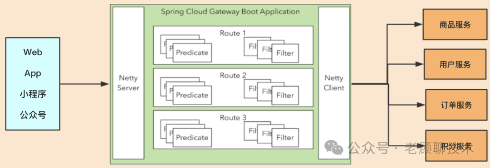
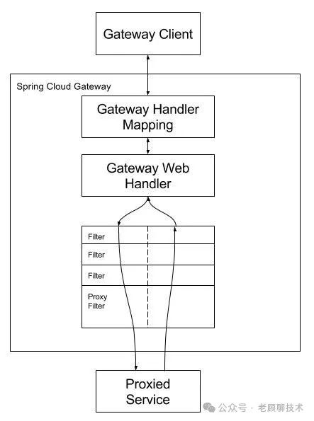

# API网关服务

## Spring Cloud Gateway

> 参考: https://mp.weixin.qq.com/s/yWCFa4ZClRMjl1S9asw8wg

基于WebFlux, **WebFlux是一个典型非阻塞异步的框架** ，它的核心是基于Reactor的相关API实现的。相对于传统的web框架来说， **它可以运行在诸如Netty，Undertow及支持Servlet3.1的容器上** 。

### 工作流程

1）Route：路由是网关的基本构件。它由ID、目标URI、谓词集合和过滤器集合定义。如果聚合谓词为真，则匹配路由。

2）Predicate：参照Java8的新特性Predicate。这允许开发人员匹配HTTP请求中的任何内容，比如头或参数。

3）Filter：可以在发送下游请求之前或之后修改请求和响应。

核心逻辑就是路由转发，执行过滤器链。

Filter在**“pre”类型的过滤器可以做参数校验、权限校验、流量监控、日志输出、协议转换**等，在**“post”类型的过滤器中可以做响应内容、响应头的修改，日志的输出，流量监控**等
