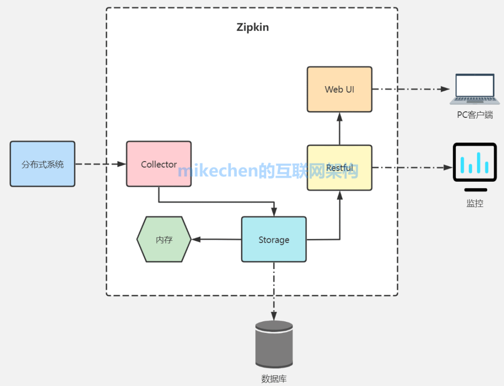
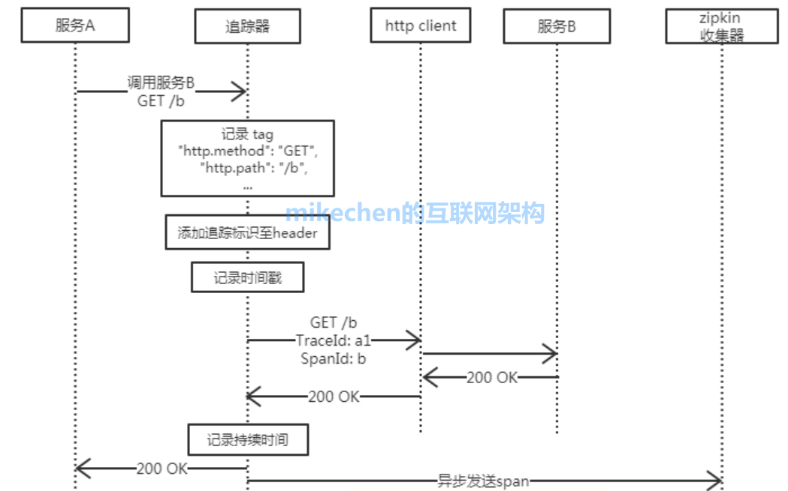

# 分布式链路追踪

## Spring Cloud Sleuth

链路追踪就是将一次分布式请求，还原成调用链路，进行：日志记录、性能监控、并将一次分布式请求的调用情况集中展示。

Spring Cloud Sleuth采用的是Google的开源项目Dapper的专业术语，span、Trace、Annotations。

- Span, 每次发送一个远程调用服务就会产生一个span, span通过一个64位ID唯一标识, 还有其他数据信息, 如摘要, 时间戳, tags, IP等
- Trace, 一个Trace是一次完整的链路, 内部包含多个span
- Annotations, 用来及时记录一个事件的存在，一些核心 annotations 用来定义一个请求的开始和结束

基本原理: 在入口生成（traceid，spanid），并在调用中将traceid传递下去。

Sleuth可以实现服务调用的链路透传， 如果需要实现链路检索功能，可以使用Zipkin, Zipkin核心功能日志收集和链路检索，Zipkin 具有可视化页面。

## Zipkin

- 整体架构

- 工作流程
  
