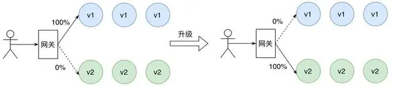

# 阿里微服务技术治理白皮书

## 微服务架构

微服务架构的最⼤好处是它可以提升开发效率和系统整体的稳定性：

* 开发和部署相对简单：单个微服务的功能可以更快地更改，因为可以独⽴部署，影响范围更
  ⼩，启动和调试单个微服务的时间成本相⽐于单体应⽤也⼤⼤减少。
* 横向扩展简单：根据业务的⾼峰低⾕周期快速的横向扩展⾮常简单，因为单个微服务通常很
  ⼩，可以随着系统整体负载的变化更快地启动和停⽌。
* 架构升级灵活：单个微服务的内部架构可以迅速升级，因为微服务之间松散耦合的，只⾯向
  定义好的通讯接⼝进⾏编程。这使开发团队能够基于⾃身的技术背景和偏好灵活选择，⽽不
  会直接影响其他应⽤程序、服务或团队。
* 更好的容错性：微服务之间可以实现更好的故障隔离，单个服务内的内存泄露等故障不容易
  影响其他服务，相⽐单体应⽤⼀个组件故障会拖垮整个系统

微服务开发实施过程中常⻅的问题：

* 服务之间使⽤远程调⽤进⾏通讯，这⽐进程内的直接调⽤复杂很多。由于通讯链路的复杂性，
  可能会出现很多不确定的问题，会出现远程调⽤不可⽤或者延迟较⾼的情况，开发⼈员需要
  能够处理这些偶发问题，避免影响业务。
* 随着业务的发展，微服务之间的拓扑图开始变得复杂，排查问题变得困难，搭建完整的开发
  测试环境成本也越来越⼤。
* 当功能涉及到多个微服务模块时，迭代时需要谨慎地协调多个开发团队的迭代排期，才能保
  证迭代能够按时交付，达到敏捷开发的效果。

## 微服务治理在云原生下的挑战

## 微服务治理概念的区分

### 开发态服务治理

开发态服务治理的⽬标是为了提升研发效率，让开发更快捷，主要功能包括：

* 服务契约：业务开服能够清晰的了解应用定义了哪些接口、每个接口的参数、以及接口的业
  务说明；便于开发者迅速了解应用。
* 服务调试：在微服务开发和运行时快速地对某个接口进行调试，而不需要经过手动编写测试
  代码，也不需要关心网络打通流程。
* 服务 Mock：当某个接口尚未开发完成时，可以通过配置 Mock 此接口的请求行为，返回预
  设的值，使得开发时不需要依赖于下游接口开发完成。
* 开发环境隔离：通过逻辑隔离的方式，为每一个正在开发的功能特性隔离出一个独立的环境，
  在低成本的前提下，划分出多个完整的独立环境，使得各功能特性的开发调试不会互相影响，
  提升开发迭代的效率。
* 端云互联：本地开发的微服务可以快速的访问云上的服务，云上的服务也能调用到本地开发
  的微服务

### 测试态服务治理

测试态的微服务治理的⽬标是为了提升测试效率，让测试更快更准更全⾯。

* 服务压测：微服务上线前快速发起压测，迅速了解微服务的容量是否偏离基线，确保新版的
  性能。
* ⾃动化回归：通过自动化的方式进行回归测试，自动发起测试并自动比对结果进行验证，无
  需人工重复测试，保障业务代码逻辑的正确性。
* 流量录制：将线上流量录制下来，自动生成测试用例进行回归测试，通过真实的请求丰富测
  试覆盖率，保障业务代码逻辑的正确性。
* 流量回放：将录制好的流量重新运行，验证当前的业务运行结果是否和录制好的请求的结果
  匹配。

### 运⾏态服务治理

运⾏态通常⼜分为 3 个部分：发布态，安全态，⾼可⽤。

#### 发布态

发布态通常解决的是业务发布的时候的流量治理问题，他主要包括：

* ⽆损下线：确保应用在发布、停止、扩容时，所有请求都不会被影响，确保微服务下线的过
  程中业务无损。
* ⽆损上线：应用刚启动时可能会存在一些资源未初始化完成、未预热完毕的情况，无损上线
  功能可以确保在这个场景下不影响业务。
* ⾦丝雀发布：满足特定流量特征的请求才会进入微服务的灰度节点，通过小流量验证微服务
  新版的逻辑是否符合预期。
* 全链路灰度：一个迭代的多个应用同时发布，希望经过灰度的上游流量只能达到下游的灰度
  节点，确保灰度流量只在灰度环境中流转。

#### 安全态

* 服务鉴权：保护敏感微服务，确保敏感服务只能被已授权的应用发起访问。
* 漏洞防护：开源框架通常会陆陆续续被发现许多漏洞，整体的升级成本很高，需要通过不升
  级框架的⽅式实现漏洞的防护。
* 配置鉴权：某些配置⽐较敏感，不希望任何微服务都有权限访问，控制只有受限的微服务才
  能访问

#### ⾼可⽤

* 限流：针对超过阈值的流量进行限流控制，保障机器和整体业务的稳定性。
* 降级：在资源有限的情况下，针对某些不重要的请求返回预设的降级结果，把有限的资源让
  给重要的请求。
* 熔断：客户端访问后端服务不可用的情况下，返回固定异常或预定义的结果，避免引起业务
  异常，甚至雪崩。
* 离群实例摘除：在单个服务提供者节点持续不可用的情况下，在消费者侧摘除这个异常节点，
  保障业务的高可用。
* 同可⽤区优先路由：微服务多可用区部署的情况下，确保流量优先在同一个可用区内流转，
  降低业务的整体时延。
* 就近容灾路由：当某个可⽤区发⽣故障，可以把流量尽快的切到正常的可⽤区，让业务以最
  快速度恢复

## 全链路灰度解决方案

### 蓝绿发布

* 对服务的新版本进行冗余部署, 一般新版本的机器规格和数量与旧版本保持一致, 此时只有旧版本对外提供服务, 新版本作为热备, 当服务进行版本升级时, 只需将流量全部切换到新版本即可, 旧版本作为热备, 如果上线后出现严重BUG, 只需将流量切回旧版本, 大大缩短故障恢复时间, 待新版本BUG修复完成并重新部署后, 再将旧版本流量切换到新版本
* 蓝绿发布通过使用额外的机器资源来解决服务发布期间的不可用问题，当服务新版本出现故障时，也可以快速将流量切回旧版本
* 优点：部署结构简单，运维方便；服务升级过程操作简单，周期短。
* 缺点：资源冗余，需要部署两套生产环境；新版本故障影响范围大。
* 补充: 当切换到新版本时，需要妥当处理未完成的业务和新的业务。

### 滚动发布

* 滚动发布，一般是取出一个或者多个服务器停止服务，执行更新，并重新将其投入使用。周而复始，直到集群中所有的实例都更新成新版本。
* 相对于蓝绿部署，更加节约资源——它不需要运行两个集群、两倍的实例数。我们可以部分部署，例如每次只取出集群的20%进行升级。
* 这种方式也有很多缺点，例如：
  * 没有一个确定OK的环境。使用蓝绿部署，我们能够清晰地知道老版本是OK的，而使用滚动发布，我们无法确定。
  * 修改了现有的环境。
  * 如果需要回滚，很困难。举个例子，在某一次发布中，我们需要更新100个实例，每次更新10个实例，每次部署需要5分钟。当滚动发布到第80个实例时，发现了问题，需要回滚。此时，脾气不好的程序猿很可能想掀桌子，因为回滚是一个痛苦，并且漫长的过程。
  * 有的时候，我们还可能对系统进行动态伸缩，如果部署期间，系统自动扩容/缩容了，我们还需判断到底哪个节点使用的是哪个代码。尽管有一些自动化的运维工具，但是依然令人心惊胆战。

### 灰度发布/金丝雀发布

* 金丝雀发布的思想则是将少量的请求引流到新版本上，因此部署新版本服务只需极小数的机器。验证新版本符合预期后，逐步调整流量权重比例，使得流量慢慢从老版本迁移至新版本，期间可以根据设置的流量比例，对新版本服务进行扩容，同时对老版本服务进行缩容，使得底层资源得到最大化利用。
* 金丝雀发布的优点：按比例将流量无差别地导向新版本，新版本故障影响范围小；发布期间逐步对新版本扩容，同时对老版本缩容，资源利用率高。
* 金丝雀发布的缺点：流量无差别地导向新版本，可能会影响重要用户的体验；发布周期长。

### A/B测试

* A/B 测试基于用户请求的元信息将流量路由到新版本，这是一种基于请求内容匹配的灰度发布策略, 只有匹配特定规则的请求才会被引流到新版本，常见的做法包括基于 Http Header 和 Cookie。
* A/B 测试的优点：可以对特定的请求或者用户提供服务新版本，新版本故障影响范围小；需要构建完备的监控平台，用于对比不同版本之间请求状态的差异。
* A/B 测试的缺点：仍然存在资源冗余，因为无法准确评估请求容量；发布周期长。

**总结**

* 蓝绿部署：不停止老版本，额外搞一套新版本，等测试发现新版本OK后，删除老版本。
* 滚动发布：按批次停止老版本实例，启动新版本实例。
* 灰度发布/金丝雀部署：不停止老版本，额外搞一套新版本，常常按照用户设置路由权重，例如90%的用户维持使用老版本，10%的用户尝鲜新版本。不同版本应用共存，经常与A/B测试一起使用，用于测试选择多种方案。

### 全链路灰度

全链路灰度治理策略主要专注于整个调⽤链，它不关⼼链路上经过具体哪些微服务，流量控制视⻆从服务转移⾄请求链路上，仅需要少量的治理规则即可构建出从⽹关到整个后端服务的多个流量隔离环境，有效保证了多个亲密关系的服务顺利安全发布以及服务多版本并⾏开发，进⼀步促进业务的快速发展

#### 物理环境隔离

* 需要为要灰度的服务搭建⼀套⽹络隔离、资源独⽴的环境，在其中部署服务的灰度版本, 同时由于与正式环境隔离, 需要冗余部署线上服务以及注册中心, 中间件等, 一般用于企业测试, 预发开发环境的搭建
* 若机器数目过多, 会造成运维, 机器成本过大

#### 逻辑环境隔离

**全链路灰度的实现需要解决以下问题：**
1.链路上各个组件和服务能够根据请求流量特征进⾏动态路由。
2.需要对服务下的所有节点进⾏分组，能够区分版本。
3.需要对流量进⾏灰度标识、版本标识。
4.需要识别出不同版本的灰度流量。

##### 标签路由

##### 节点打标

* K8S可以在Pod模板中为节点添加标签
* springCloud体系可以为业务容器添加标签"version=gray"的元数据

##### 流量染色

* 前端在发起请求时根据⽤户信息或者平台信息的不同对流量进⾏打标
* 如果前端⽆法做到，我们也可以在微服务⽹关上对匹配特定路由规则的请求动态 添加流量标识
* 流量在链路中流经灰度节点时，如果请求信息中不含有灰度标识，需要⾃动为其染⾊

分布式链路追踪

* 分布式链路追踪技术对⼤型分布式系统中请求调⽤链路进⾏详细记录，核⼼思想就是通过⼀个
  全局唯⼀的 traceid 和每⼀条的 spanid 来记录请求链路所经过的节点以及请求耗时，其中
  traceid 是需要整个链路传递的。
* 借助于分布式链路追踪思想，我们也可以传递⼀些⾃定义信息，⽐如灰度标识

##### 逻辑环境隔离

⾸先，需要⽀持动态路由功能，对于 Spring Cloud、Dubbo 开发框架，可以对出⼝流量实现⾃定义 Filter，在该 Filter 中完成流量识别以及标签路由。同时需要借助分布式链路追踪技术完成流量标识链路传递以及流量⾃动染⾊。此外，需要引⼊⼀个中⼼化的流量治理平台，⽅便各个业务线的开发者定义⾃⼰的全链路灰度规则

#### RPC流量的全链路灰度方案

