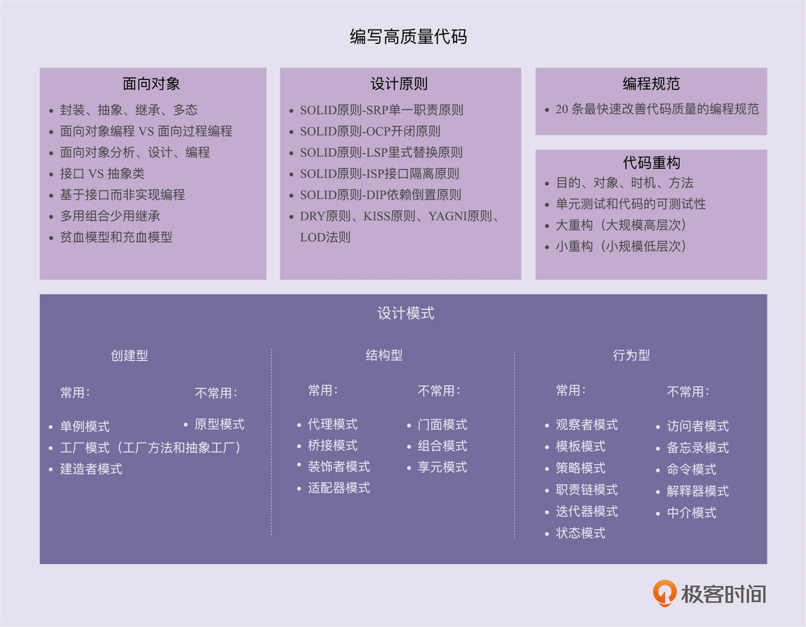

# 面向对象与设计原则

## 编写高质量代码

* 面向对象其丰富的特性是设计原则, 设计模式的基础
* 设计原则是指导代码设计的经验总结
* 设计模式是对经常遇到的一些问题, 总结出的一套解决方案或设计思路; 应用设计模式主要是提高代码的可拓展性




## 面向对象

面向对象编程是一种编程范式或编程风格。它以类或对象作为组织代码的基本单元，并将封装、抽象、继承、多态四个特性，作为代码设计和实现的基石 。

### 四大特性解决了什么问题?

* 封装: 保护数据不被随意篡改, 提高可维护性; 仅暴露有限的必要接口, 提高类的易用性
* 抽象: 隐藏方法的具体实现, 隔离变化, 提高代码可拓展性
* 继承: 解决代码复用问题
* 多态: 子类可以替换父类, 在实际的代码运行过程中, 调用子类的方法实现, 多态可以提高代码的扩展性和复用性，是很多设计模式、设计原则、编程技巧的代码实现基础。

### 接口和抽象类的区别

如果我们要表示一种 is-a 的关系，并且是为了解决代码复用的问题，我们就用抽象类；如果我们要表示一种 has-a 关系，并且是为了解决抽象而非代码复用的问题，那我们就可以使用接口。

从类的继承层次上来看，抽象类是一种自下而上的设计思路，先有子类的代码重复，然后再抽象成上层的父类（也就是抽象类）。而接口正好相反，它是一种自上而下的设计思路。我们在编程的时候，一般都是先设计接口，再去考虑具体的实现。

### 基于接口而非实现编程

**“接口”就是一组“协议”或者“约定”，是功能提供者提供给使用者的一个“功能列表”。**

基于接口而非实现编程， 这条原则能非常有效地提高代码质量，之所以这么说，那是因为，应用这条原则， **可以将接口和实现相分离，封装不稳定的实现，暴露稳定的接口。** 上游系统面向接口而非实现编程，不依赖不稳定的实现细节，这样当实现发生变化的时候，上游系统的代码基本上不需要做改动，以此来降低耦合性，提高扩展性。

在编写代码的时候，要遵从“基于接口而非实现编程”的原则，具体来讲，我们需要做到下面这 3 点。

1. **函数的命名不能暴露任何实现细节。** 比如，前面提到的 uploadToAliyun() 就不符合要求，应该改为去掉 aliyun 这样的字眼，改为更加抽象的命名方式，比如：upload()。
2. **封装具体的实现细节。** 比如，跟阿里云相关的特殊上传（或下载）流程不应该暴露给调用者。我们对上传（或下载）流程进行封装，对外提供一个包裹所有上传（或下载）细节的方法，给调用者使用。
3. **为实现类定义抽象的接口。** 具体的实现类都依赖统一的接口定义，遵从一致的上传功能协议。使用者依赖接口，而不是具体的实现类来编程。


## 设计原则

### SOLID原则

#### 单一职责

1. 如何理解单一职责原则（SRP）？

 **一个类只负责完成一个职责或者功能。** 不要设计大而全的类，要设计粒度小、功能单一的类。单一职责原则是为了实现代码高内聚、低耦合，提高代码的复用性、可读性、可维护性。

2. 如何判断类的职责是否足够单一？

不同的应用场景、不同阶段的需求背景、不同的业务层面，对同一个类的职责是否单一，可能会有不同的判定结果。实际上，一些侧面的判断指标更具有指导意义和可执行性，比如，出现下面这些情况就有可能说明这类的设计不满足单一职责原则：

* 类中的代码行数、函数或者属性过多；
* 类依赖的其他类过多，或者依赖类的其他类过多；
* 私有方法过多；比较难给类起一个合适的名字；
* 类中大量的方法都是集中操作类中的某几个属性。

3. 类的职责是否设计得越单一越好？

如果拆分得过细，实际上会适得其反，反倒会降低内聚性，也会影响代码的可维护性。

#### 开闭

对拓展开放, 对修改关闭

对拓展开放是为了应对变化(需求)，对修改关闭是为了保证已有代码的稳定性；最终结果是为了让系统更有弹性！

#### 里氏替换

子类对象（object of subtype/derived class）能够替换程序（program）中父类对象（object of base/parent class）出现的任何地方，并且保证原来程序的逻辑行为（behavior）不变及正确性不被破坏。

里式替换原则是用来指导，继承关系中子类该如何设计的一个原则。

理解里式替换原则，最核心的就是理解“design by contract，按照协议来设计”这几个字。父类定义了函数的“约定”（或者叫协议），那子类可以改变函数的内部实现逻辑，但不能改变函数原有的“约定”。

这里的约定包括：函数声明要实现的功能；对输入、输出、异常的约定；甚至包括注释中所罗列的任何特殊说明。

#### 接口隔离

客户端不应该被强迫依赖它不需要的接口。其中的“客户端”，可以理解为接口的调用者或者使用者。

理解“接口隔离原则”的重点是理解其中的“接口”二字。

这里有三种不同的理解。

* 如果把“接口”理解为一组接口集合，可以是某个微服务的接口，也可以是某个类库的接口等。如果部分接口只被部分调用者使用，我们就需要将这部分接口隔离出来，单独给这部分调用者使用，而不强迫其他调用者也依赖这部分不会被用到的接口。
* 如果把“接口”理解为单个 API 接口或函数，部分调用者只需要函数中的部分功能，那我们就需要把函数拆分成粒度更细的多个函数，让调用者只依赖它需要的那个细粒度函数。
* 如果把“接口”理解为 OOP 中的接口，也可以理解为面向对象编程语言中的接口语法。那接口的设计要尽量单一，不要让接口的实现类和调用者，依赖不需要的接口函数。

#### 依赖反转

##### 控制反转（IOC, Inversion Of Control）

控制指的是对程序执行流程的控制，而“反转”指的是在没有使用框架之前，程序员自己控制整个程序的执行。在使用框架之后，整个程序的执行流程可以通过框架来控制。流程的控制权从程序员“反转”到了框架。

使用控制反转之前

```Java

public class UserServiceTest {
  public static boolean doTest() {
    // ... 
  }
  
  public static void main(String[] args) {//这部分逻辑可以放到框架中
    if (doTest()) {
      System.out.println("Test succeed.");
    } else {
      System.out.println("Test failed.");
    }
  }
}
```

之后

```Java

public abstract class TestCase {
  public void run() {
    if (doTest()) {
      System.out.println("Test succeed.");
    } else {
      System.out.println("Test failed.");
    }
  }
  
  public abstract boolean doTest();
}

public class JunitApplication {
  private static final List<TestCase> testCases = new ArrayList<>();
  
  public static void register(TestCase testCase) {
    testCases.add(testCase);
  }
  
  public static final void main(String[] args) {
    for (TestCase case: testCases) {
      case.run();
    }
  }
```

使用

```Java

public class UserServiceTest extends TestCase {
  @Override
  public boolean doTest() {
    // ... 
  }
}

// 注册操作还可以通过配置的方式来实现，不需要程序员显示调用register()
JunitApplication.register(new UserServiceTest();
```

##### 依赖注入（DI）

不通过 new() 的方式在类内部创建依赖类对象，而是将依赖的类对象在外部创建好之后，通过构造函数、函数参数等方式传递（或注入）给类使用。

下面代码还有继续优化的空间，我们还可以把 MessageSender 定义成接口，基于接口而非实现编程。

```Java

// 非依赖注入实现方式
public class Notification {
  private MessageSender messageSender;
  
  public Notification() {
    this.messageSender = new MessageSender(); //此处有点像hardcode
  }
  
  public void sendMessage(String cellphone, String message) {
    //...省略校验逻辑等...
    this.messageSender.send(cellphone, message);
  }
}

public class MessageSender {
  public void send(String cellphone, String message) {
    //....
  }
}
// 使用Notification
Notification notification = new Notification();

// 依赖注入的实现方式
public class Notification {
  private MessageSender messageSender;
  
  // 通过构造函数将messageSender传递进来
  public Notification(MessageSender messageSender) {
    this.messageSender = messageSender;
  }
  
  public void sendMessage(String cellphone, String message) {
    //...省略校验逻辑等...
    this.messageSender.send(cellphone, message);
  }
}
//使用Notification
MessageSender messageSender = new MessageSender();
Notification notification = new Notification(messageSender);
```

##### 依赖注入框架（DI Framework）

我们只需要通过依赖注入框架提供的扩展点，简单配置一下所有需要创建的类对象、类与类之间的依赖关系，就可以实现由框架来自动创建对象、管理对象的生命周期、依赖注入等原本需要程序员来做的事情。

现成的依赖注入框架有很多，比如 Google Guice、Java Spring、Pico Container、Butterfly Container 等。

##### 依赖反转原则（DIP）

高层模块（high-level modules）不要依赖低层模块（low-level）。高层模块和低层模块应该通过抽象（abstractions）来互相依赖。除此之外，抽象（abstractions）不要依赖具体实现细节（details），具体实现细节（details）依赖抽象（abstractions）。

所谓高层模块和低层模块的划分，简单来说就是，在调用链上，调用者属于高层，被调用者属于低层。在平时的业务代码开发中，高层模块依赖底层模块是没有任何问题的。实际上，这条原则主要还是用来指导框架层面的设计，跟前面讲到的控制反转类似。我们拿 Tomcat 这个 Servlet 容器作为例子来解释一下。

Tomcat 是运行 Java Web 应用程序的容器。我们编写的 Web 应用程序代码只需要部署在 Tomcat 容器下，便可以被 Tomcat 容器调用执行。按照之前的划分原则，Tomcat 就是高层模块，我们编写的 Web 应用程序代码就是低层模块。Tomcat 和应用程序代码之间并没有直接的依赖关系，两者都依赖同一个“抽象”，也就是 Servlet 规范。Servlet 规范不依赖具体的 Tomcat 容器和应用程序的实现细节，而 Tomcat 容器和应用程序依赖 Servlet 规范。

### KISS原则

KISS 原则的英文描述有好几个版本，比如下面这几个。翻译成中文就是：尽量保持简单。

* Keep It Simple and Stupid.
* Keep It Short and Simple.
* Keep It Simple and Straightforward.

如何满足KISS原则?

* 不要使用同事可能不懂的技术来实现代码。比如前面例子中的正则表达式，还有一些编程语言中过于高级的语法等。
* 不要重复造轮子，要善于使用已经有的工具类库。经验证明，自己去实现这些类库，出 bug 的概率会更高，维护的成本也比较高。
* 不要过度优化。不要过度使用一些奇技淫巧（比如，位运算代替算术运算、复杂的条件语句代替 if-else、使用一些过于底层的函数等）来优化代码，牺牲代码的可读性。

### YAGNI原则

YAGNI 原则的英文全称是：You Ain’t Gonna Need It。直译就是：你不会需要它。这条原则也算是万金油了。当用在软件开发中的时候，它的意思是：不要去设计当前用不到的功能；不要去编写当前用不到的代码。实际上，这条原则的核心思想就是：不要做过度设计。

### DRY 原则

Don’t Repeat Yourself。中文直译为：不要重复自己。将它应用在编程中，可以理解为：不要写重复的代码。

三种代码重复的情况：实现逻辑重复、功能语义重复、代码执行重复。

* 实现逻辑重复，但功能语义不重复的代码，并不违反 DRY 原则。因为功能职责不用, 这时可以抽取更细粒度的函数加以复用
* 实现逻辑不重复，但功能语义重复的代码，也算是违反 DRY 原则。因为同一功能职责在系统中的实现应该是唯一的.
* 代码执行重复也算是违反 DRY 原则。比如函数在同一方法中重复调用执行

提高代码复用性

减少代码耦合, 满足单一职责原则, 模块化, 业务与非业务逻辑分离, 通用代码下沉, 继承、多态、抽象、封装, 应用模板等设计模式

### 迪米特原则

如何理解“高内聚、松耦合”？

所谓高内聚，就是指相近的功能应该放到同一个类中，不相近的功能不要放到同一类中。相近的功能往往会被同时修改，放到同一个类中，修改会比较集中。

所谓松耦合指的是，在代码中，类与类之间的依赖关系简单清晰。即使两个类有依赖关系，一个类的代码改动也不会或者很少导致依赖类的代码改动。

迪米特法则的英文翻译是：Law of Demeter，缩写是 LOD。单从这个名字上来看，我们完全猜不出这个原则讲的是什么。不过，它还有另外一个更加达意的名字，叫作最小知识原则，英文翻译为：The Least Knowledge Principle。

如何理解迪米特原则?

不该有直接依赖关系的类之间，不要有依赖；有依赖关系的类之间，尽量只依赖必要的接口（也就是定义中的“有限知识”）。迪米特法则是希望减少类之间的耦合，让类越独立越好。每个类都应该少了解系统的其他部分。一旦发生变化，需要了解这一变化的类就会比较少。
