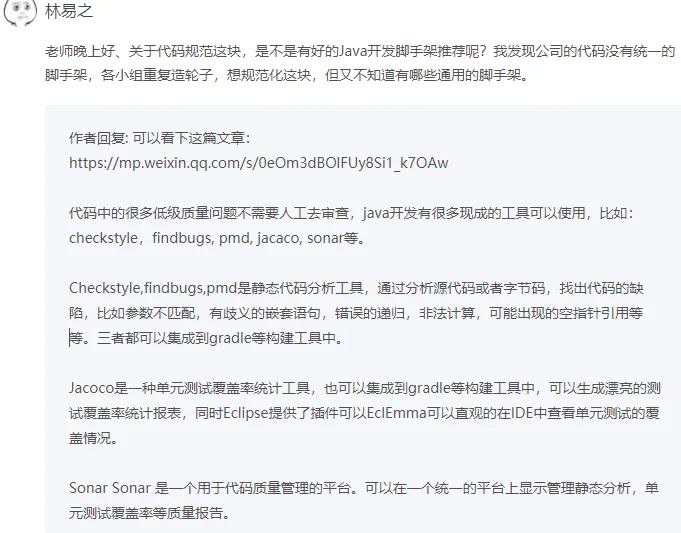
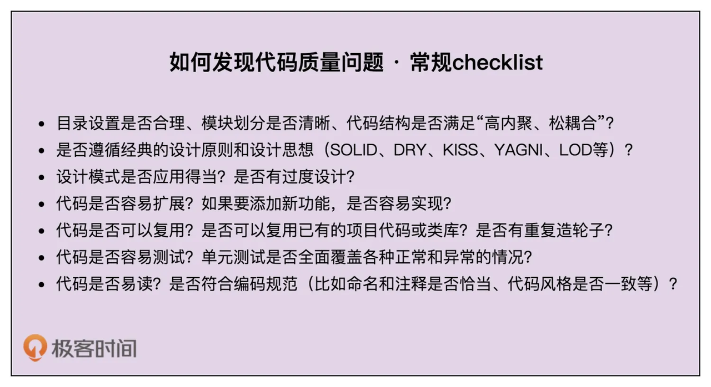
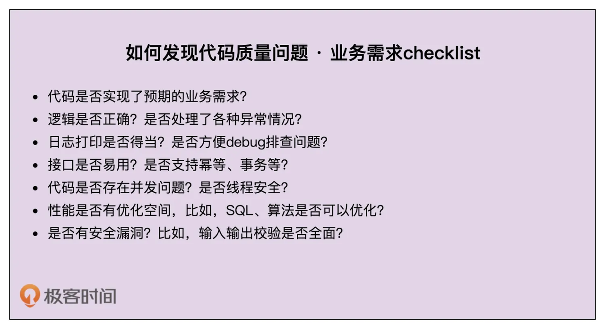

# 规范和重构

## 重构改善软件结构

软件设计大师 Martin Fowler 是这样定义重构的：“重构是一种对软件内部结构的改善，目的是在不改变软件的可见行为的情况下，使其更易理解，修改成本更低。”

按照重构的规模，我们可以将重构大致分为大规模高层次的重构和小规模低层次的重构。

* 大规模高层次重构包括对代码分层、模块化、解耦、梳理类之间的交互关系、抽象复用组件等等。这部分工作利用的更多的是比较抽象、比较顶层的设计思想、原则、模式。
* 小规模低层次的重构包括规范命名、注释、修正函数参数过多、消除超大类、提取重复代码等等编程细节问题，主要是针对类、函数级别的重构。小规模低层次的重构更多的是利用编码规范这一理论知识。

一定要建立持续重构意识，把重构作为开发必不可少的部分，融入到日常开发中，而不是等到代码出现很大问题的时候，再大刀阔斧地重构。

## 单元测试为重构保驾护航

最可落地执行、最有效的保证重构不出错的手段应该就是单元测试（Unit Testing）了。

所谓代码的可测试性，就是针对代码编写单元测试的难易程度, 代码的可测试性可以从侧面上反应代码设计是否合理。

常见的 Anti-Patterns, 常见的测试不友好的代码有下面这 5 种：

* 代码中包含未决行为
* 逻辑滥用可变全局变量
* 滥用静态方法
* 使用复杂的继承关系
* 高度耦合的代码

依赖注入是编写可测试性代码的最有效手段。通过依赖注入，我们在编写单元测试的时候，可以通过 mock 的方法解依赖外部服务

## 快速改善代码质量的20条编程规范

### 命名

1. 命名多长最合适？

对于一些默认的、大家都比较熟知的词，我比较推荐用缩写。这样一方面能让命名短一些，另一方面又不影响阅读理解，比如，sec 表示 second、str 表示 string、num 表示 number、doc 表示 document。

除此之外，对于作用域比较小的变量，我们可以使用相对短的命名，比如一些函数内的临时变量。相反，对于类名这种作用域比较大的，我更推荐用长的命名方式。

2. 利用上下文简化命名

比如user中的name替换userName

3. 命名要可读、可搜索

我们在命名的时候，最好能符合整个项目的命名习惯。大家都用“selectXXX”表示查询，你就不要用“queryXXX”；大家都用“insertXXX”表示插入一条数据，你就要不用“addXXX”，统一规约是很重要的，能减少很多不必要的麻烦。

4. 如何命名接口和抽象类？

对于接口和抽象类，选择哪种命名方式都是可以的，只要项目里能够统一就行。

### 注释

1. 注释到底该写什么？

注释的内容主要包含这样三个方面：做什么、为什么、怎么做.

* 注释比代码承载的信息更多
* 注释起到总结性作用、文档的作用
* 一些总结性注释能让代码结构更清晰

2. 注释是不是越多越好？

类和函数一定要写注释，而且要写得尽可能全面、详细，而函数内部的注释要相对少一些，一般都是靠好的命名、提炼函数、解释性变量、总结性注释来提高代码的可读性。

### 代码风格

3. 函数、类多大才合适？

文中参考谷歌规范, 咱参考阿里编码规范

4. 一行代码多长最合适？

同上

5. 善用空行分割单元块对于比较长的函数
6. 四格缩进还是两格缩进？

我个人比较推荐使用两格缩进

7. 大括号是否要另起一行？否
8. 类中成员的排列顺序

在 Google Java 编程规范中，依赖类按照字母序从小到大排列。类中先写成员变量后写函数。成员变量之间或函数之间，先写静态成员变量或函数，后写普通变量或函数，并且按照作用域大小依次排列。

**今天讲到所有的代码风格都没有对错和优劣之分，只要能在团队、项目中统一即可，不过，最好能跟业内推荐的风格、开源项目的代码风格相一致。**

### 编程技巧

* 将复杂的逻辑提炼拆分成函数和类。
* 通过拆分成多个函数或将参数封装为对象的方式，来处理参数过多的情况。
* **函数中不要使用参数来做代码执行逻辑的控制。**
* **函数设计要职责单一。**
* 移除过深的嵌套层次，方法包括：去掉多余的 if 或 else 语句，使用 continue、break、return 关键字提前退出嵌套，调整执行顺序来减少嵌套，将部分嵌套逻辑抽象成函数。
* 用字面常量取代魔法数。
* 用解释性变量来解释复杂表达式，以此提高代码可读性。

**最后，还有一条非常重要的，那就是，项目、团队，甚至公司，一定要制定统一的编码规范，并且通过 Code Review 督促执行，这对提高代码质量有立竿见影的效果。**

