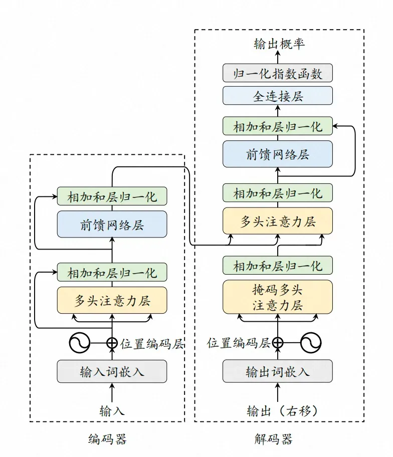
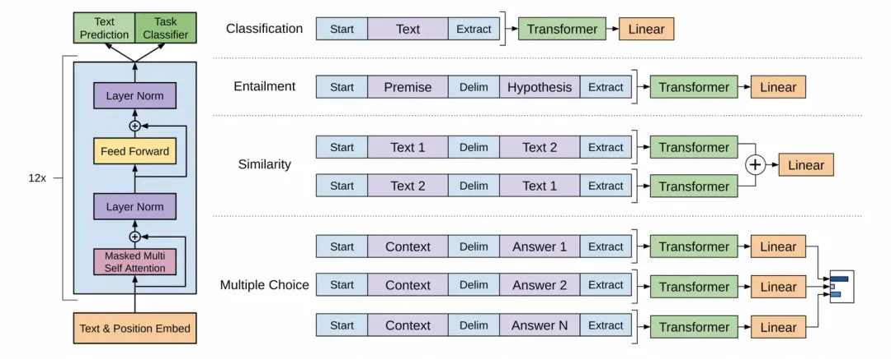
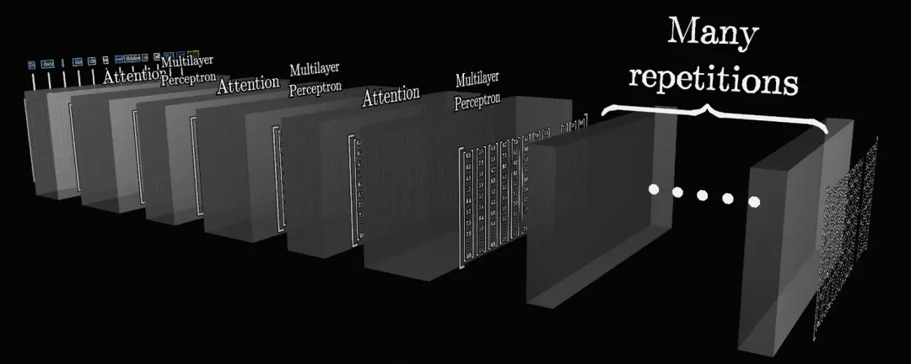
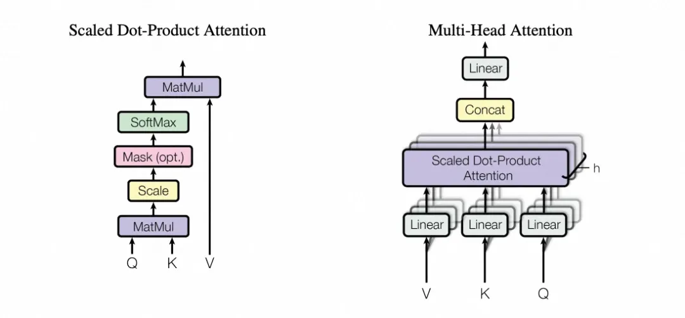
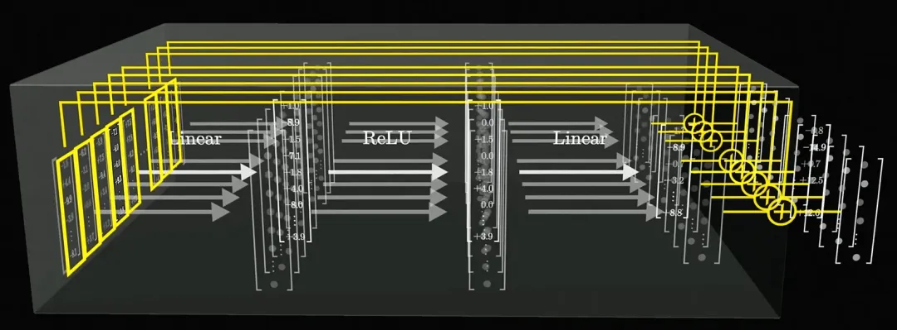
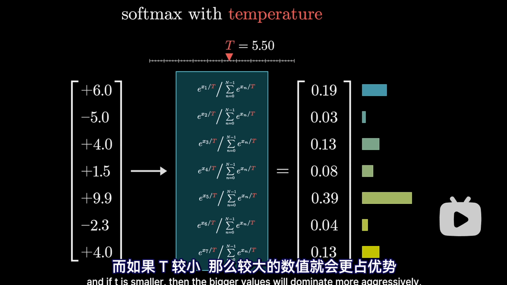

# GPT原理

> 参考：[一文彻底讲透GPT架构及推理原理](https://mp.weixin.qq.com/s/S-gdaAn3izW2NC70-MZjuw)
>
> [【官方双语】GPT是什么？直观解释Transformer | 深度学习第5章](https://www.bilibili.com/video/BV13z421U7cs/?spm_id_from=333.337.search-card.all.click&vd_source=6284116748f32d7c5c4d43eb77d2de8f)
>
> [【官方双语】直观解释注意力机制，Transformer的核心 | 【深度学习第6章】](https://www.bilibili.com/video/BV1TZ421j7Ke/?spm_id_from=333.337.search-card.all.click&vd_source=6284116748f32d7c5c4d43eb77d2de8f)

## 基础概念

* 分词（Tokenization）：首先大模型会将输入内容进行分词，分割成一系列的词元（Token），形成一个词元序列。
* 词元（Token）：指将输入的文本分割成的最小单位，词元可以是一个单词、一个词组、一个标点符号、一个字符等。
* 词嵌入（Embedding）：分词后的词元将被转换为高维空间中的向量表示，向量中包含了词元的语义信息。
* 注意力机制: “注意力机制”可以动态地捕捉序列中不同位置元素之间的依赖关系，分析其强弱程度，并根据这些依赖关系生成新的序列表示。其核心思想是模仿人类的注意力，即在处理大量信息时，能够聚焦于输入数据的特定部分，忽略掉那些不太重要的信息，从而更好地理解输入内容。

## 一句话解释

Transformer通过自注意力机制并行处理输入序列中的所有元素，捕捉全局依赖关系，从而实现高效的序列建模和转换。

GPT（Generative Pre-trained Transformer）是一种基于Transformer架构的语言模型，通过预训练学习大量文本数据的语言规律，然后通过微调适应特定任务，从而生成连贯且符合上下文的文本。

## **Transformer架构**

Transformer架构分为两部分：

* 编码器：用于理解输入序列的内容。它读取输入数据，并将其转换成一个连续的表示，这个表示捕捉了输入数据的关键信息和上下文。
* 解码器：用于生成输出序列，使用编码器的输出和之前生成的输出来预测序列中的下一个元素。

随着技术的演进，基于Transformer已经形成了三种常见架构

* 编码器-解码器架构（Encoder-Decoder Architecture），参考模型：T5
* 编码器架构（Encoder-Only Architecture），参考模型：BERT
* 解码器架构（Decoder-Only Architecture），参考模型：GPT（来自OpenAI）、Qwen（来自通义千问）、GLM（来自清华大学）

其中编码器-解码器架构，适合进行序列到序列的任务，比如文本翻译、内容摘要。编码器架构，适合需要对输入内容分析但不需要生成新序列的任务，比如情感分析、文本分类。解码器架构，适合基于已有信息生成新序列的任务，比如文本生成、对话系统。

## GPT

> GPT模型架构，引自GPT-1的论文《Improving Language Understanding by Generative Pre-Training》

GPT使用了Transformer的解码器部分，同时舍弃了编码器中的交叉注意力机制层，保留了其余部分。整体上模型结构分为三部分：

* 输入层（Input Layer）：将文本转换为模型可以处理的格式，涉及分词、词嵌入、位置编码等。
* 隐藏层（Hidden Layer）：由多个Transformer的解码器堆叠而成，是GPT的核心，负责模型的理解、思考的过程。
* 输出层（Output Layer）：基于隐藏层的最终输出生成为模型的最终预测，在GPT中，该过程通常是生成下一个词元的概率分布。

在隐藏层中，最核心的两个结构分别是

* 掩码多头自注意力层（Masked Multi Self Attention Layers，对应Transformer的Masked Multi-Head Attention Layers，简称MHA，也叫MSA）。
* 前置反馈网络层（Feed Forward Networks Layers，简称FFN，与MLP类似）。

MHA的功能是理解输入内容，它使模型能够在处理序列时捕捉到输入数据之间的依赖关系和上下文信息，类似于我们的大脑在接收到新的信息后进行理解的过程。FFN层会对MHA的输出进行进一步的非线性变换，以提取更高级别的特征，类似于我们的大脑在思考如何回应，进而基于通过训练获得的信息和知识，产生新的内容。

隐藏层不只有一层，而是一种多层嵌套的结构。如上图，Attention是MHA，Multilayer Perceptron（MLP）是FFN，它们就像奥利奥饼干一样彼此交错。这是为了通过建立更深的网络结构，帮助模型在不同的抽象层次上捕捉序列内部的依赖关系，最终将整段文字的所有关键含义，以某种方式充分融合到最后的输出中。

## 大模型的整体处理流程

让我们尝试将一段文本输入给大模型，看一看大模型的整体处理流程

1.分词（Tokenization）：首先大模型会进行分词，将文本内容分割成一系列的词元（token）。

2.词嵌入（Embedding）：分词后的词元将被转换为高维空间中的向量表示，向量中包含了词元的语义信息。

3.位置编码（PE）：将词元的在序列中的位置信息，添加到词嵌入中，以告知模型每个单词在序列中的位置。

4.掩码多头自注意力层（MHA）：通过自注意力机制捕捉序列内部词元间的依赖关系，形成对输入内容的理解。

5.前馈反馈网络（FFN）：基于MHA的输出，在更高维度的空间中，从预训练过程中学习到的特征中提取新的特征。

6.线性层（Linear）：将FFN层的输出映射到词汇表的大小，来将特征与具体的词元关联起来，线性层的输出被称作logits。

7.Softmax：基于logits形成候选词元的概率分布，并基于解码策略选择具体的输出词元。

在该流程中，我故意省略了层归一化，层归一化主要是在模型训练过程中改善训练过程，通过规范化每一层的输出，帮助模型更稳定地学习, 层归一化不会直接影响模型的使用过程。

## **MHA（多头注意力）**

> 缩放点积注意力（左）和多头注意力（右），来自《Attention Is All You Need》

多头注意力的“多头”，指的是点积注意力函数实例有多种。不同的头，这可能意味着词元会从不同角度去发问，同时表达出不同角度的特征，比如一个头可能专注于捕捉语法信息，另一个头可能更关注语义信息，还有一个头可能更关注情感分析。这对于充分捕获上下文信息，尤其是在处理复杂的序列数据时，变得更加强大和灵活。

## 前馈神经网络

FFN，全拼Feed-Forward Network，前馈神经网络。FFN层，通过对自注意力层提供的充分结合了上下文信息的输出进行处理，在高维空间中进行结合训练获得的特征和知识，获得新的特征。

> FFN层的处理过程，引自3Blue1Brown的视频《直观解释大语言模型如何储存事实》

举个例子，假设在自注意力层产生的输入中，模型只能了解到词元的语法特征、语义特征，比如“勇敢的”，模型能感知到它是“形容词”、代表“勇敢”。那么在经过这次线性变换后，模型通过扩充维度，就能感知到其“情感特征”，比如“正向”、“积极”。

总结一下，向上的线性变换，使得词元能够表达出更多的特征，激活函数通过非线性因素，来增强模型对特征的表达能力，向下的线性变换，会将这些特征进行组合，这就是FFN层中模型的“思考”过程。

## Softmax

GPT 模型的最后一层会为词汇表中的每个 token 生成一个 **未归一化的分数** （logits），表示模型对该 token 的偏好程度。Softmax 将 logits 转换为概率分布, 使得所有 token 的概率之和为 1。

温度参数 *T* 控制 Softmax 输出的概率分布的**平滑程度:**

* T越大, 概率分布变得更加平滑, 所有 token 的概率差异减小, 生成的文本更加多样化，但可能包含更多不相关或不连贯的内容。适用于需要高创造性和多样性的场景，如诗歌生成、创意写作
* T越小, 概率分布变得更加尖锐, 高概率 token 的概率进一步增加, 生成的文本更加确定性和保守，多样性降低。适用于需要高准确性和一致性的场景，如代码生成、技术文档。

## 提示工程

Prompt Engineering（提示工程），则是指针对特定任务设计合适的任务提示（Prompt）的过程。

* 提示工程：通过精心设计的输入提示（Prompt）来引导预训练模型生成期望的输出，而无需对模型的权重进行调整。
* 微调：微调是在预训练模型的基础上，使用特定任务的数据进一步训练模型，以调整模型权重，使其更好地适应特定任务。

提示工程侧重于优化输入数据的形式和内容，以激发模型的潜在能力，来提高输出的准确性和相关性。它可以快速适应新任务。而微调可以使模型更深入地理解特定领域的知识和语言模式，进而显著提高模型在特定任务上的性能，但其在灵活性上相对较弱，训练依赖于计算资源和高质量的标注数据。
