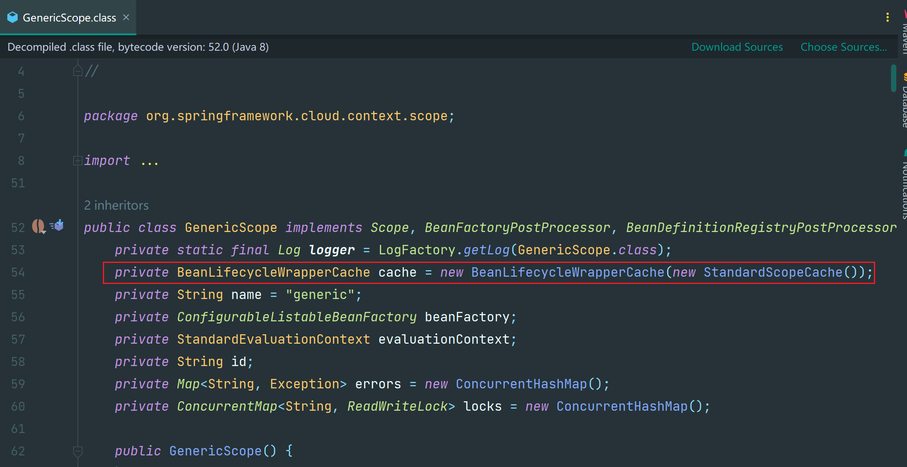
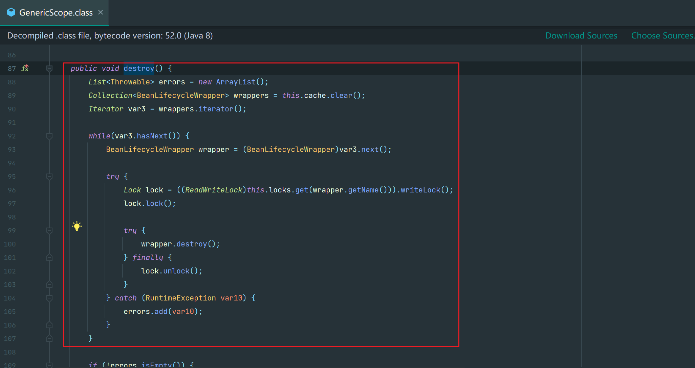
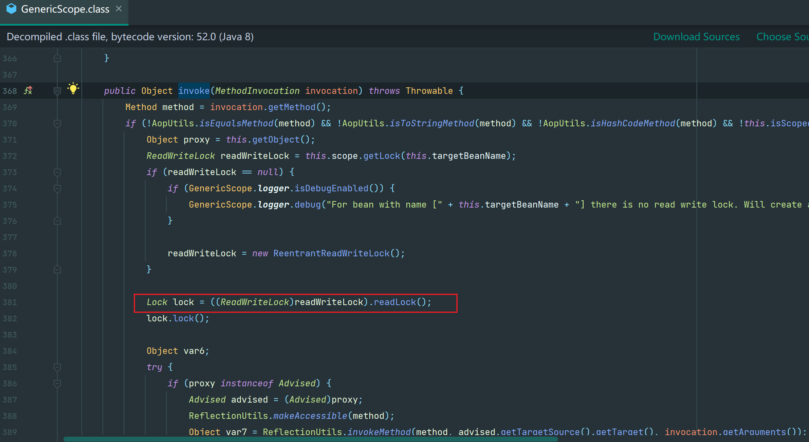
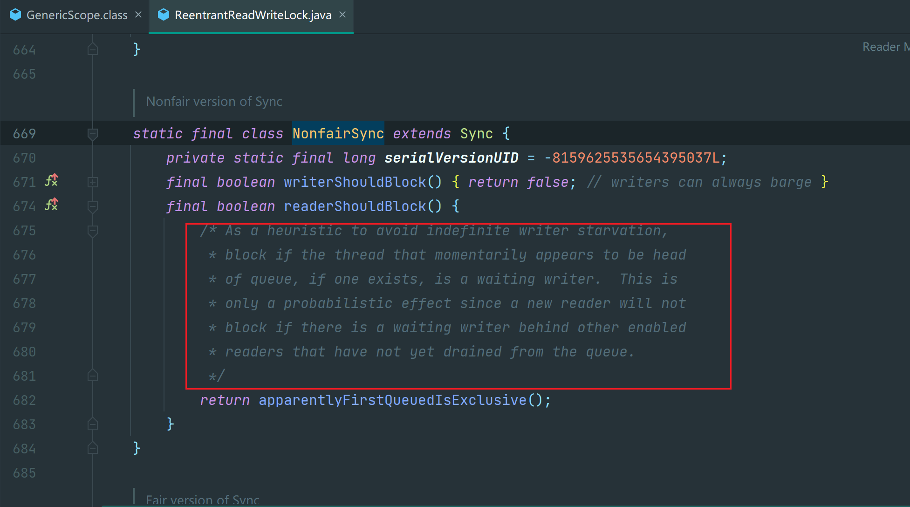

# 微服务配置热刷后无法处理请求问题

## 背景

- 202408, 在pa发8月份版本时, 按流程"关闭网关灰度","ARK热刷配置"以及"推送cms配置", 操作完成后, 生产日志频繁告警, ext服务疑似假死, 重启后恢复正常
- 经仔细核对操作时间, 发现在ARK配置热刷后, 服务不再打印acc日志, 无法处理请求
- ext服务框架为ARK2.7.14-3-rockyas, 此前在ARK1.12.9版本也有热刷操作, 一切正常

## 问题排查

### dev/stg复现, 对比热刷日志, 定位问题代码在GrayDyeFilter的@RefreshScope

- 使用ark的dev/stg环境, 成功复现问题, 详细对比ark1与ark2在执行热刷时的日志, 发现代码中GrayDyeFilter销毁异常, 无对应的销毁日志(代码略)
- Filter的生命周期与servlet容器相关, 而@RefreshScope注解的SpringBean需要被Spring容器进行销毁和创建, 怀疑此处造成的异常
- 移除@RefreshScope注解后, 热刷恢复正常, 接下来, 进一步排查Filter不能加该注解的原因

### @RefreshScope原理

- 当Bean被注解@RefreshScope时, Bean的Scope为Refresh, springboot在创建Bean时会单独将Bean缓存在ScopeCache中

- 当微服务接收到/actuator/refresh的端点热刷请求时, 会将ScopeCache清空, 对应的Bean被销毁, 然后Bean在获取时就会被重新床加你, 注入最新的外部化配置值, 以达到热刷的效果

### 当执行/actuator/refresh时, lock加锁失败, Filter的bean销毁异常, 线程死锁

- 本地搭建测试代码复现, 热刷时发现Filter的bean加锁失败(就是上图代码的96行)
- 深入查看GenericScope源码, GenericScope使用读写锁(ReentrantReadWriteLock)来管理bean的实例, 在bean方法执行时, 会先获取锁, 防止在读取期间的写操作(如创建新实例或更新bean的状态), 以保证多个线程并发读取时数据的一致性, 在bean被销毁时, 会加写锁, 写锁是独占的, 新的读取操作需要等待写锁释放

- 综上, 当服务收到/actuator/refresh的http请求时, Filter过滤器方法被执行, 该线程获取了filter对应的ReentrantReadWriteLock, 并加上了读锁, 当执行到销毁的逻辑时, 要加写锁, 由于线程已经加了读锁, 且请求未执行完成读锁不会释放, 写锁一直阻塞等不到读锁释放, 于是线程死锁, 热刷请求也一直处于阻塞状态
- 在上上图97行打断点, 在获取写锁时, 可以明确看到线程已经持有了读锁

### 后续Tomcat请求线程获取读锁失败, 均会阻塞

- 热刷线程获取写锁失败后, 会进入AQS队列, ReentrantLock使用了AQS(AbstractQueuedSynchronizer), AQS内部维护ule一个虚拟的双向队列CLH, AQS是将每条请求共享资源的线程封装成CLH锁队列的一个节点来实现锁的分配, AQS定义两种资源共享方式, Exclusive(独占)如写锁, Share(共享)如读锁
- AQS机制, 当一个线程尝试以共享模式(例如在ReentrantReadWriteLock的读锁)获取资源时, 如果发现队列头部的节点是等待独占模式(例如写锁)的线程, AQS会阻塞当前线程, 让等待写锁的线程有机会会先获取资源, 这样做有助于减少在非公平锁策略下写线程可能遇到的饥饿问题
- 因此下图ReadLock#lock()->...->AbstractQueuedSynchronizer#tryAcquireShard(int unused)时通过readerShouldBlock方法判断出读锁加锁失败, 并入队阻塞

> /* 作为一种避免写者无限期饥饿的启发式策略，
>
> * 若队列头部存在且暂时表现为等待状态的写者线程（前提是该线程确实存在），则进行阻塞。
> * 这种机制仅产生概率性效果，因为当队列中存在尚未处理完毕的其他可用读者的情况下，
> * 即使队尾有等待的写者，新到来的读者也不会被阻塞。
>   */

- 因此后续的请求进来, 在尝试获取读锁时, 都会阻塞, 直至tomcat线程全部处于阻塞状态, 也就无法处理任何请求了

## 总结

- ark2配置热刷后服务不可用, 问题原因为代码中的一个filter标注了@RefreshScope, ark2热刷通过http请求下发, 经过该filter时该线程加了读锁, 而后该filter被销毁时, 该线程需要获取写锁, 而请求未执行完成, 读锁不会被释放, 导致线程死锁, 热刷请求阻塞
- 随后其他tomcat处理http请求的线程, 都会经过filter需要获取读锁, 但由于AQS队列写锁优先级提升的机制, 队列前有等待的写锁, 那读锁会获取失败, 线程阻塞, 直至所有线程均阻塞, 服务无法处理请求
- 修复方案为Filter去掉@RefreshScope注解, 若配置需要刷新, 在配置类使用@ConfigurationProperties或@RefreshScope+@Value注解即可

## 为什么ark1热刷没有问题?

- ark1是借助kafka中间件进行的热刷, 执行refresh的线程是消费者线程, 不会经过web的flter, 因而在销毁的时候可以正常加写锁, 正常热刷
