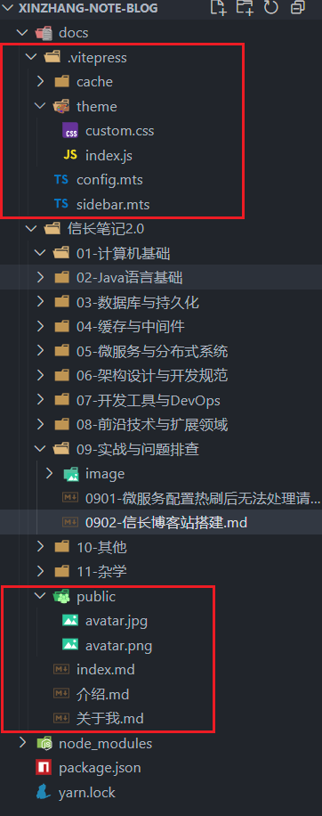
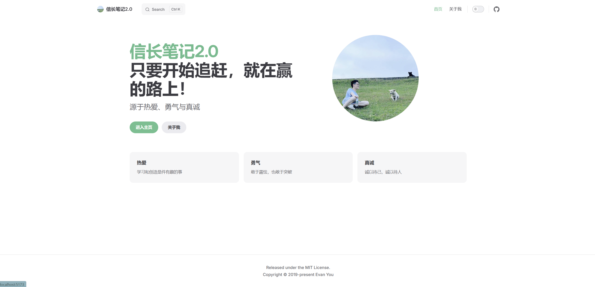
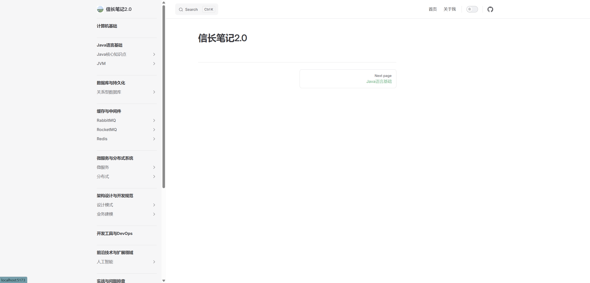
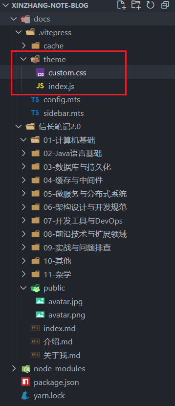
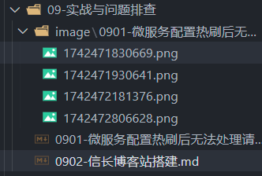

# 信长博客站搭建

## 使用VitePress建站

> 官方: https://vitepress.dev/zh/
>
> 主流程参考: https://mp.weixin.qq.com/s/R8lmyQj0zwXxYr5ydlRbPw

先参考官方文档搭建工程, 本地把页面跑起来, 我的工程结构如下



### index.md

```
---
# https://vitepress.dev/reference/default-theme-home-page
layout: home
lastUpdated: true
hero:
  name: "信长笔记2.0"
  text: "只要开始追赶，就在赢的路上！"
  tagline: 源于热爱、勇气与真诚
  image:
      # 首页右边的图片
      src: /avatar.jpg
      # 图片的描述
      alt: avatar
  actions:
    - theme: brand
      text: 进入主页
      link: /介绍
    - theme: alt
      text: 关于我
      link: /关于我

features: 
  - title: 热爱
    details: 学习和创造是件有趣的事
  - title: 勇气
    details: 敢于露怯，也敢于突破
  - title: 真诚
    details: 诚以待己，诚以待人
---
```

### config.mts

- 我将根目录调整为了"./信长笔记2.0", 因此index.md, 头像等文件都是在该目录下的

```
import { defineConfig } from "vitepress";
import generateSidebar from "./sidebar.mts";

// https://vitepress.dev/reference/site-config
export default defineConfig({
  title: "信长笔记2.0",
  description: "信长笔记2.0",
  srcDir: "./信长笔记2.0",
  themeConfig: {
    logo: "/avatar.jpg",
    search: {
      provider: "local",
    },
    nav: [
      { text: "首页", link: "/" },
      { text: "关于我", link: "/关于我" },
    ],
    sidebar: generateSidebar(),
    socialLinks: [
      { icon: "github", link: "https://github.com/vuejs/vitepress" },
    ],
    footer: {
      message: "Released under the MIT License.",
      copyright: "Copyright © 2019-present Evan You",
    },
    // i18nRouting: true,
  },
});

```

### sidebar.mts

- 自动生成侧边导航栏的脚本
- 注意.mts文件是使用 **ECMAScript Modules (ESM)** 语法的 TypeScript 文件, 运行.mts文件需要执行 `npm install typescript ts-node @types/node --save-dev`

```
import * as fs from "fs";
import * as path from "path";

const rootDir = path.join(__dirname, "../信长笔记2.0");

function getDirDisplayName(dirName: string): string {
  const parts = dirName.split("-");
  return parts.slice(1).join("-");
}

function buildSidebar(dirPath: string): any[] {
  const items: any[] = [];
  const entries = fs.readdirSync(dirPath, { withFileTypes: true });

  for (const entry of entries) {
    if (entry.name === "image"||entry.name === "public") continue;

    const fullPath = path.join(dirPath, entry.name);
    const relativePath = path.relative(rootDir, fullPath);

    if (entry.isDirectory()) {
      const subdirItems = buildSidebar(fullPath);
      if (subdirItems.length > 0) {
        const dirName = path.basename(fullPath);
        items.push({
          text: getDirDisplayName(dirName),
          collapsed:true,
          items: subdirItems,
        });
      }
    } else if (entry.isFile() && path.extname(entry.name) === ".md") {
      const fileName = path.basename(entry.name, ".md");
      items.push({
        text: getDirDisplayName(fileName),
        link: `/${relativePath.replace(/\\/g, "/").replace(/\.md$/, "")}`,
      });
    }
  }

  return items;
}

export default function generateSidebar() {
  const dirs = fs
    .readdirSync(rootDir, { withFileTypes: true })
    .filter((e) => e.isDirectory() && e.name !== "image")
    .map((e) => e.name);

  const sidebar = dirs.map((dir) => ({
    text: getDirDisplayName(dir),
    items: buildSidebar(path.join(rootDir, dir)),
  }));

  // console.log(JSON.stringify(sidebar, null, 2));
  return sidebar
}

generateSidebar();

// [prmopt留存]
// 现有以下文件
// - "docs/信长笔记2.0/02-Java语言基础/0201-Java核心知识点/020101-Java语言基础.md",
// - "docs/信长笔记2.0/02-Java语言基础/0201-Java核心知识点/020102-IO模型.md",
// - "docs/信长笔记2.0/02-Java语言基础/0201-Java核心知识点/020103-集合.md",
// - "docs/信长笔记2.0/03-数据库与持久化/0301-关系型数据库/030101-PowerDesign简易教程.md",
// - "docs/信长笔记2.0/03-数据库与持久化/0301-关系型数据库/030102-索引.md",
// - "docs/信长笔记2.0/03-数据库与持久化/0301-关系型数据库/030103-MySQL基础.md",
// 请实现一个sidebar.mts脚本, 生成一个sidebar数组, 要求
// 1. 递归扫描"/docs/信长笔记2.0"文件夹, 直至找到所有的md文件, 跳过"/image"文件夹以及该文件夹下的所有内容
// 2. 允许文件夹为空
// 3. sidebar.mts应该export一个generateSidebar的方法, 并且把最终生成的数组打印到控制台
// sidebar示例如下:
//  [
//       {
//         text: "Java语言基础",
//         items: [
//           {
//             text: "Java核心知识点",
//             items: [
//               {
//                 text: "Java语言基础",
//                 link: "/02-Java语言基础/0201-Java核心知识点/020101-Java语言基础",
//               },
//               {
//                 text: "IO模型",
//                 link: "/02-Java语言基础/0201-Java核心知识点/020102-IO模型",
//               },
//               {
//                 text: "集合",
//                 link: "/02-Java语言基础/0201-Java核心知识点/020103-集合",
//               },
//             ],
//           },
//           {
//             text: "并发与多线程",
//             items: [],
//           },
//           {
//             text: "JVM",
//             items: [
//               {
//                 text: "JVM基础",
//                 link: "/02-Java语言基础/0203-JVM/020301-JVM基础",
//               },
//             ],
//           },
//         ],
//       },
//     ]
```

- 这个脚本是AI写的, 建议先手动配置导航栏, 然后再让AI参考生成, 准确率更高, prompt参考如下:
  ```
  我在使用vitePress搭建博客, 其config.mts如下, 请完善一个sidebar.mts, 实现自动递归扫描 /信长笔记2.0 下的所有的文件夹, 自动生成侧边导航栏的功能, 并告知使用方式

  import { defineConfig } from "vitepress";

  // https://vitepress.dev/reference/site-config
  export default defineConfig({
    title: "信长笔记2.0",
    description: "信长笔记2.0",
    srcDir: "./信长笔记2.0",
    themeConfig: {
      // https://vitepress.dev/reference/default-theme-config
      nav: [
        { text: "首页", link: "/" },
        // { text: 'Examples', link: '/markdown-examples' }
      ],
      sidebar: [
        {
          text: "Java语言基础",
          items: [
            {
              text: "Java核心知识点",
              items: [
                {
                  text: "Java语言基础",
                  link: "/02-Java语言基础/0201-Java核心知识点/020101-Java语言基础",
                },
                {
                  text: "IO模型",
                  link: "/02-Java语言基础/0201-Java核心知识点/020102-IO模型",
                },
                {
                  text: "集合",
                  link: "/02-Java语言基础/0201-Java核心知识点/020103-集合",
                },
              ],
            },
            {
              text: "并发与多线程",
              items: [],
            },
            {
              text: "JVM",
              items: [
                {
                  text: "JVM基础",
                  link: "/02-Java语言基础/0203-JVM/020301-JVM基础",
                },
              ],
            },
          ],
        },
      ],
      socialLinks: [
        { icon: "github", link: "https://github.com/vuejs/vitepress" },
      ],
    },
  });
  ```

### 预览

- `yarn docs:dev`

  



## 个性化配置

### 变更主题颜色



#### index.js

```
import DefaultTheme from "vitepress/theme";
import "./custom.css";

export default DefaultTheme;

```

#### custom.css

- 注释的链接里有全部的css样式, 我这里将蓝色改成了绿色

```
/* 全部css: https://github.com/vuejs/vitepress/blob/main/src/client/theme-default/styles/vars.css */

:root {
 /* 微信风格浅绿色调色板 */
  --vp-c-indigo-1: #66bc8c;     /* 浅薄荷绿（导航栏/页脚主色） */
  --vp-c-indigo-2: #4d9568;     /* 活力浅绿（按钮/图标主色） */
  --vp-c-indigo-3: #69c08e;     /* 渐变过渡绿（边框/分割线） */
  --vp-c-indigo-soft: rgba(158, 207, 150, 0.12); /* 半透明遮罩层 */

}
```


### 部署


--- 

## Q&A

### Q: 为什么不用VuePress?

A: vuePress有大量"bug", 如:

- 目录结构要求每个文件夹下有个readme.md, 非常反人类, 我的笔记有多层级的目录结构, 十分不友好
- md引用的图片仅支持与md同级文件夹的相对路径, 而使用vscode+Md Editor编辑的md文档, 图片是在image/xxx/的目录下的, 如下图, 因此我的笔记图片在vuePress上展示不出来



- 尝试了多种自动生成目录的方案, 均不可行, 而vitePress更简洁, 一下子就搞定了

### Q: 不支持上下标?

A: 原生md语法是通过html标签来支持上下标的, 在vitePress可安装插件增强来支持, 上标为 `<sup>xx<sup>`, 下标为 `<sub>xxx<sub>`, 但vscode的Md Editor插件在编辑的时候会自动给html标签加上反引号, 会被自动改掉, 因此直接不用这个了

```
npm install markdown-it-sub markdown-it-sup -D

然后在 .vitepress/config.js 中配置：
import { defineConfig } from 'vitepress'
import sub from 'markdown-it-sub'
import sup from 'markdown-it-sup'

export default defineConfig({
  markdown: {
    config: md => {
      md.use(sub)
      md.use(sup)
    }
  }
})
```
