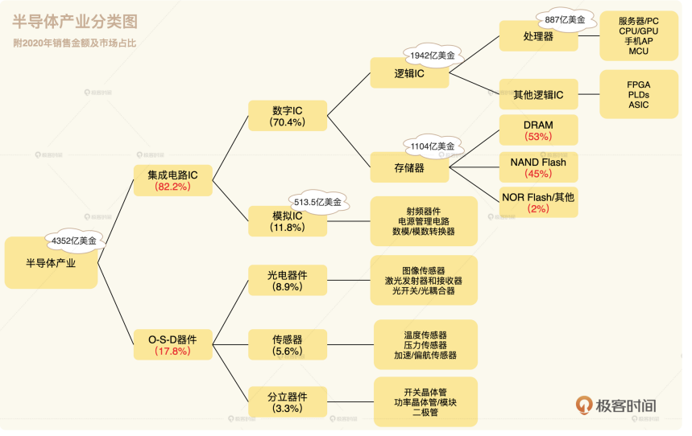
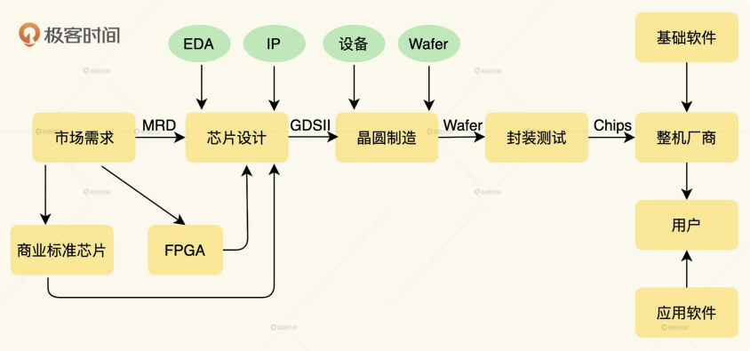
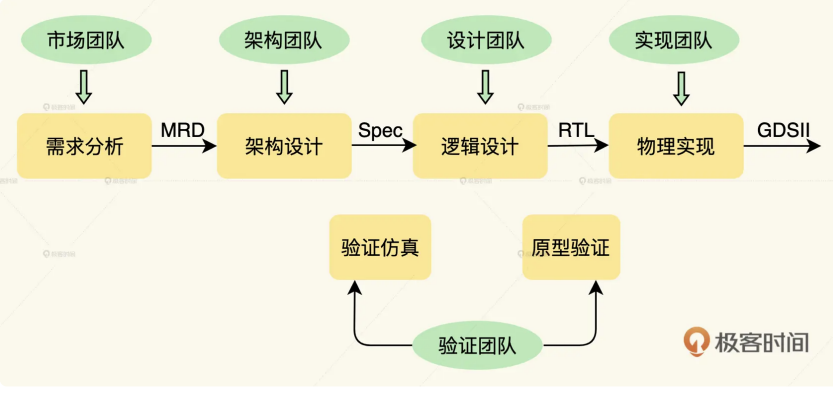
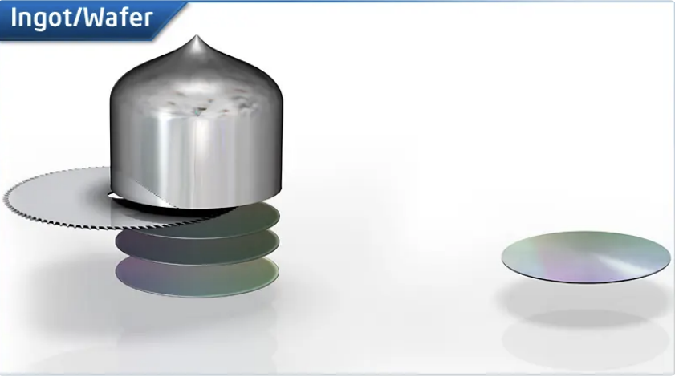
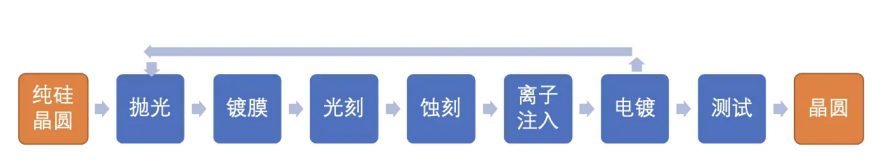
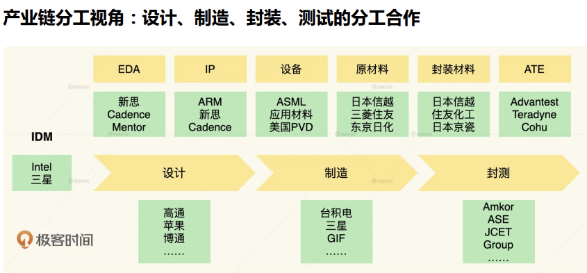

# 芯片

* 摩尔定律: 半导体芯片上集成的晶体管和电阻数量将每隔24个月增加一倍, 换句话微处理器的性能每隔2年提高一倍, 或价格下降一半; 摩尔定律是经济学基础对未来的一个预测

## 半导体产业链

* IC是Integrated Circuit 集成电路的 缩写
  * 数字集成电路(数字IC)可分为做计算控制的逻辑芯片和保存数据的存储芯片
    * CPU(Central Processing Unit) 功能主要是解释计算机指令一级处理计算机软件中的数据
    * GPU(Graphics Processing Unit) 图形处理器, 主要用来满足图像计算要求. 相对来说CPU擅长逻辑判断和串行数据运算, 而一个图片的每一个像素都需要相同的计算处理, GPU就擅长图形计算这种并行的任务
  * 处理数字信号(0, 1)就是数字IC, 处理模拟信号(声音, 光, 气压, 无线电信号也叫射频信号)的就是模拟IC; 数字IC追逐摩尔定律, 模拟IC更多追求电路速度, 分辨率, 功耗等参数提升, 强调高信噪比, 低失真, 低耗电和高稳定性
    * 射频器件, 处理5G信号, 蓝牙, WIFI, NFC等
    * 电源管理装置
    * 模数和数模转换器, 转换模拟信号与数字信号, 如将数字信号变成连续的声音信号, 并通过麦克风播放, 是个典型的DAC数模转换过程

## 芯片设计与制造

* 全流程

* 芯片设计

* 芯片制造
  * 上游: 晶圆材料准备, 提炼单晶硅锭, 并切割打磨成纯硅晶圆

- 中游: 晶圆加工, 将电路图通过光罩, 移植到晶圆上

* 下游: 封装与测试

* 产业链分工

